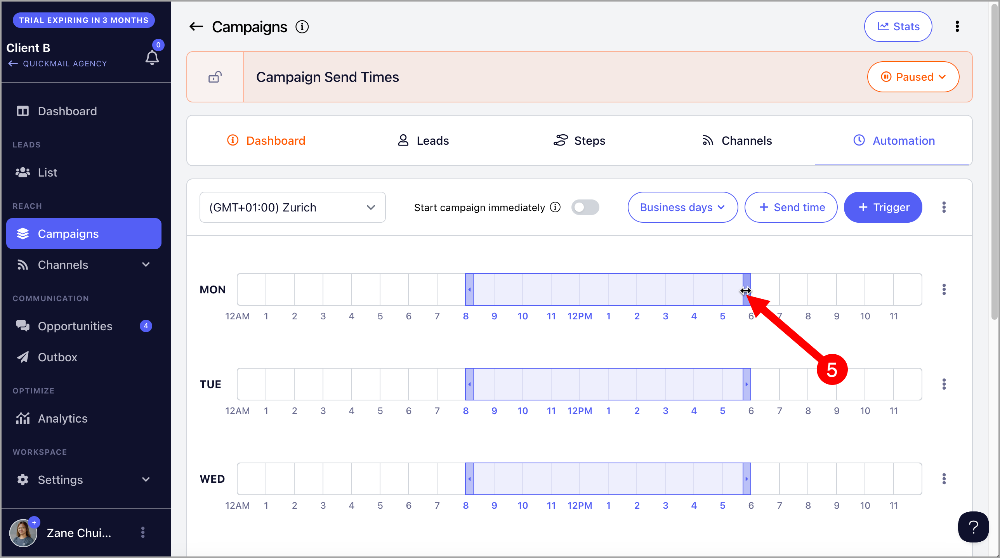
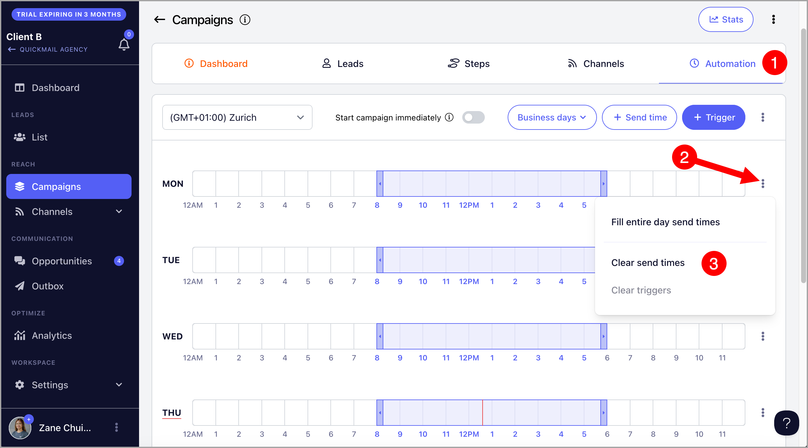

# Optimizing Send Times

**In this article:**

- What are send times for?

- How to modify send times?

- How to clear send times?

## What Are Send Times For?

Send times control when a campaign is allowed to send emails, helping you avoid sending at midnight or on weekends. The default send times are set to 8:00 AM–6:00 PM, Monday to Friday, based on the timezone in which the account was created.

## How to Modify Send Times?

Go to your preferred campaign → **Automation** tab → select your preferred timezone.

Then, drag to set your preferred send times.

Alternatively, click the **Send Time** button and enter your preferred times manually.

To allow the campaign to send emails across all business hours at once, click the menu next to **Triggers** → **Fill All Business Days Send Times**.

**Tip:** The red line in the send times grid indicates the current day and time.

## How to Clear Send Times?

To clear send times for a specific day, click the menu for that day → **Clear Send Times**.

To clear all send times at once, click the menu next to **Triggers** → **Clear All Send Times**.
