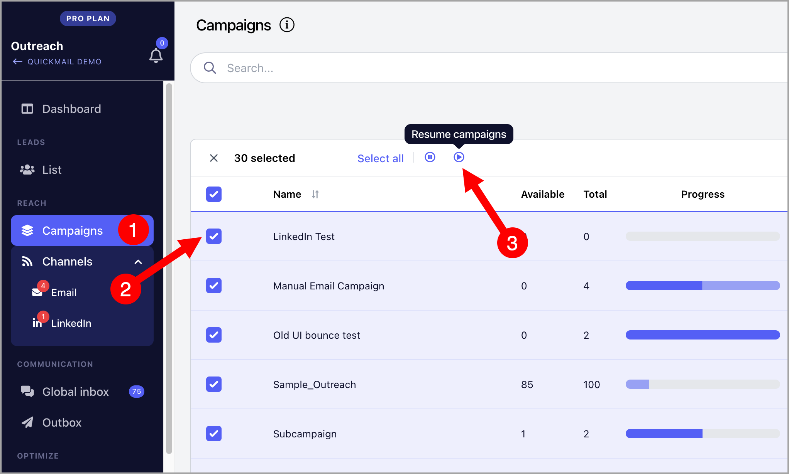

# Pausing and Unpausing Campaigns

There are two ways to pause and unpause campaigns: **Manually** and **in Bulk**.

**In this article:**

- Manual

- In bulk

## Manual

To manually pause or resume a campaign, go to the campaign → click the **Live** or **Pause** button.

## In Bulk

To pause or resume multiple campaigns at the same time, go to **Campaigns** → select your preferred campaigns → click the **Pause** or **Resume** button.

