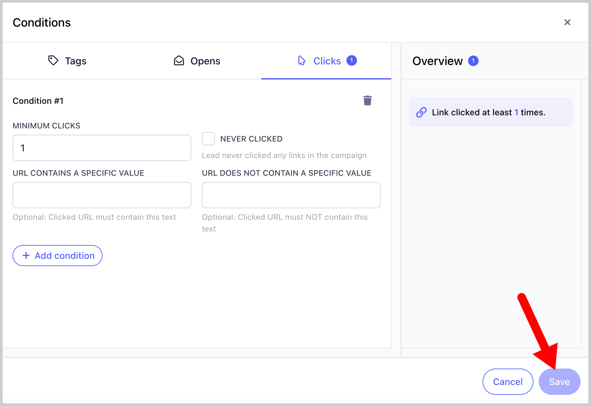
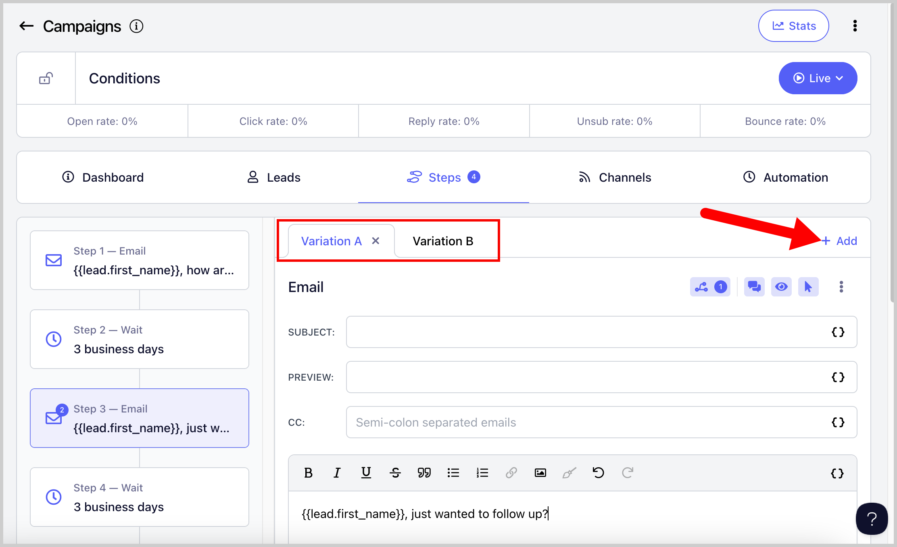

# Sending Email Variations Based on Conditions

**In this article:**

- Why use conditions?

- What conditions are available?

- How to add a condition?

- What happens when a lead doesn't meet the conditions?

**Important:** Conditions are currently available only on the Growth and Agency plans.

## Why Use Conditions?

Conditions allow you to control which email variation a lead receives based on specific criteria, or stop a lead's progress in a campaign if they don't meet certain criteria.

For example, if you want to stop follow-ups when a lead opens an email, you can set the follow-up step to only send to leads with zero opens.

## What Conditions Are Available?

At the moment, conditions can be based on:

- Minimum number of clicks

- URL clicked

- Minimum number of opens

- Tags

## How to Add a Condition?

Conditions must be configured individually for each step in a campaign.

Go to your campaign → **Steps** tab → click your preferred step → select your preferred email variation (if there are multiple) → click the **Conditions** icon.

**Pro tip:** Avoid adding conditions based on clicks or opens to the first step. Since no emails have been sent to the lead yet, they will not be able to meet those conditions.

Select the type of condition you want to apply → review the overview panel on the right → click **Save**.

Once conditions are added to a step, the Conditions icon will turn blue and display a number indicating how many conditions have been set.

## What Happens When a Lead Doesn't Meet the Conditions?

If a lead does not meet the conditions for a step, their campaign progress will stop and their status will show as **Error Running**. This happens because there is no variation or step for them to move forward to.

To prevent this, create multiple email variations that cover both outcomes. For example, if one variation is set for the condition "never clicked a link," there should also be a variation for "clicked a link at least once."

If a lead has already run into an error and you want the campaign to continue sending to them, create an email variation that allows the lead to pass the condition that caused the error. Once added, you can resume the lead and the campaign will continue from where it left off.

Note that leads in an error state or who have already completed the campaign are considered stopped and will not automatically receive any newly added steps. Only leads with a running status will continue into new steps added to the campaign.
