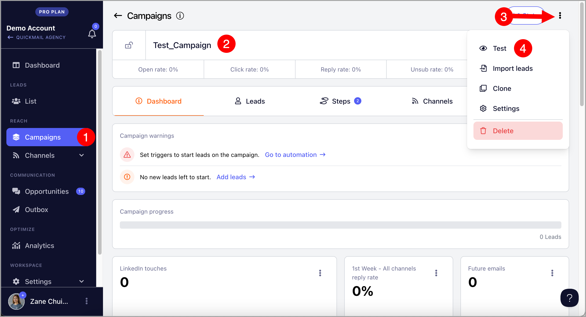
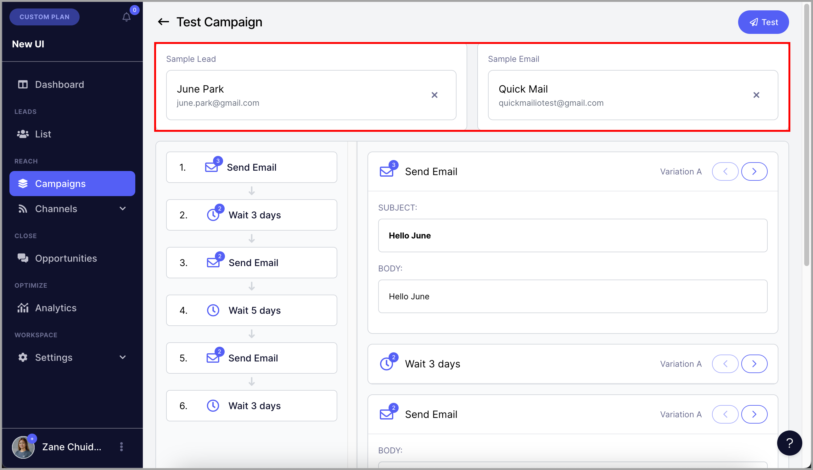
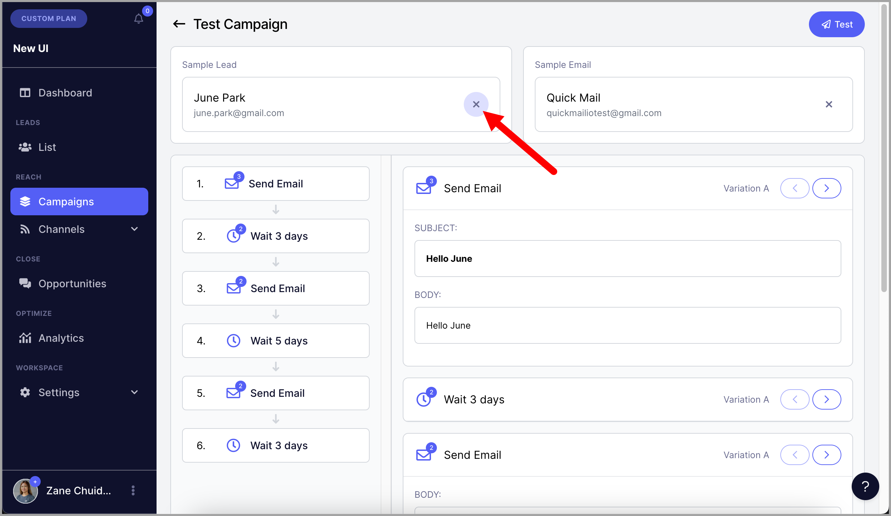
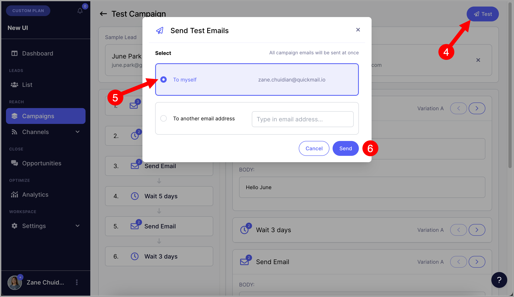

# Sending Test Emails

## Why send test emails?

Sending test emails is a good way to check what the campaign emails will look like when the emails are sent to leads.

**Note:** Sending test emails will ignore the wait steps. So all email steps will be sent in one go.

## How to send test emails?

**Step 1.** Go to Campaigns → Open a specific campaign → Click menu (three vertical dots) at the upper right-hand corner → Test campaign

**Step 2.** A test lead and an email account that will be used for sending test emails will be automatically selected.

**Note:** The test email will not be sent to the Lead selected. Selecting a Lead will allow users to see how the email will look for a specific Lead based on their info when using attributes.

If you would like to use a different test lead or email account for sending test emails, simply click on X and select a different lead or email.

**Step 3.** If you're good with the test Lead and email account selected, click on "Test" and select to which email address will the test emails be sent.

## Troubleshooting

## Troubleshooting

### Why didn't I receive the test email?

There are a few common reasons a test email might not arrive:

* **Microsoft email accounts:** When several test emails are sent in quick succession, Microsoft may ignore some of them and not deliver them.
* **Spam, promotions, or other folders:** The email may have landed in spam, promotions, or another folder, so please double-check there.
* **Bounced email:** The test email may have bounced. Check the sender's inbox for a bounce notification, and make sure the sender's email account can send without issues and the recipient email address can receive emails.
* **Lost permission on the sender:** By default, test emails are sent from the first email account listed on your Emails page. If that account has lost permission, the test email won't send.  [Reauthenticate the account](https://help.quickmail.com/email-accounts/re-authenticating-email-accounts/) or select a different sender.
* **Email account security settings:** If you see the error "Permission to send email is not granted," QuickMail may not have full access to the inbox. Ask your email admin or IT team to grant QuickMail full permission. This can also happen if the email account was added using the wrong email provider.
* **No email steps in the campaign:** Test emails can only be sent if the campaign has at least one email step.
* **No leads or email accounts added:** A test email needs a lead to fill in the email details and an email account to send from. Make sure both have been added.
* **AI personalization timeout:** If you see an error like "OpenAI error: Timed out reading data from server," your OpenAI API key may have hit its rate limit. Try again later, upgrade your OpenAI plan, or use QuickMail's Reword AI credits instead.

### Why are my test emails cut off?

Gmail clips emails when the HTML size goes over about 102 KB. This includes any previous emails quoted in the same thread, so longer follow-ups are more likely to be clipped.

