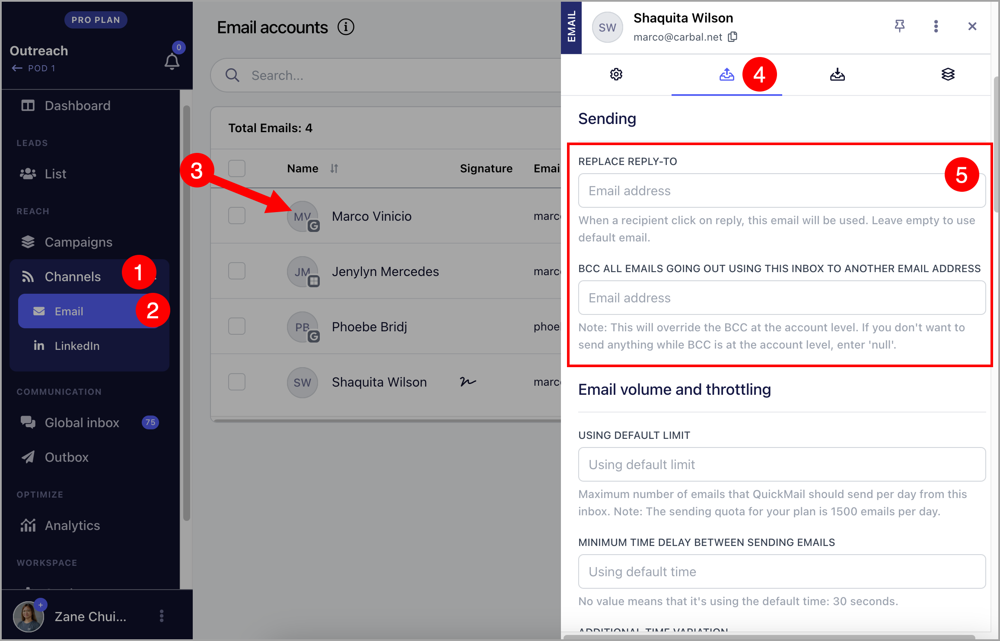

# Setting Up an Email Alias (Replace Sent-From & Reply-To)

**In this article:**

- Why set up an alias?

- Can I add an alias email account as a separate sender?

- How to use an alias with a Gmail inbox?

- How to use an alias with a Microsoft inbox?

- How to use an alias with a custom inbox?

## Why Set Up an Alias?

Setting up an alias allows you to send emails from or receive replies to a different address. This can help you sort your emails more easily or present a different sender address to recipients.

## Can I Add an Alias Email Account as a Separate Sender?

No. It is not possible to add an alias email account (or an email account without its own login or license) as a separate sender.

**Note:** Changing the send-from and reply-to address may cause replies to go undetected in QuickMail. To avoid this, add the send-from and reply-to address as an inbox in QuickMail so it can also be scanned for replies.

Keep in mind that aliases still affect the deliverability of the primary email account, since emails sent via an alias are technically still sent from the primary address. If the goal is to avoid getting flagged, using an alias is not recommended.

Additionally, emails sent from aliases are not signed with SPF and DKIM records, which makes them more likely to land in spam.

## How to Use an Alias with a Gmail Inbox?

**Step 1.** Set up an alias directly in your Gmail account. Here is a [guide](https://support.google.com/mail/answer/22370?hl=en) on how to do this.

**Note:** If you would like to use a secondary domain in your Google Workspace as an alias, it must also be set up as an alias in Gmail.

**Step 2.** Go to **Channels** → **Emails** → click on the email account → **Sending** tab → add your preferred address under **Send-From** or **Reply-To**.

## How to Use an Alias with a Microsoft Inbox?

**Step 1.** Set up an alias directly in your Microsoft account. Here is a [guide](https://support.microsoft.com/en-us/office/add-or-remove-an-email-alias-in-outlook-com-459b1989-356d-40fa-a689-8f285b13f1f2) on how to do this.

**Step 2.** Go to **Channels** → **Emails** → click on the email account → **Sending** tab → add your preferred address under **Send-From** or **Reply-To**.

## How to Use an Alias with a Custom Inbox?

**Step 1.** Set up an alias directly in your email account. Here are guides for custom inboxes commonly used with QuickMail:

- [Zoho Mail](https://www.zoho.com/mail/how-to/create-email-alias.html) — make sure to also set up the address as a sent-from email address in Zoho.

- [Amazon WorkMail](https://docs.aws.amazon.com/workmail/latest/userguide/email-messages.html#send_alias)

- [FastMail](https://www.fastmail.help/hc/en-us/articles/360060591073-How-to-set-up-aliases)

**Step 2.** Go to **Channels** → **Emails** → click on the email account → **Sending** tab → add your preferred address under **Send-From** or **Reply-To**.

