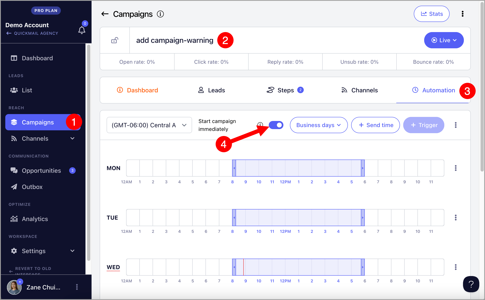
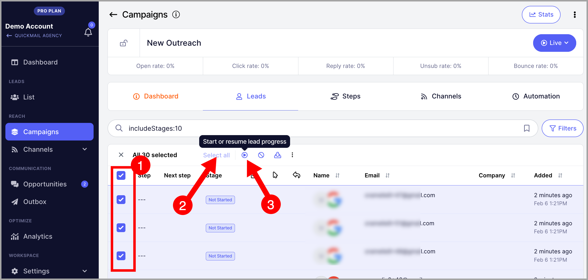

# Starting Campaigns Immediately

**In this article:**

- Why set a campaign to start immediately?

- How does it work?

- How to enable it?

- Troubleshooting

  - Leads are not starting after enabling instant start — why?

  - Where did my triggers go?

## Why Set a Campaign to Start Immediately?

- **Immediate execution** — emails start sending right away, which is useful for urgent outreach.

- **Faster testing** — quickly test new email copy, subject lines, or lead lists without waiting for triggers.

- **Better control** — you decide exactly when the campaign starts and can make adjustments in real time.

## How Does It Work?

When leads are added to a campaign, they are placed in a "Not Started" status and must be started either manually or through triggers.

Instant start automatically starts leads as soon as they are added to the campaign, without needing to set up triggers.

## How to Enable It?

Go to the campaign → **Automation** tab → toggle on **Start Campaign Immediately**.

## Troubleshooting

### Leads Are Not Starting After Enabling Instant Start — Why?

This setting only applies to leads added to the campaign after it is enabled. Leads that were already in "Not Started" status before the setting was turned on will not start automatically.

To start existing leads, filter them first.

Then select all → **Resume** → **Resume Immediately**.

**Important:** Resuming a large number of leads at once can cause a sudden spike in email volume. To avoid sending in high volumes, set up a daily email limit. 

Here is a detailed guide: https://help.quickmail.com/email-accounts/setting-daily-sending-limit/

### Where Did My Triggers Go?

Enabling instant start hides your triggers since they are not needed when leads start automatically.

If you decide to stop using instant start, toggle the setting off and your triggers will reappear.
