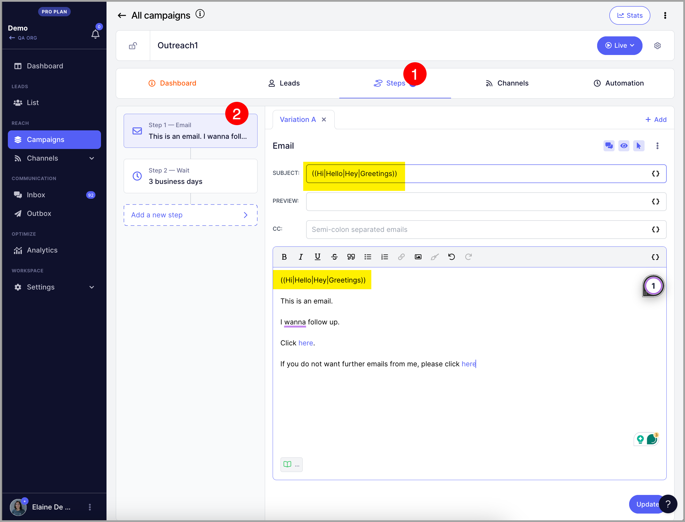
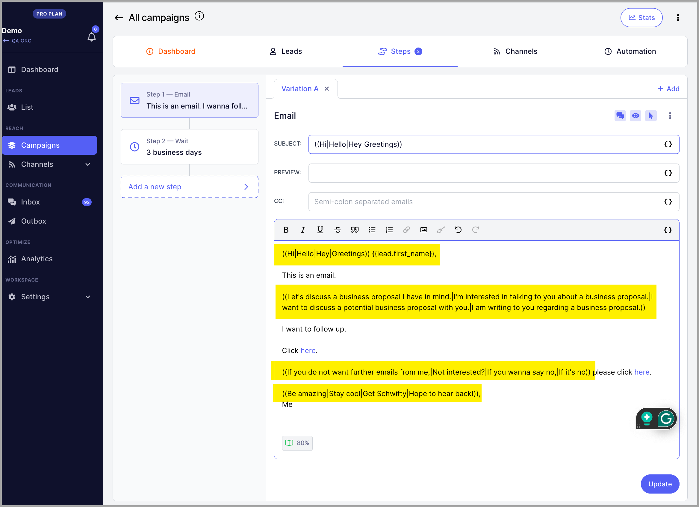
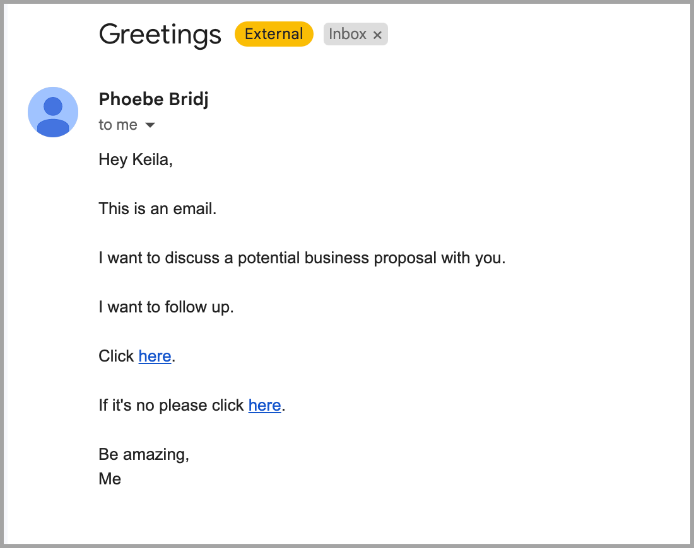

# Text Variations (Spintax)

**In this article:**

- Why use text variations?

- How to add text variations?

## Why Use Text Variations?

Text variations allow you to vary the content of outgoing emails. This helps avoid campaign fatigue, where spam filters flag an email account for sending too many emails with identical content.

## How to Add Text Variations?

Use double opening parentheses `((` to start a variation set, separate each variation with a vertical bar `|`, and close the set with double closing parentheses `))`.

**Example:**

`(( Hi | Hello | Hey | Greetings ))`

Phrases and sentences work too:

You can also add multiple variation sets in a single email to create even more variety:

Each time a lead reaches the email step, one variation from each set is picked at random. For example, the variations above may produce an email like this:

**Pro tip:** In addition to text variations, you can also create email variations for A/Z testing to track which copy performs best.
Additionally, you can use Reword with AI instead of manually creating spintax.
Here's more info on it: https://help.quickmail.com/deliverability/rewording-with-ai/
