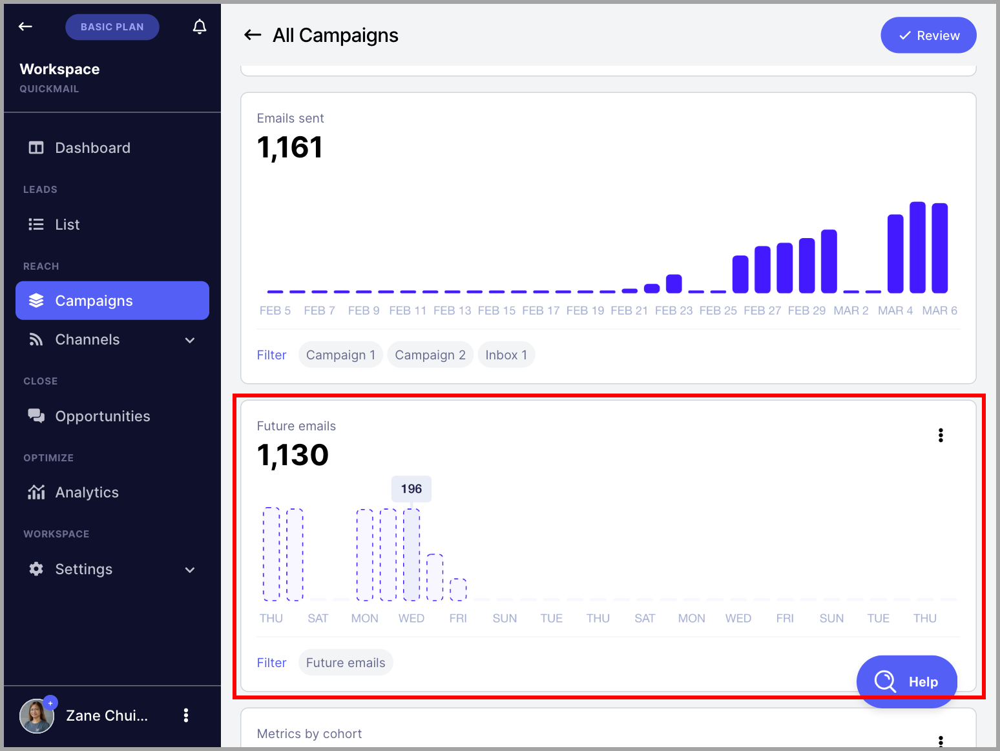

# Understanding Future Emails

**In this article:**

- Where can I see future emails?

- How are future emails calculated?

Future Emails helps you estimate upcoming campaign volume, making it easier to plan your sending activity and manage resources.

Note: Future Emails is still a work in progress. It displays scheduled follow-ups and estimated emails to new leads based on your triggers, but it may not include follow-ups that haven’t been scheduled yet. Since sending volume depends on several factors, use this tool as a general forecast rather than an exact measure of future email volume.

## Where Can I See Future Emails?

To check future emails, go to **Campaigns** → select a campaign → view the **Future Emails** section in the campaign dashboard.

## How Are Future Emails Calculated?

Future emails are calculated based on the following factors:

- The number of leads in an active campaign

- The number of leads that will start the campaign based on triggers

- The number of scheduled follow-up emails

- Wait steps

The following factors are not yet taken into account:

- The type of the first step in a campaign (for example, if it is not an email step)

- Time delay between sending emails

- Send times

- Out-of-office leads

- The number of follow-up emails that aren't scheduled yet
