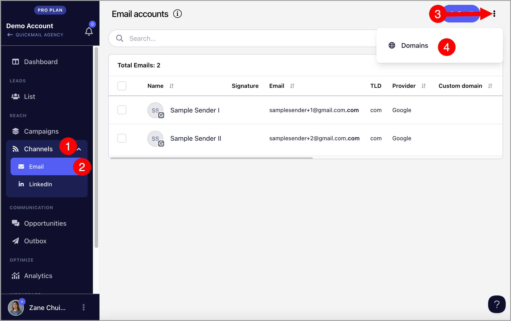
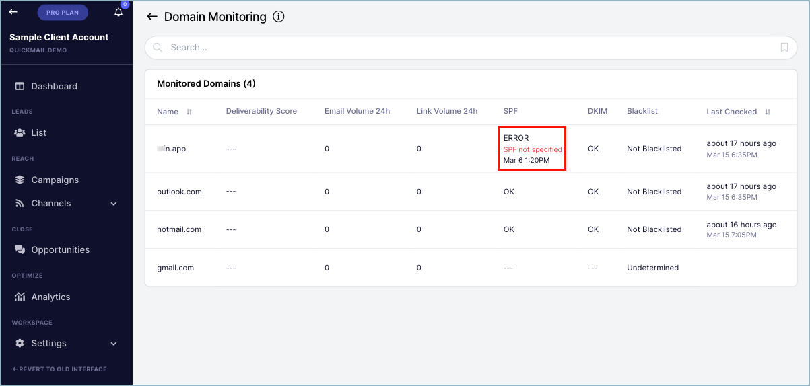

# Blacklist & Domain Health Monitoring

**In this article:**

- What is the Domain Health Monitor?

- Why monitor Domain Heath?

- Where to find the Domain Health Monitor?

- How to read the Domain Health Monitor?

# What is the Domain Health Monitor?

This is the section where the current status of the domain authentication and Blacklist monitoring can be found.

# Why monitor Domain Heath?

Domain health has a direct impact on email deliverability.

Poor authentication or being Blacklisted is an indicator of deliverability issues. Email could potentially be landing in spam boxes and corrective actions are needed.

# Where to find the Domain Health Monitor?

The domain health monitor is found in Channels → Email → Menu → Domains

# How to read the Domain Health Monitor

The domain health monitor is composed of 8 sections:

- **Name: **Shows the domain name

- **Deliverability Score:** The score assigned from the Warm-up emails using the [MailFlow.io](http://MailFlow.io) integration

- **Email Volume 24h:** How many emails have been sent in the last 24 hours

- **Link Volume 24h:** How many links have been sent in the last 24 hours

- **SPF: **SPF record test results

- **DKIM:** DKIM records test results

- **Blacklist:** Blacklist monitoring results

- **Last Checked: **The time since the last domain health check

