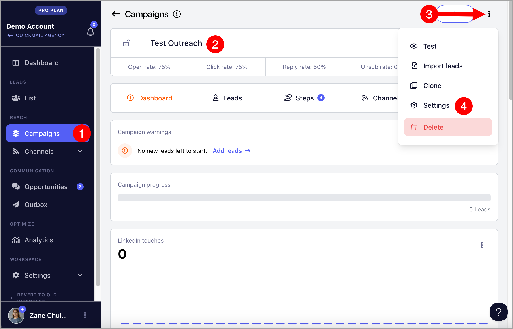
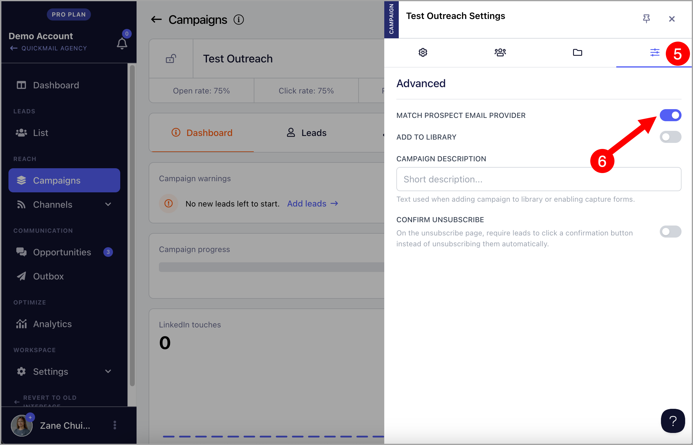

# Matching Email Service Provider

## Why use this feature?

Matching an Email Service Provider (ESP) allows users to automatically send emails from inboxes within the recipient’s provider, improving deliverability. This reduces the risk of emails being marked as spam and helps maintain a strong sender reputation. With features like automatic delivery optimization and dedicated IPs, emails are more likely to reach inboxes, enhancing communication and engagement.

## How it works?

In QuickMail, leads are automatically assigned to inboxes when they start a campaign. This ensures that all follow-up emails come from the same email address for consistency. When the "Match Email Service Provider" feature is enabled, leads are only assigned to inboxes that use the same email provider as the lead. As a result, if the leads and inboxes belong to different email providers, the distribution may be uneven, meaning some inboxes may send more emails than the others.

**Important:** This feature will only apply to new leads added to the campaign. Existing leads won't be affected.

## How to use this feature?

To enable this feature, go to the Campaign → Menu → Settings

After that, go to the Advanced tab (4th tab) → Match prospect email provider

