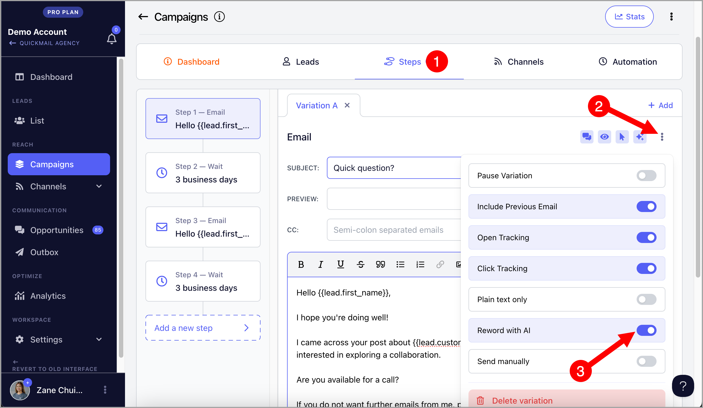
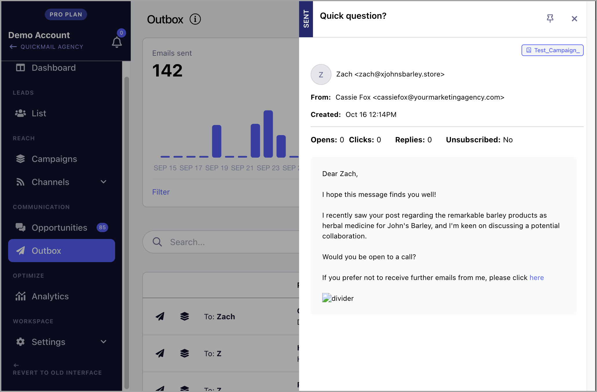
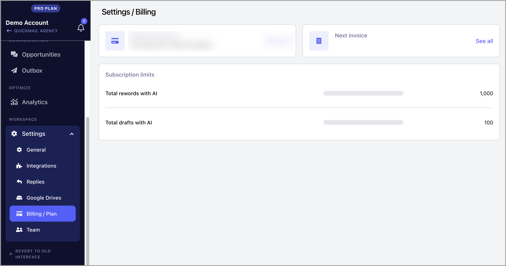

# Rewording with AI ✨

In this article:
- Why use Reword with AI?

- How does it work?

- How to use it?

- How much does it cost?

- Handling common errors

## Why use Reword with AI?

Email providers may flag emails as spam if you're sending identical copies repeatedly. By using Reword with AI to automatically rephrase your emails, you can reduce the risk of getting flagged. This makes your sending activity appear less spammy and more personalized, helping you maintain a strong sender reputation. AI employs advanced language techniques to create varied content while keeping your message clear, ensuring that you reach your audience without interruption.

## How does it work?

Rewording with AI generates varied content based on the original text you provided in an email step. It automatically rephrases the emails sent, while keeping the original copy in the email steps unchanged.

Each month, you have a set amount of AI credits available for rewording your emails. These credits refresh monthly, so you can continue using the feature as needed. If you need more credits, please check info here.

## How to use it?

**Step 1** . Go to the email step in the campaign you'd like to reword and enable "Reword with AI."

If you'd like to reword all email steps, this feature must be enabled in each email step.

**Step 2.** Start the campaign to send emails. Sent emails will be automatically reworded by AI, while the text in the email step remains unchanged.

**Tip:** You can check the Outbox page to see what the sent emails look like.

## How much does it cost?

Every account, regardless of your plan, receives free 1,000 Reword with AI credits each month. These credits reset automatically, providing you with a fresh set every month.

If you need to add more credits, it costs $10/mo per additional 10,000 credits monthly. Please contact [support@quickmail.io](mailto:support@quickmail.io) for us to configure your subscription.

**Note:** For users who added an OpenAI key before January 6, 2025, your OpenAI credits will be automatically used when you use Reword with AI. If there are no OpenAI credits available, the system will automatically use your monthly credits instead.

You can view the remaining credits in your subscription by going to the Billing/Plan section of your workspace or agency.

## Handing Common Errors

The lead will run into an error if we encounter problems with OpenAI. Here are some common errors and how to fix them.

OpenAI Error: Timed out reading data from server
This error could happen if the email size is too long.

**Solution:** Shorten the emails or remove some images.

OpenAI Error: 429 Too many request
This error could happen if the OpenAI account you're using doesn't have enough API credits.

**Solution: **Go to your [Open.AI](https://platform.openai.com/settings/organization/billing/overview)'s billing page and ensure you have a credit balance to use the API.
