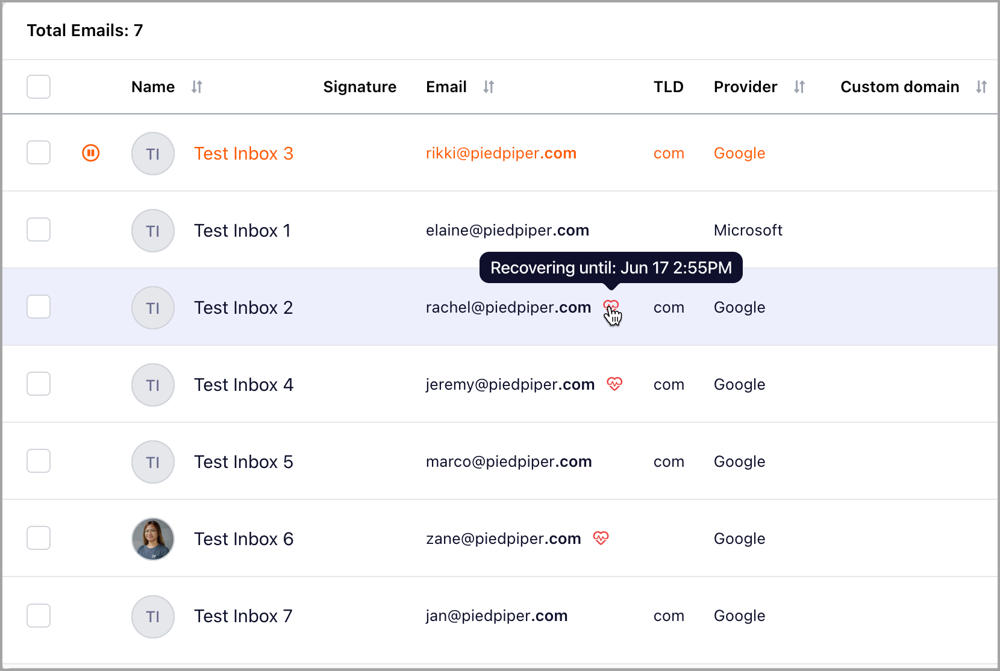
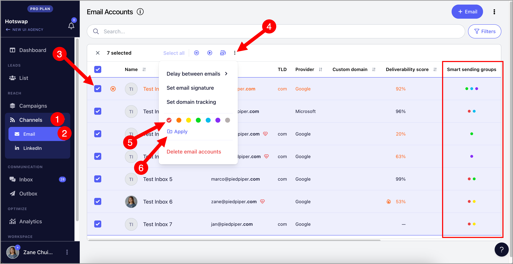
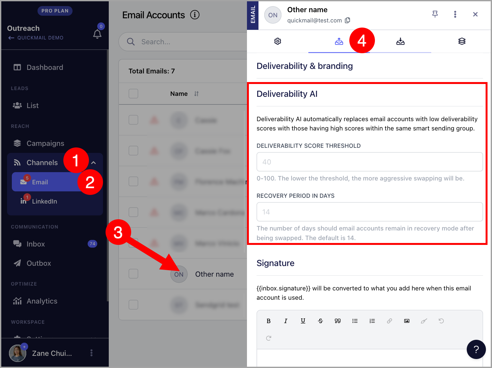

# Deliverability AI

- What is Deliverability AI?

- What is Smart Sending Group?

- How does Deliverability AI work?

- How are Deliverability Scores generated?

- What happens when email accounts get swapped out?

- How to assign email accounts to Smart Sending Groups?

- How to remove email accounts from Smart Sending Groups?

- When does the system swap inboxes?

- How to change Deliverability AI thresholds?

# What is Deliverability AI?

Deliverability AI is a feature that automatically swaps email accounts with low deliverability scores in a campaign with ones that have high deliverability scores within the same smart sending group. This ensures the success of your campaigns by sending only from emails with good deliverability

# What is Smart Sending Group?

A Smart Sending Group consists of email accounts that can be swapped in or out in a campaign. Users can assign email accounts to up to 7 Smart Sending Groups based on the colors: Red, Orange, Yellow, Green, Blue, Purple, Gray

# How does Deliverability AI work?

To use Deliverability AI, your email accounts must first be assigned to a smart sending group. Once they're assigned, the system checks them every day and swaps out any email account that falls below the [Deliverability Index](https://help.quickmail.com/deliverability/deliverability-index/).

By default, an email account is swapped out if its deliverability score drops below 60% or if it has lost permission. It will be replaced with another email account from the same smart sending group that has a score of 60% or higher. If there's no qualified email account available in that group, the original email account will stay assigned to the campaign.

To change the threshold, see the How to change the deliverability score threshold section below.

**Note:** Open tracking needs to be enabled for the Deliverability AI to work.

Paused email accounts won't be swapped

# How are Deliverability Scores generated?

Thedeliverability index is based on the number of detected opens from the email account and the Mailflow confidence score within the past ten days. The deliverability score will not appear if the email volume sent from QuickMail is too low or if the inbox has been sending emails for less than 10 days.

# What happens when the email accounts get swapped out?

When the email account gets swapped out, it gets unassigned from the campaign and will enter a 14-day recovery mode. This means no emails to new leads will be sent, but it may still send follow up emails.

A heart icon will appear beside the email account indicating that it has been swapped out and is in recovery mode.

If you would like to change the length of the recovery period, see How to adjust recovery days

**Tip:** If you would like to use the email account that has been swapped out, simply re-assign it to the campaign and remove it from a Smart Sending Group to prevent it from being swapped out again. When this happens, the email account will be removed from recovery mode.

# How to assign email accounts to Smart Sending Groups?

To assign email accounts to smart sending groups, navigate to Email page and select your preferred email accounts. Then, click on the three horizontal dots and click the color of your preferred smart sending group. Once a check icon appears, hit "Apply".

The color will appear afterwards in the Smart sending groups column.

# How to remove email accounts from Smart Sending Groups?

To remove email accounts to smart sending groups, navigate to the Email page and select your preferred email accounts. Then, click on the three horizontal dots and click the color of your preferred smart sending group twice. Once an X icon appears, hit "Apply".

The color will disappear afterwards in the Smart sending groups column.

# When does the system swap inboxes?

The system performs daily checks at midnight in your account's timezone.

**Tip:** If you would like to change or check the account timezone, check out this guide: Account Timezones

# How to change deliverability score threshold and recovery period?

To change the deliverability score threshold and recovery period, go to the Email page and click on the email account to open settings. Under the Sending Settings, look for Deliverability AI.

