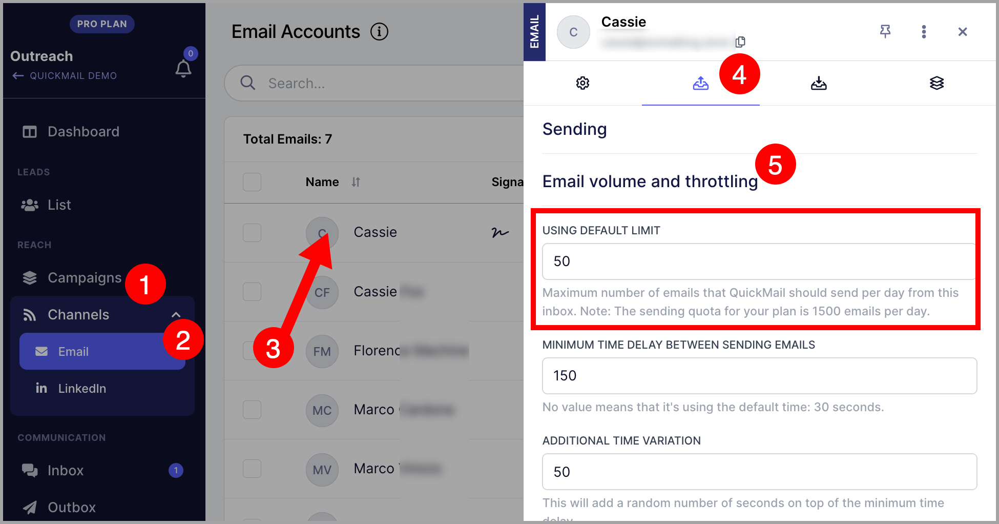
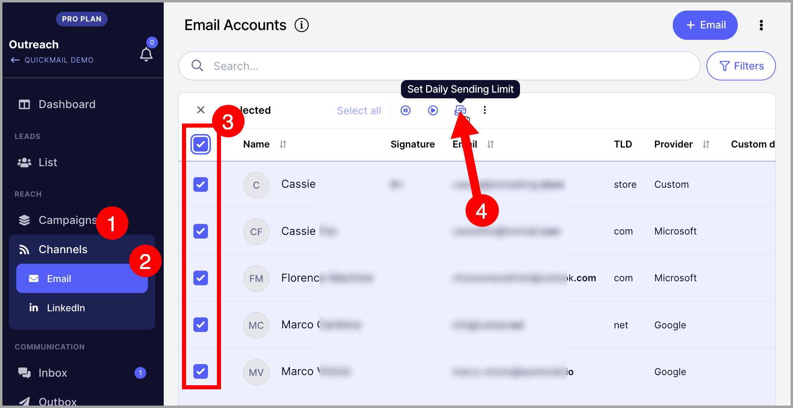
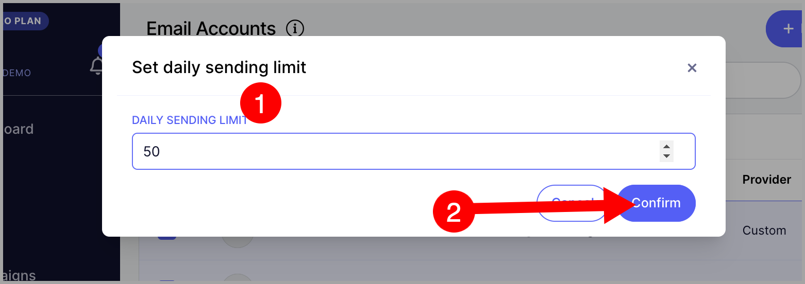
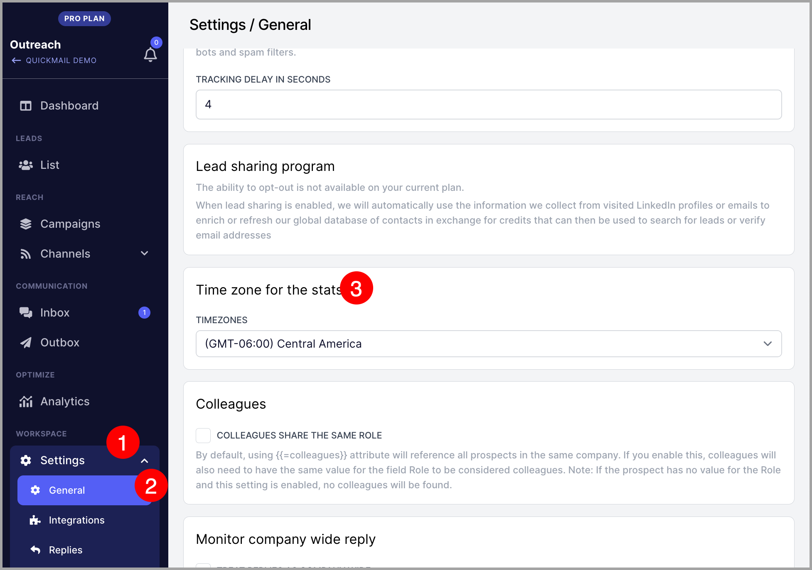

# Setting Daily Sending Limit

### In this article:

- Why limit daily email sends?

- How does the daily sending limiter work?

- How to set it up for each email?

- How to set it up for multiple emails?

# Why limit daily email sends?

The email limiter allows you to easily control how many emails are going out from an inbox.

By using the email limiter, you can easily do the following:

- **Increase and decrease the volume of emails when warming up an inbox**
If the inbox is new, it is recommended that the inbox gets warmed up to build a good sender reputation.
As the inbox establishes a good sender reputation, the inbox can gradually increase its sending volume.
Being able to adjust the email limit makes it easier to upscale and downscale the volume of emails being sent from an inbox.

- **Control how the campaign volume can be spread out to multiple inboxes**
Depending on the inbox reputation, some inboxes can send around 200 emails and some can only send 20.
When running a campaign using multiple inboxes, setting the daily email limit makes it's easy to
set how many emails an inbox can send from a campaign.

- **Avoid QuickMail from using up all your daily email limit**
Email service providers put email limits in place to avoid the abuse of their systems.
If you've used up all your daily email limit in QuickMail,
you won't be able to send manual emails and follow-ups outside QuickMail.

**Note: If you need to control the times and days a campaign can send emails, you can use send times. If you need to control the number of leads starting the campaign daily, you can use send times and triggers respectively. Here's a **video guide** on that.**

# How does the daily sending limiter work?

The email limiter will set how many emails can go out from an email within the day.

# How to set it up for each email?

To set up the email limiter in each email, go to Channels → Email → click the email you want to set the email limiter → Sending → Scroll down → Maximum number of emails that QuickMail should send per day from this inbox.

# How to set it up for multiple emails?

To set up the email limiter in multiple inboxes, from email channels, select all emails -> Set Daily Sending Limit.

Then, input the limit and click confirm.

**Note: The daily email limiter resets every midnight of the account's timezone. To check the account timezone, go to the general settings.**

