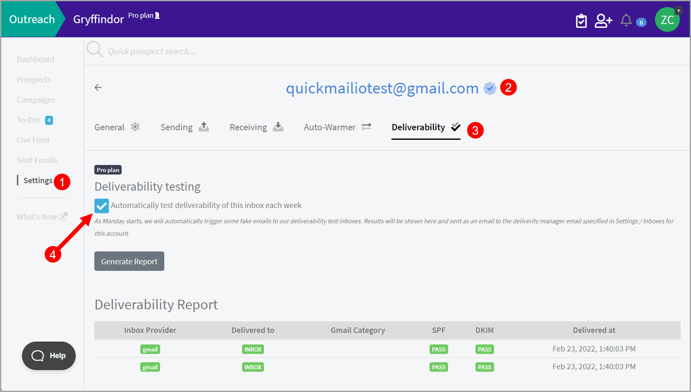
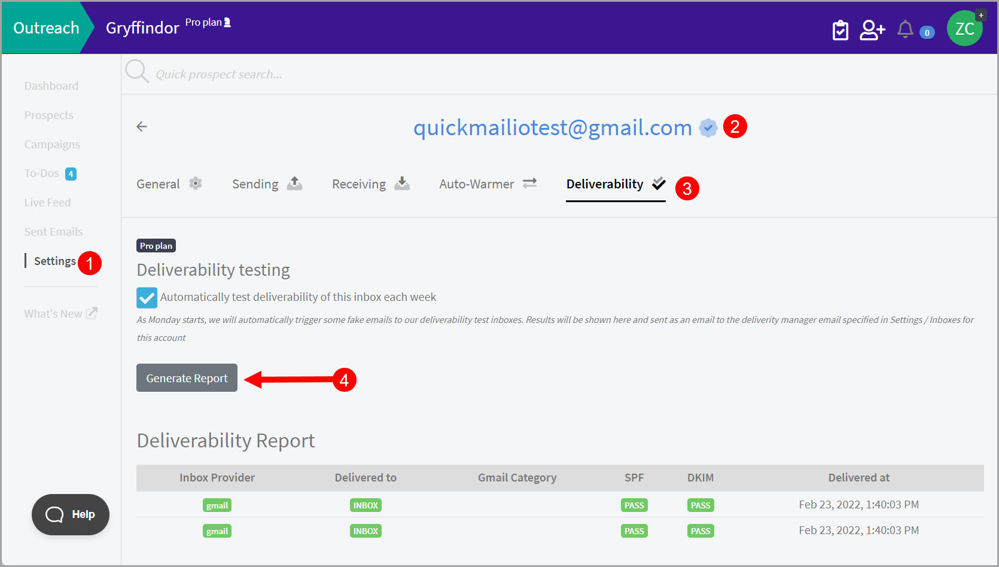

# Understanding the Deliverability Report

Note: Deliverability report is not yet on the new UI. To access it, please go to the old UI by changing your workspace link to account.

For example:

https://next.quickmail.com/workspace/1234567890

https://next.quickmail.com/account/1234567890

Please use the old UI only for deliverability report to avoid any confusion.

## Why keep track of the Deliverability Report?

The deliverability report gives you a sense as to where the emails coming from an inbox are landing (inbox, spam, promotions).

It also shows whether your SPF and DKIM records are updated.

Knowing where your emails are landing can help you quickly rule out deliverability issues and solve them.

## How does it work?

If the deliverability testing is on, QuickMail will automatically send occasional test emails from the inbox connected to the QuickMail account to the inboxes that we own and monitor.

These deliverability testings take place after the inbox has been added, and then at the beginning of the week going forward.

In the Sent Items in your Inbox, you may see messages that you don't recognize, sent to people you've never heard of.

Don't panic because if the recipients and email subjects of the messages are any of the following,

your account is not compromised. It's just us testing the deliverability of your inbox.

Here are some examples of the names of the recipients of those messages:

** Everlyne**

** Everlyne Green**

** Richard**

** Richard Hendricks**

** noreply**

** qmnorep**

Here are some examples of subject lines for those messages:

** Coffee next Monday?**

** Meeting Next Wednesday?**

** Hi from (yourname)**

** Everlyne Green / (yourname)**

*** Quick question Everlyne Green?**

## How to receive a weekly Deliverability Report?

We can automatically generate a weekly Deliverability Report for your inboxes and send it to you via email.

To receive a weekly deliverability report for a specific inbox, go to Settings -> Inboxes -> Select an Inbox -> Deliverability Tab -> Check the box 'Automatically test deliverability of this inbox each week'

## How to manually generate a Deliverability Report?

You can manually generate a deliverability report for a specific inbox at any time.

To do that, go to Settings -> Inboxes -> Select an Inbox -> Deliverability Tab -> Generate Report

**Note: It may take up to 30 minutes for the deliverability report to generate.**

## Analyzing the Deliverability Report

#### SPF

If the SPF test fails, this means that there is something wrong with the inbox' SPF. To fix this, you may check [MxToolbox](https://mxtoolbox.com/) to see what's causing the error in the SPF.

These are the usual SPF errors and how to fix them:

- Multiple SPFs - Having Multiple SPF is not allowed. To fix it, delete the other SPF records or merged them into one SPF record.

- SPF Deprecated - SPF or RR DNS type of SPF has been discontinued in 2014. To fix this, Change the SPF record to TXT DNS type.

- Wrong SPF syntax - If your inbox is from Google or Outlook, you may follow this guide on how to correctly set up the SPF records: SPF, DKIM, and DMARC records. However, if they are from a different email provider, you may search for a help article or contact your email provider.

#### DKIM

We only test DKIM for one email provider each time a deliverability report is generated. So, it's normal to see DKIM in yellow (Skipping test)

#### Delivered-to: Inbox

If the deliverability test email that we sent to our monitor inbox successfully lands in the inbox, the deliverability result will show it was delivered to Inbox.

This is a good indication that your email will likely land in the inbox of a specific email provider.

#### Delivered-to: Spam

If the deliverability test email that we sent to our monitor inbox lands in spam, the deliverability result will show it was delivered to Spam. It's normal for emails from new inboxes to land in Spam especially if the recipient is an Outlook inbox.

####

## How can I improve the deliverability of my inbox?

There are several reasons why emails land in spam. It could be because of the volume of emails sent from the inbox, the content of the email, the tenure of the inbox, or how the DNS record of the inbox is configured.

For Starters, these blog articles might come in handy in improving the deliverability of your inbox:

- [Ultimate Guide to Cold Email Deliverability (2022)](https://quickmail.com/cold-email-deliverability)

- [The Ultimate Cold Email Checklist](https://quickmail.com/checklist)

- [Cold Email: The Definitive Guide For 2022](https://quickmail.com/cold-email)
