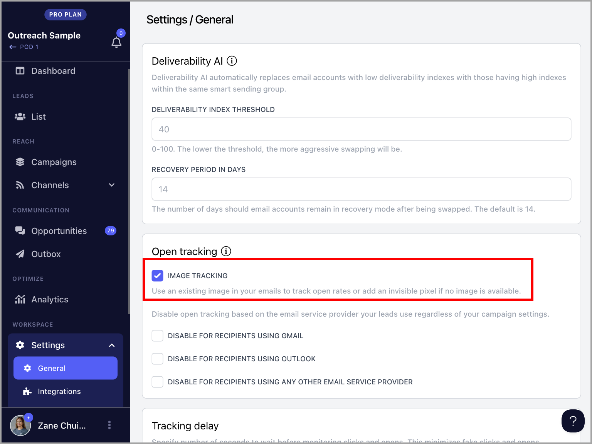

# Visible Image Tracking

In addition to the ability to disable open tracking based on email provider, QuickMail now offers Visible Image Tracking, which allows open tracking to be based on the images included in your emails rather than invisible pixels. This helps prevent emails from being flagged for open tracking.

This update responds to Gmail flagging emails with hidden images, including tiny pixels used for open tracking in cold outreach. Recipients see a banner stating "Images in this message are hidden," along with a prominent "Report spam" button, which can decrease reply rates and increase spam reports.

**In this article:**

- How does it work?

- How to set it up?

## How Does It Work?

By default, QuickMail inserts a tiny invisible tracking pixel into your emails. When the recipient opens the email, this pixel loads to signal that the email has been read.

With Visible Image Tracking enabled, any visible images you include in your emails will be used for open tracking instead, helping prevent the email from being flagged.

If no image is included, a tiny transparent dot will be inserted at the bottom of the email. While invisible to the eye, it remains detectable in the HTML code, which prevents the warning banner from appearing for recipients.

**Important:** Visible Image Tracking only works for linked images — images added via an image URL. It does not work for embedded or directly uploaded images.

## How to Set It Up?

Go to workspace **Settings** → **General** → check the box labeled **Image Tracking**. Once enabled, the feature takes effect immediately.

