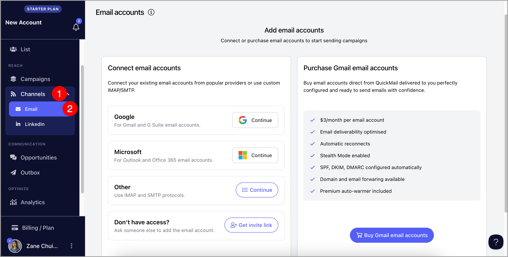

# Adding Email Accounts for Sending

**In this article:**

- Why add an email account?

- How to add an email account?

- I have access to the email account

- I don't have access to the email account

- I'm having difficulties adding an inbox, what should I do?

-

**Important:** Adding email accounts for sending is different than adding team members to your account. For step-by-step guidance on adding team members, check out this guide.

# Why add an email account?

In QuickMail, we don’t provide servers or IPs for sending emails. To use QuickMail, you’ll need an email account that can both send and receive messages.

If you don't have inboxes for sending yet, we sell Google emails.

Here's a detailed guide on that: Buying Gmail Accounts & Domains Through QuickMail.

**Tip:** Email deliverability depends on the sender reputation of your email accounts.

Here are some QuickMail features to improve deliverability: Maximizing Email Deliverability in QuickMail

# How to add an email account?

To get started, go to Channels → Email

## Option 1: If you have access to the email account

- ### Gmail & Outlook

You can directly log in to your inbox to add it to QuickMail.

- ### Custom

If you're not using Gmail or Outlook, you can still use QuickMail with all other email addresses, as long as they support secure SMTP and IMAP connection

**Note:** It's not possible to add an email account with SMTP alone

To add a custom email, please get the SMTP and IMAP credentials from your email service provider.

Here are some known custom inbox providers and help articles on how to get their SMTP and IMAP credentials:

- Zoho [SMTP](https://www.zoho.com/mail/help/zoho-smtp.html) & [IMAP](https://www.zoho.com/mail/help/imap-access.html)

- [Siteground](https://world.siteground.com/kb/how_to_configure_my_mail_client/)

- [Namecheap](https://www.namecheap.com/support/knowledgebase/article.aspx/1179/2175/general-private-email-configuration-for-mail-clients-and-mobile-devices/)

- [GoDaddy](https://ph.godaddy.com/help/server-and-port-settings-for-workspace-email-6949)

Some things to note when adding a custom email:

- Make sure that IMAP and SMTP are turned on for the email address and credentials are correct

- Make sure that your ESP supports a secure connection because we don't support non-secure connections

- Avoid setting up 2FA as that might stop us from checking the inbox so it won't get added to QuickMail.

- Check if your subscription supports IMAP access

**Note:** Custom email addresses can be tricky to set up because they have varying configurations. To get the best help if you're getting errors, please contact your email service provider.

## Option 2: f you don't have access to the inbox

- If you're working with a client and you don't have access to their email account, you can generate an invite to the client.

To generate an invite link, click "I don't have access to the inbox" → Click "Copy link to clipboard" → Provide the link to your client

## Option 3: If you don't have an inbox for sending emails yet

# I'm having difficulties adding an inbox, what should I do

- Email already exists
An email address can only be added to one account at a time. It could be that the email address is added to an expired account.

To solve this, please contact [support@quickmail.io](mailto:support@quickmail.io) and provide the email address so we can delete it from a different account.

- It keeps adding the wrong Outlook inbox
When adding a Microsoft account, it automatically loads whichever email account is logged into your browser.

There are several ways to fix this:

- Log out all your email addresses in [Outlook.com](http://Outlook.com) or [Microsoft.com](http://Microsoft.com)

- Generate an invite link and open it in an incognito window. Since incognito windows don't have any data, instead of loading any email account, you will need to enter the correct email and password.

- Temporarily use a different browser

**Note:** Custom email addresses can cause different errors. To troubleshoot them, please go to this article. If you can't find any of the errors on the list, please contact your email service provider.

# How many inboxes can I add?

The number of inboxes that can be added to an account depends on the account's plan.

Here's a detailed guide on our pricing to learn more about it: [https://quickmail.io/pricing/](https://quickmail.io/pricing/)

**Pro tip:** If you want to increase the volume of emails the account can send daily, the best way to go about it is to use multiple inboxes. Having multiple inboxes is a good way to spread out the volume of messages coming from a single campaign through Inbox Rotation.
