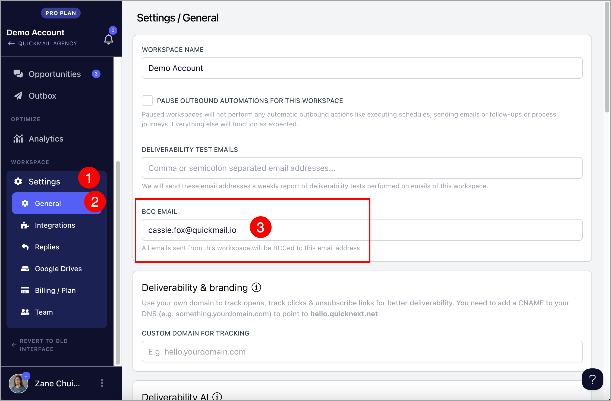

# Adding BCC and CC to Emails

**In this article:**

- What is it for?

- How to set up a BCC email?

  - Workspace level

  - Email account level

## What Is It For?

**BCC (blind carbon copy)** allows you to send copies of all outgoing emails in QuickMail to another address. This is commonly used to log emails in a CRM such as Salesforce or HubSpot.

**Warning:** Setting an address that is already added as an email account in QuickMail as a BCC will cause sent emails to be detected as campaign replies, which can mark all journeys as replied.

**CC (carbon copy)** allows you to visibly copy another person on your outgoing emails. Unlike BCC, the recipient can see who has been CC'd. This is useful when you want to:
- Loop in a colleague so they can follow the conversation (e.g., an account executive or manager)
- Copy a shared team inbox for visibility
- Include a partner or consultant who is involved in the outreach

## How to Set Up a BCC Email?

### Workspace Level

Setting a BCC email at the workspace level ensures it is included in every campaign, eliminating the need to apply it to each email account individually.

Go to **Settings** → **General** → under **BCC Email**, fill in the BCC Email field.

### Email Account Level

Setting a BCC email at the email account level adds the BCC address to all emails sent from that specific account. If the workspace has multiple email accounts, only the one with the BCC setting will include the BCC address.

Go to **Email** → click the email account → under **Sending Settings**, fill in the BCC Email field.

## How to Set Up a CC email?
In campaign steps, there is a CC field where you can add an email address directly. For multiple addresses, separate them with a comma.

If you want a different CC address for each lead, create a custom property for CC, assign the relevant email to each lead, then insert that custom property in the CC field.

Note: CC and BCC fields are not visible in the Outbox. 
To confirm they were added correctly, log into your email provider and scan the sent emails — avoid opening them to prevent false opens and clicks from being recorded.
