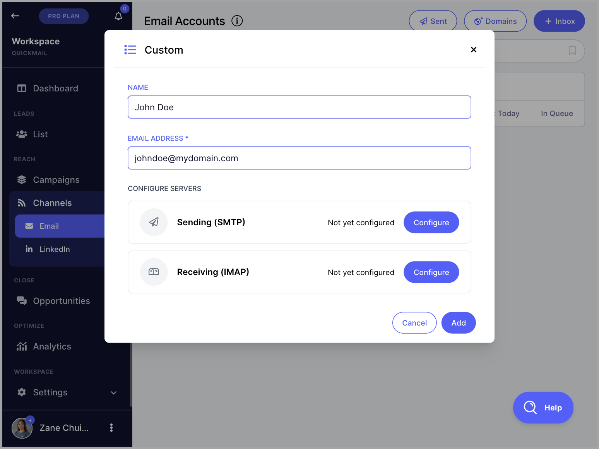

# Adding Email Accounts for Sending

**In this article:**

- Why add an email account?

- How to add an email account?

  - Option 1: I have access to the email account

  - Option 2: I don't have access to the email account

- I'm having difficulties adding an email account. What should I do?

- How many email accounts can I add?

- My email account keeps getting paused due to error 550 5.1.8. What does it mean?

**Important:** Adding email accounts for sending is different from adding team members to your account. For a step-by-step guide on adding team members, check out this guide.

## Why Add an Email Account?

QuickMail does not provide servers or IPs for sending emails. To use QuickMail, you will need an email account that can both send and receive messages.

If you do not have email accounts for sending yet, QuickMail sells Google email accounts. Here is a detailed guide: Buying Gmail Accounts & Domains Through QuickMail.

**Tip:** Email deliverability depends on the sender reputation of your email accounts. Here are some QuickMail features to help improve deliverability: Maximizing Email Deliverability in QuickMail.

## How to Add an Email Account?

Go to **Email**.

### Option 1: I Have Access to the Email Account

**Gmail and Outlook**

You can log in to your email account directly to add it to QuickMail.

**Custom**

If you are not using Gmail or Outlook, you can still use QuickMail with any email address that supports secure SMTP and IMAP connections.

**Note:** It is not possible to add an email account using SMTP alone.

To add a custom email, get the SMTP and IMAP credentials from your email service provider.

Here are some common custom email providers and guides on how to get their SMTP and IMAP credentials:

- Zoho: [SMTP](https://www.zoho.com/mail/help/zoho-smtp.html) & [IMAP](https://www.zoho.com/mail/help/imap-access.html)

- [Siteground](https://world.siteground.com/kb/how_to_configure_my_mail_client/)

- [Namecheap](https://www.namecheap.com/support/knowledgebase/article.aspx/1179/2175/general-private-email-configuration-for-mail-clients-and-mobile-devices/)

- [GoDaddy](https://ph.godaddy.com/help/server-and-port-settings-for-workspace-email-6949)

Things to keep in mind when adding a custom email:

- Make sure IMAP and SMTP are enabled for the email address and that the credentials are correct.

- Make sure your email service provider supports a secure connection, as non-secure connections are not supported.

- Avoid setting up 2FA, as it may prevent QuickMail from accessing the email account.

- Check whether your subscription plan includes IMAP access.

**Note:** Custom email addresses can be tricky to set up due to varying configurations. If you encounter errors, contact your email service provider for assistance.

**Bulk adding custom emails via CSV**

You can bulk add custom emails using a CSV file with the following headers (one value per column):

- SMTP host / port / username / password or API key (from your email service provider)

- IMAP host / port / username / password (from your mailbox provider)

- Inbox name

### Option 2: I Don't Have Access to the Email Account

If you are working with a client and do not have access to their email account, you can generate an invite link for them.

To generate an invite link, click **I don't have access to the inbox** → **Copy link to clipboard** → send the link to your client.

## I'm Having Difficulties Adding an Email Account. What Should I Do?

**Email already exists**

An email address can only be added to one account at a time. If you are seeing this error, the email address may already be associated with an expired account.

To resolve this, contact [support@quickmail.io](mailto:support@quickmail.io) and provide the email address so it can be removed from the other account.

**It keeps adding the wrong Outlook email account**

When adding a Microsoft account, QuickMail automatically loads whichever email account is currently logged in to your browser. To fix this, try one of the following:

- Log out of all email addresses in [Outlook.com](http://Outlook.com) or [Microsoft.com](http://Microsoft.com).

- Generate an invite link and open it in an incognito window. Since incognito windows have no saved session data, you will be prompted to enter the correct email and password manually.

- Temporarily use a different browser.

**Note:** Custom email addresses can produce a variety of errors. For troubleshooting, refer to this article. If your error is not listed, contact your email service provider.

## How Many Email Accounts Can I Add?

The number of email accounts you can add depends on your account plan. For a full breakdown, see our pricing guide: [https://quickmail.io/pricing/](https://quickmail.io/pricing/)

**Pro tip:** If you want to increase the daily email volume of your account, the most effective approach is to use multiple email accounts. This allows you to spread the sending volume across accounts through inbox rotation.

## My Email Account Keeps Getting Paused Due to Error 550 5.1.8. What Does It Mean?

The error code 550 5.1.8 (Access denied, bad outbound sender) indicates that Microsoft is flagging the email account's sending behavior and has temporarily blocked it.

When QuickMail detects these bounces, it automatically pauses the email account to prevent further bounces from occurring.

This issue is caused by Microsoft's actions, not by QuickMail, and is not related to invalid email addresses in your lead list. It can occur if the email account sends too many emails with identical content, has a low sender reputation, or appears to be sending spam.

To resolve this, contact Microsoft Support to request an unblock. If you have admin access, you can also follow this guide: Restore Restricted Users in Defender for Office 365.

Once the email account is unblocked by Microsoft, remember to unpause it in QuickMail.

To avoid future blocks, consider the following best practices:

- **Throttle email sending** — set a daily send limit and increase the delay between emails.

- **Use AI for variations** — add unique variations to your emails to improve deliverability.

- **Create text and email variations** — this makes it harder for email service providers to flag your content.

- **Avoid spam trigger words** — use tools like Mailmeteor's spam checker to review your email content.

- **Use custom domain tracking** — this can help maximize deliverability.

- **Verify emails** — regularly clean your lead list to remove invalid addresses.
