# Handling Replies with Opportunities

**In this article:**

- Why use Opportunities?

- What can I do with Opportunities?

- What are the types of Opportunities?

- Where can I find Opportunities?

- Responding to a lead's reply

- Selecting an email account to send from

- Marking replies as pending

- Marking replies as won or lost

- Snoozing and unsnoozing conversations

- Viewing or downloading the original email (EML)

- Categorizing replies

- Attaching files

- Completing a task

- Completing a call task

- Completing a draft

- Filtering Opportunities

- Assigning Opportunities to team members

- Opportunity reports

- Adding notes

- Exporting Opportunities

- Status bar

- Bulk actions

## Why Use Opportunities?

Opportunities keeps all lead replies from different campaigns and email accounts in one place, so you never miss a response. Each conversation is displayed as a single thread, making it easy to track the full history with a lead. You can also manage tasks, calls, and draft emails directly from the same view.

Opportunities also uses AI to summarize conversations, suggest responses, and categorize replies, helping you stay organized and focus on the leads that matter most.

**Note:** You can insert properties into your replies and they will render correctly.

## What Can I Do with Opportunities?

- Respond to, view, and manage email replies

- Respond to, view, and manage LinkedIn replies

- Complete tasks

- Complete call tasks and make calls via third-party phone dialers such as Aircall

- Edit and send drafts for manual emails

- Send attachments

## What Are the Types of Opportunities?

- Email replies (envelope icon)

- LinkedIn replies (LinkedIn icon in the lead's thumbnail)

- Accepted LinkedIn connection requests

- Tasks (clipboard icon)

- Call tasks (phone icon)

- Drafts (leaf icon)

- Sent emails (paper plane icon)

## Where Can I Find Opportunities?

Opportunities can be found on the **Opportunities** page or in a lead's quick view. Note that Opportunities will only appear in the quick view if there is an opportunity associated with that lead.

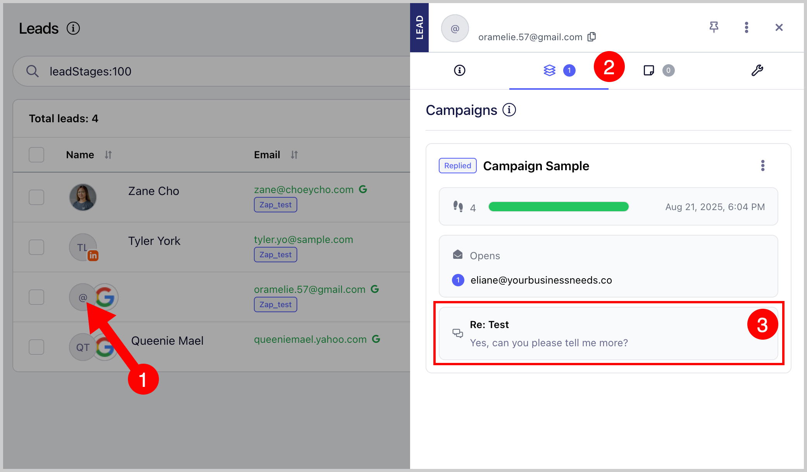

## Responding to a Lead's Reply

Replies displayed in bold are active items that need to be addressed. Opening a reply will not remove the bold formatting on its own.

To respond, click the message in the Opportunities list → click **Reply**.

Once you send your reply, the opportunity will automatically be marked as pending and will no longer appear in bold.

**Tip:** If you are having difficulty composing a reply or following a long email thread, Drafting Replies with AI may help.

**Note:** Replies sent via LinkedIn are not sent immediately. There is a 35-second delay before the message is sent. This is by design to handle temporary LinkedIn errors and prevent duplicate sends.

## Selecting an Email Account to Send From

To select which account to send from, choose one of the options in the **From** field.

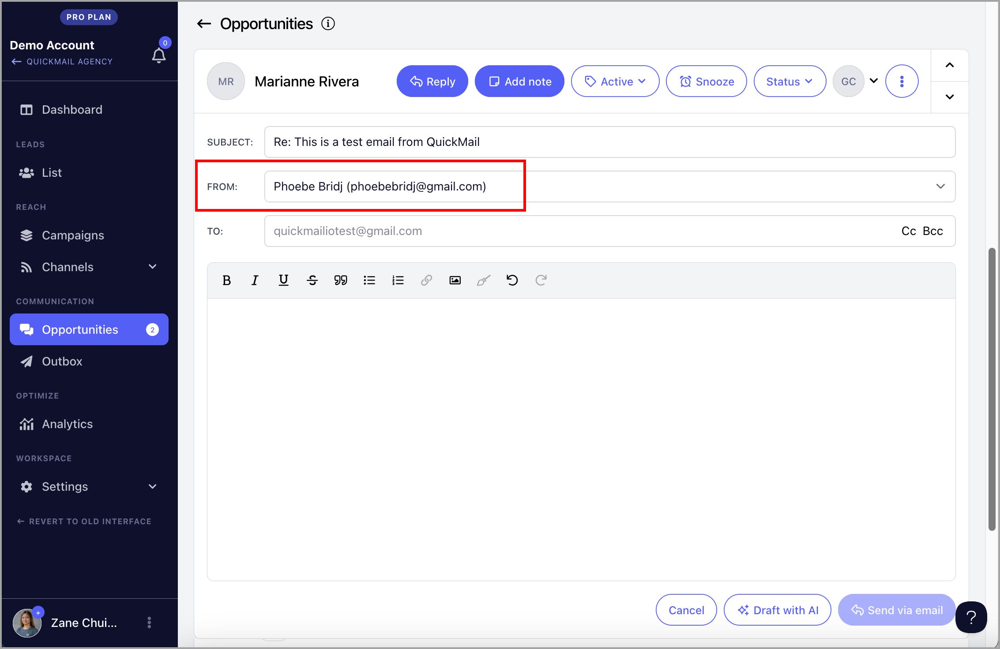

**Tip:** When an inbox is deleted, the lead replies from that inbox are not deleted. You can still reply to the lead using a different inbox.

## Marking Replies as Pending

Once you respond to an opportunity, it is automatically marked as pending and will no longer appear in bold.

To mark a conversation as pending without replying, open the reply in Opportunities → click the **Active** button → set to **Pending**.

This moves the conversation to the bottom of the list and removes the bold formatting, making it easier to differentiate active from pending replies.

## Marking Replies as Won or Lost

Replies can be marked as Won or Lost to help identify and close potential deals.

**Note:** Marking a reply as Won or Lost will automatically archive it. To view archived opportunities, use the filters.

To mark a reply as Won or Lost, open the reply in Opportunities → click the **Status** button → select **Won** or **Lost**.

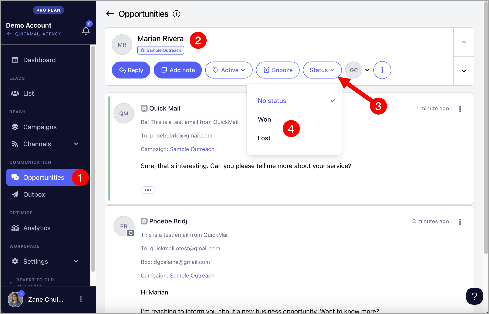

## Snoozing and Unsnoozing Conversations

If a reply does not need immediate attention, you can snooze it to focus on more urgent conversations.

**Note:** Snoozed replies will not appear in your list until the snooze ends or the lead sends another reply. To view snoozed opportunities, use the filters.

To snooze or unsnooze an opportunity, select the opportunity from the list → click the **Snooze** or **Unsnooze** button.

## Viewing or Downloading the Original Email (EML)

The Opportunities page displays a readable version of each email, including the subject and message content. You can also view or download the original email for additional details such as the email source, attachments, and other information not shown in the preview.

To do this, go to the opportunity → click the menu icon (vertical ellipsis) → select **Download** or **Show Original**.

## Categorizing Replies

Categorizing replies generates stats for positive and negative replies in the analytics. If you are on the Expert plan, replies will be categorized automatically.

To manually categorize a reply, go to the opportunity → click the menu icon (vertical ellipsis) → **Change Reply Type** → select a reply category.

**Note:** It is not yet possible to customize the available reply categories.

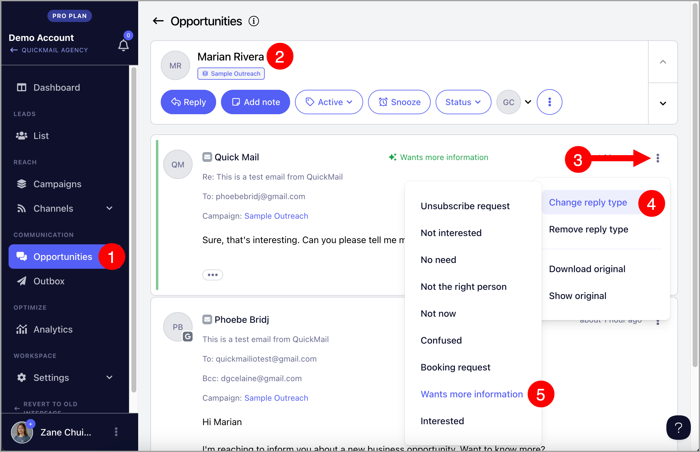

**Tip:** To learn more about AI Reply Categorization, check out this guide: Categorizing Replies with AI.

## Attaching Files

To attach a file to an opportunity, click the **Attach File** button in the reply editor.

## Completing a Task

Tasks are automatically generated when a lead reaches a task step. To complete a task, open the opportunity with the clipboard icon → click **Mark as Complete**.

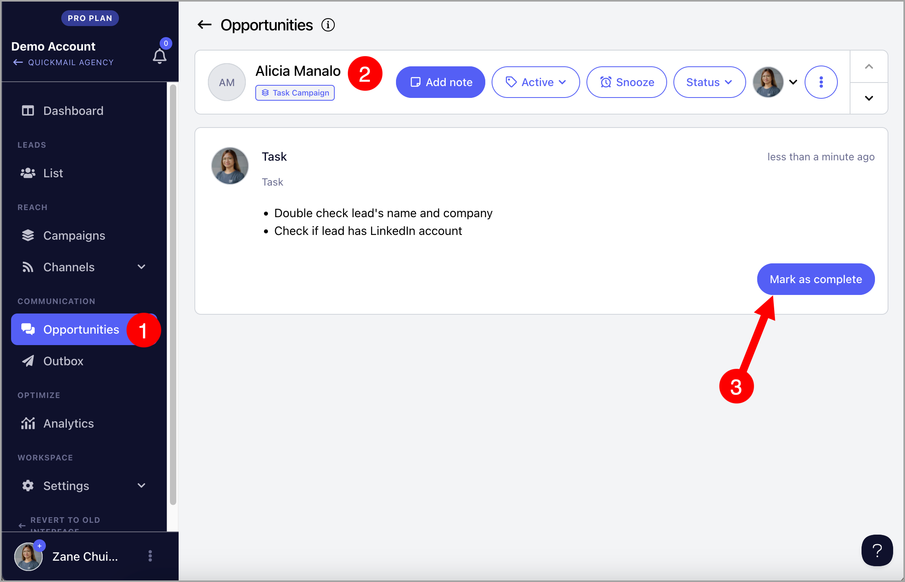

## Completing a Call Task

Call tasks are automatically generated when a lead reaches a call step. To complete a call task, open the opportunity with the phone icon → click **Mark as Complete**.

**Tip:** You can make calls from QuickMail as long as you have a phone dialer app installed on your computer. The lead must also have a phone number saved to their profile. For more information, check out this guide: Call Steps.

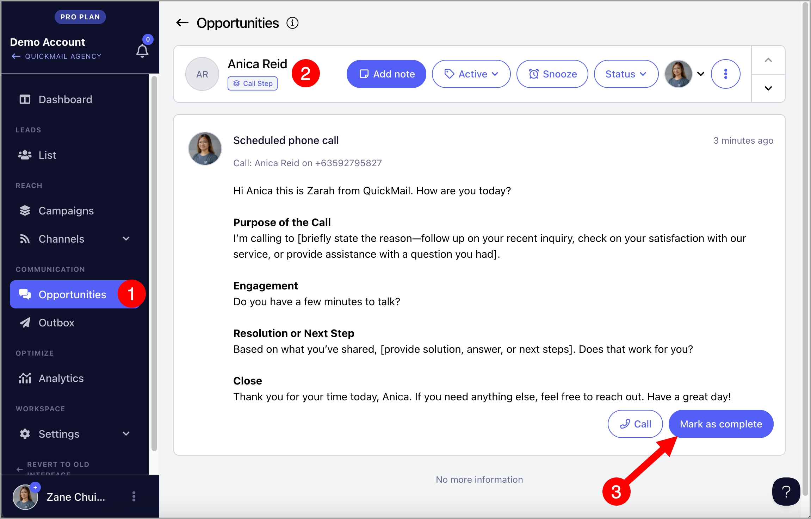

## Completing a Draft

If an email step is set to be sent manually, a draft will be generated. From Opportunities, you can view, edit, and send the draft.

To complete a draft, open the opportunity with the leaf icon → click **Mark as Complete**.

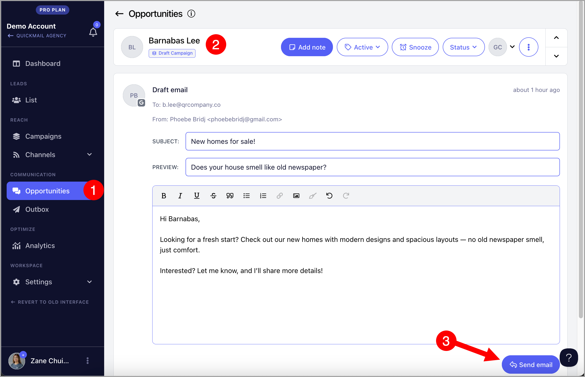

## Filtering Opportunities

Opportunities can be filtered to quickly find specific replies. Available filter criteria include:

- State (All, Active, Pending, Archived)

- Status (Won, Lost, Open)

- Snoozed

- Last updated

- Team member assigned

- Campaign

- Email account

- Type of task

- Incomplete or complete tasks

## Assigning Opportunities to Team Members

QuickMail automatically assigns replies to the owner of the inbox that received them. The team member who added the inbox becomes its owner by default.

Inboxes added via an invite link do not have an owner, so replies from those inboxes will appear under the **Unassigned** tab.

To automatically assign new opportunities from a specific inbox to a team member, go to **Channels** → **Email Accounts** → **Change Inbox Owner**.

To manually assign a team member to an existing opportunity, go to **Opportunities** → select the opportunity → assign a team member.

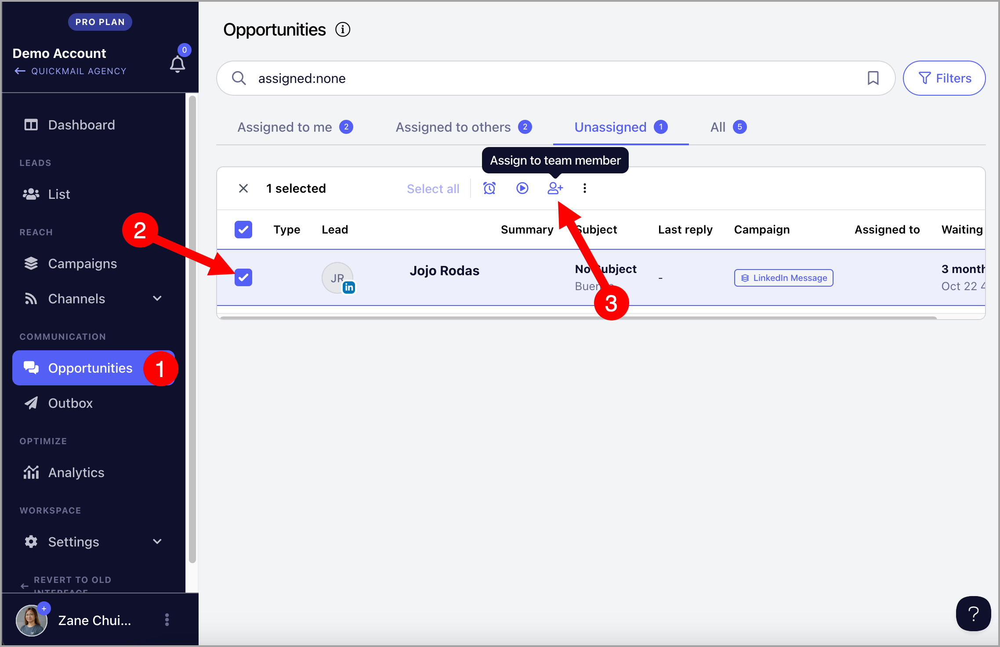

## Opportunity Reports

Replies are detected when QuickMail scans your email accounts for new responses. As a result, no email notifications are sent for new opportunities. To receive a daily summary instead, you can enable Opportunity Reports.

Enabling Opportunity Reports is currently only available in the old interface. If you are using the new interface, follow these steps:

**Step 1.** Get your workspace number from the URL. On the Opportunities page, the URL will look like this:

*https://next.quickmail.com/workspace/15/opportunities/list*

The number after `workspace/` is your workspace number (in this case, 15).

**Step 2.** Replace `XXX` in the URL below with your workspace number and open it in your browser:

`https://next.quickmail.com/account/XXX/settings/replies`

**Step 3.** Check the **Opportunity Reports** box → select the days and times you would like to receive reports → click **Update**.

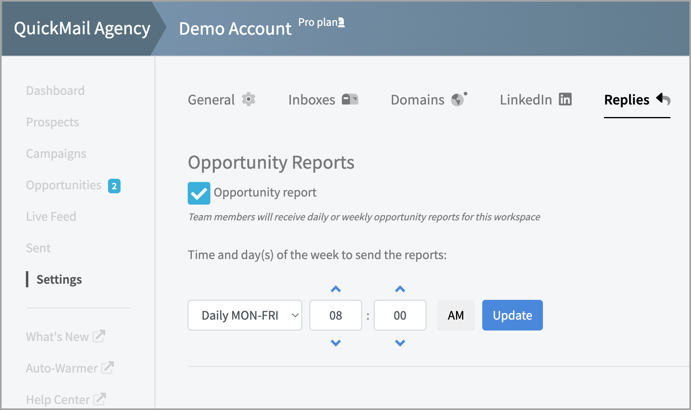

## Adding Notes

Notes are internal memos that can be added to any conversation. To add a note, open the conversation → click **Add Note**.

A text editor will open where you can write and format your note directly in the conversation thread.

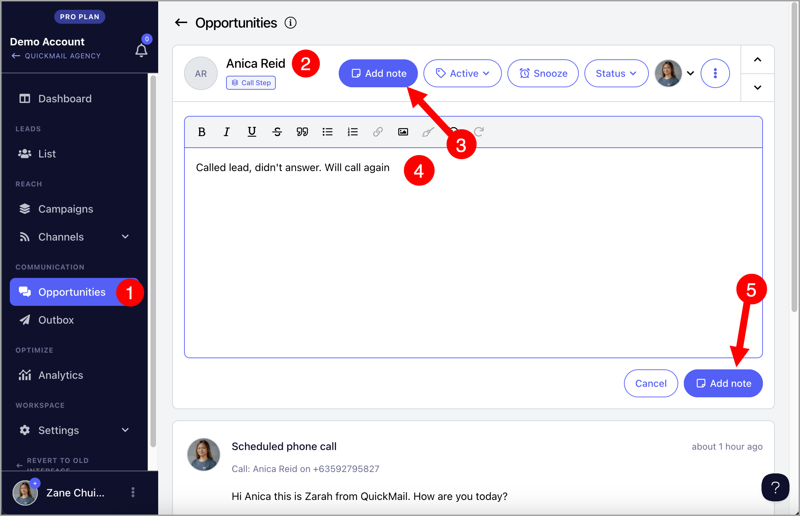

## Exporting Opportunities

Exporting allows you to download a CSV containing detailed information about your opportunities, including message history, sender and recipient addresses, and the date each message was received.

To export, go to **Opportunities** → select the opportunities you want to export → click **Export**.

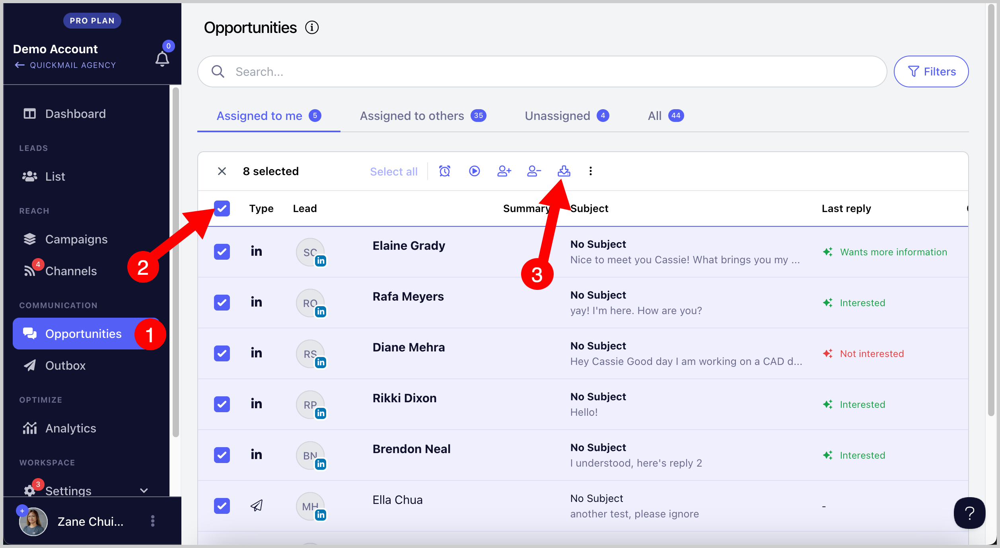

The CSV will be sent to the email address you use to log in.

## Status Bar

Whenever the status of an opportunity changes, the change is logged and displayed in a status bar at the top of the latest reply. This allows team members to see who has previously managed the opportunity and what actions were taken.

Status changes logged include: Active, Pending, Won, Lost, and reassignment to a different team member.

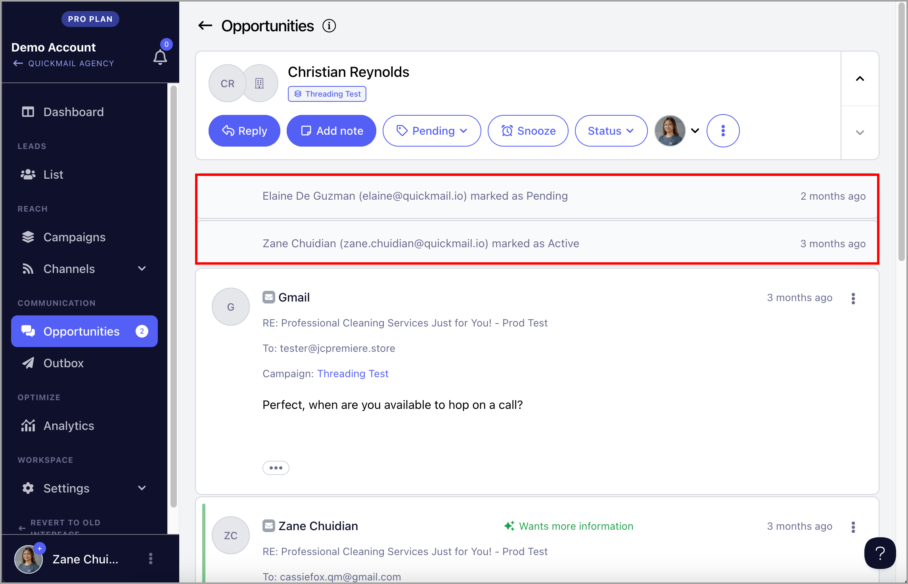

## Bulk Actions

Multiple opportunities can be managed in bulk. Available bulk actions include:

- Snoozing

- Unsnoozing

- Adding an assignee

- Removing an assignee

- Archiving

- Deleting

To use bulk actions, select multiple opportunities — one by one, by page, or all at once — then click the desired action.

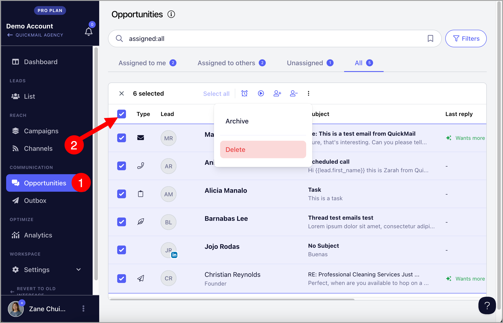
