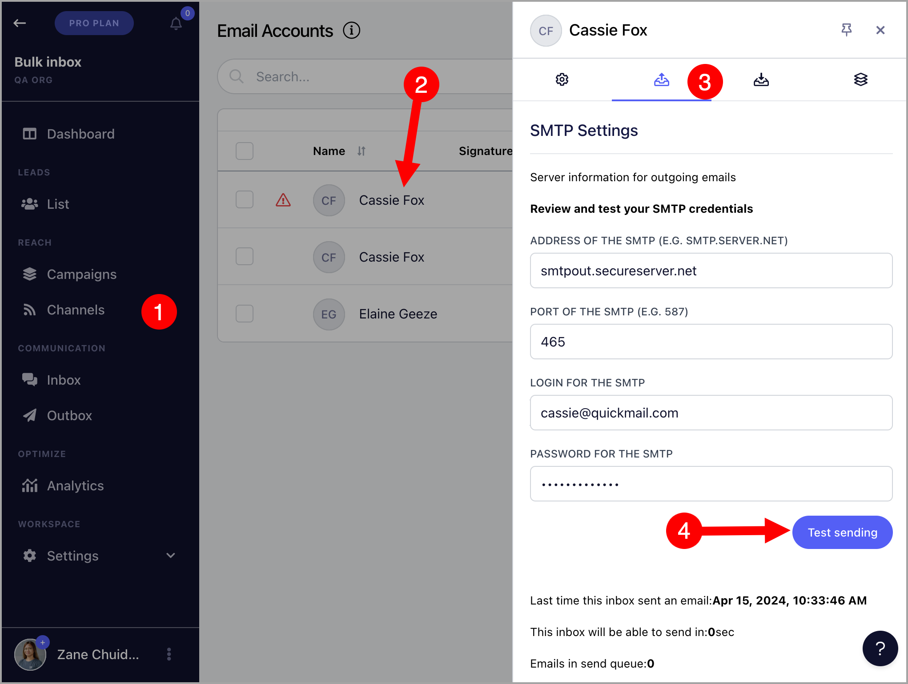
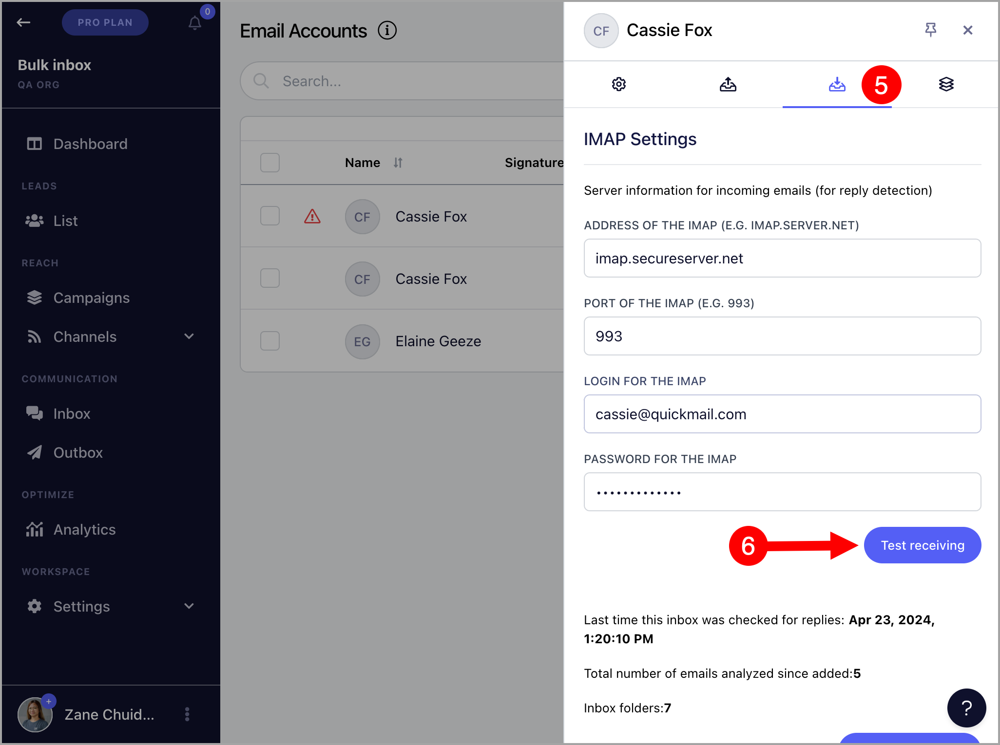
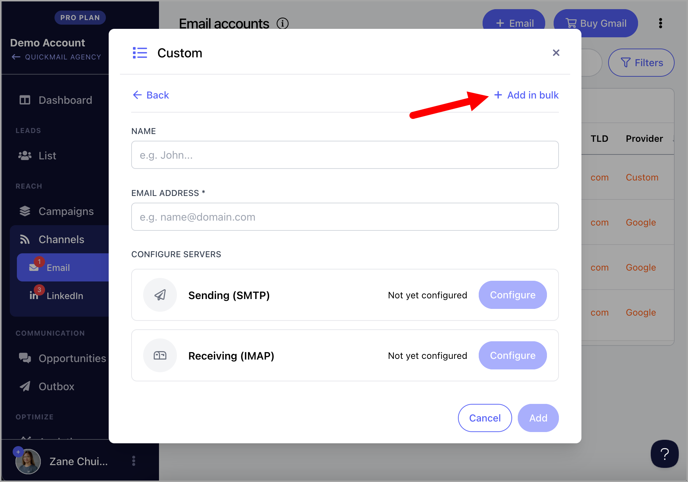

# Re-authenticating Email Accounts

QuickMail may lose access to your email account due to changes in the account's security settings, account cancellation, or a security check by the email provider. When this happens, no emails will be sent from the affected account, and replies and bounces will not be detected until the account is re-authenticated.

**In this article:**

- How to know if an email account lost authentication?

- How to re-authenticate email accounts?

  - Gmail and Outlook

  - Custom email accounts

## How to Know if an Email Account Lost Authentication?

If QuickMail loses access to your email account, you will receive an email notification identifying the affected account.

**Note:** The notification is sent to the account admin, the inbox owner in QuickMail, and the email account itself.

Here is an example of what the notification looks like:

A red indicator will also appear in the left-side navigation under **Channels**, and a warning icon will appear next to the affected email account.

## How to Re-authenticate Email Accounts?

**Note:** Once a disconnected email account is re-authenticated, all pending emails will be sent immediately.

### Gmail or Outlook

Re-authentication for Gmail and Outlook must be done individually. There is no option to re-authenticate multiple accounts in bulk.

Go to **Channels** → **Emails** → select the affected email account.

**Option 1: If you have access to the email account**

Click **Continue with Google** or **Continue with Microsoft** under **Re-grant Authorization**.

**Option 2: If you don't have access to the email account**

Generate and copy the shareable re-authentication link and provide it to the person who has access to the account.

### Custom Email Accounts

**Option 1: Re-authenticate individually**

Go to **Channels** → **Emails** → select the email account → **Sending Settings** → update the SMTP details if needed → click **Test Sending**.

Then go to **Receiving Settings** → update the IMAP details if needed → click **Test Receiving**.

**Option 2: Re-authenticate in bulk**

Prepare a list of the email addresses, passwords, SMTP settings, and IMAP settings for the accounts you need to re-authenticate. You can use this template: [Format for Bulk Re-authentication of Custom Inboxes](https://docs.google.com/spreadsheets/d/1uMcEfIRJ-I5Dbu1ioUguJ3t1OvWOPxMCcQzI9bLA2tQ/edit?gid=0#gid=0)

Once you have the CSV ready, go to **Channels** → **Email** → **+ Email** → **Other: Continue**.

Click **+ Add in Bulk**.

Map the correct columns.

Check the box **Update inbox if it exists**.

An import report will be sent to your email showing the status of each account. The red warning icon will no longer appear once the accounts have been successfully re-authenticated.

## Troubleshooting: 

If you are trying to reconnect multiple email accounts and the process keeps sending you back to the first email account, the problem is usually caused by your browser session, not by QuickMail.

This happens because Microsoft (or Google) remembers the account that is currently signed in through your browser. When you try to authenticate another inbox, the browser may automatically reuse the first logged-in account instead of allowing you to choose the correct one.

**Common causes include:**

Saved browser cookies or cache that store your previous login session.
Microsoft’s “Keep me signed in” option, which keeps your account active and automatically selects it during authentication.
Being logged into multiple Microsoft/Google accounts in the same browser window, which can confuse the login process.
Ways to fix it:

**Option 1: Use an incognito/private browser window**

Generate a new invite link in QuickMail to reauthenticate the email inbox.
Open the invite link in an incognito/private window (Chrome Incognito, Edge InPrivate, Safari Private Browsing).
Sign in with the correct email account.
Complete the authentication process.

**Option 2: Clear browser data**

Clear your browser’s cookies, cache, and history.
Close and reopen your browser.
Try reconnecting the email account again.

**Option 3: Sign out of your accounts first**

Go to Microsoft or Outlook and sign out of your accounts:
* Microsoft account sign-in
* Outlook webmail
* If using Google accounts, sign out from Google Account

Reopen the QuickMail authentication link and sign in only with the email account you want to reconnect.

In short: QuickMail is only sending the authentication request. The looping happens because the browser is automatically choosing the previously signed-in Microsoft/Google account. Using a fresh browser session usually resolves it.
