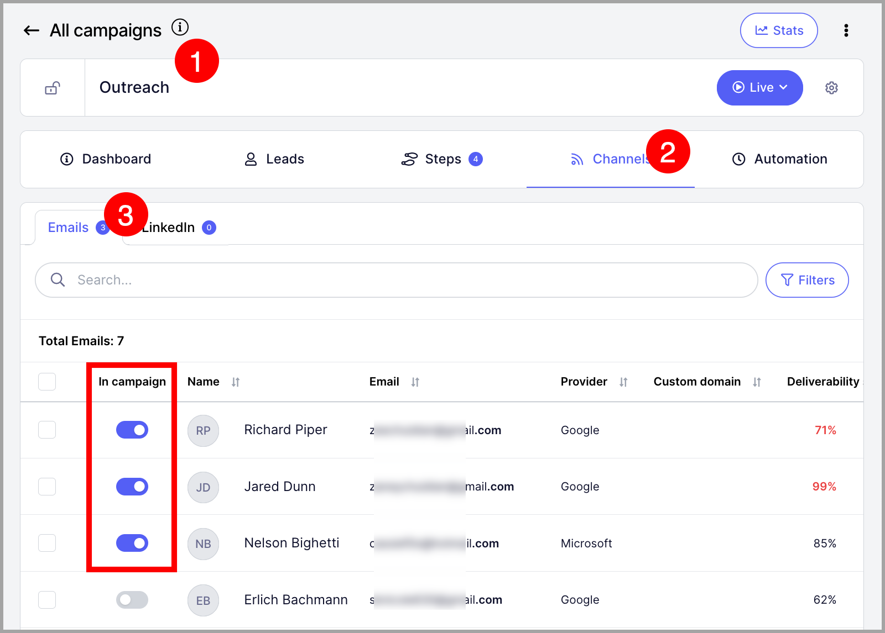
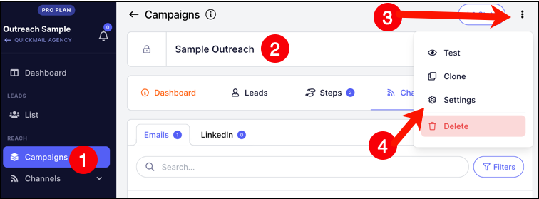
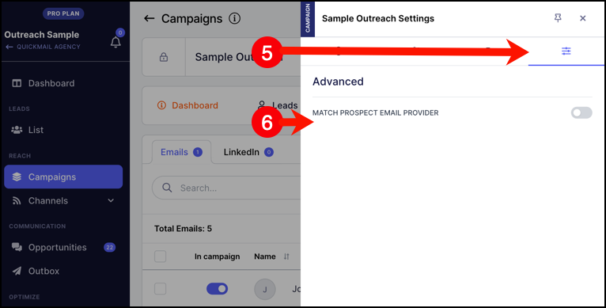

# Using Multiple Emails to Scale Campaigns (Inbox Rotation)

### In this article:

- Why rotate emails?

- How does it work?

- How to set it up?

- Match the lead's email provider

- How to remove the email from a campaign if its deliverability goes bad?

# Why rotate emails?

Email rotation is set up to increase the number of emails being sent from a campaign.

This is because the volume of emails coming from a campaign will be spread out to the emails assigned to it.

Emails are also rotated if a single campaign must be sent by multiple team members.

# How does it work?

When a lead starts the campaign, QuickMail will randomly choose which email the journey will be assigned.

The email that sends the initial email will be the same email that will send all the follow-up emails in the campaign.

Note: There's no option yet to set how many leads or which leads will be assigned to which emails.
# How to set it up?

If multiple emails are already added to the account, just go to the campaign channels. Under emails, toggle on emails that you want to send the campaign from.

**Note:** For a detailed guide on how to add an email for sending: Adding an email account for sending

# Match the lead's email provider

To further improve deliverability you can enable the option to match the lead's email provider.

This feature will identify the email provider for the leads and will match it if possible using the email accounts assigned to the campaign.

For example if the lead has their email service hosted in Google and you assign a Google email account to send from the campaign, that matching email account will be used to send. The same applies for Microsoft as a provider.

In cases where provider matching isn't possible, the journey will be automatically assigned to a different campaign inbox.

### How to set it up?

The setting is enabled for each campaign. Go to Campaigns -> Open the campaign -> Options -> Settings

Then go to Advanced settings -> Match prospect email provider

# How to remove the email from a campaign if its deliverability goes bad?

You can manually toggle the email off from the same page where you assigned the email.

Pro tip: If you want to do it automatically, we have a Deliverability AI that allows you to group emails and automatically swap the campaign to use the good emails and put bad emails in recovery.
**Learn more about it **here**.**

# I already assigned the inbox from the campaigns but it's still sending emails?

When a lead starts a campaign, QuickMail assigns that lead to a specific inbox, and all emails for that lead continue to be sent from the same inbox.

So if some leads in a campaign originally started from the unassigned inbox, their follow-ups will remain tied to those inboxes unless the assignment is reset.

To reassign those leads to different inboxes, you can:

- Pause the campaign

- Remove the old inboxes

- Set the campaign live again

Once the campaign resumes, the leads assigned to the removed inboxes will automatically be redistributed to the remaining active inboxes.

One important thing to note: any other campaigns currently using the old inbox will also need to be paused first.

After the reassignment is complete, the old inboxes can then be added back to the account and campaigns if needed.

If deleting is not an option, you can pause the inboxes to stop sending emails from them.

Just note that that could delay the leads assigned to them.

# I have assigned more emails to the campaign but they're not sending emails

It's similar to the topic above.

When a lead starts a campaign, QuickMail assigns that lead to a specific inbox, and all emails for that lead continue to be sent from the same inbox.
So if some leads in a campaign originally started from the inbox first assigned to the campaign, all leads will remain tied to those inboxes.

This means that the queue won't get reassigned to other emails automatically.

