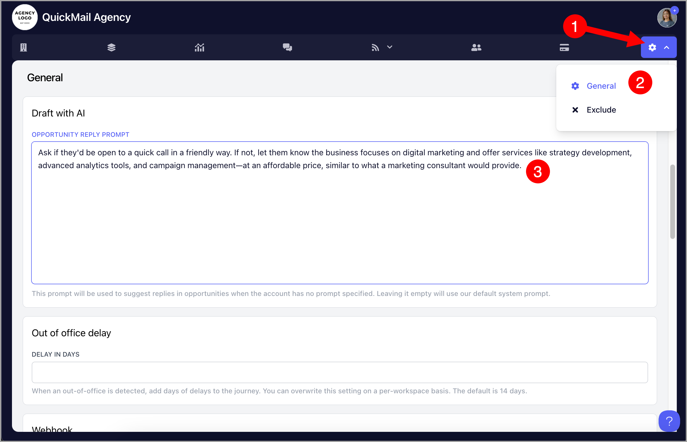
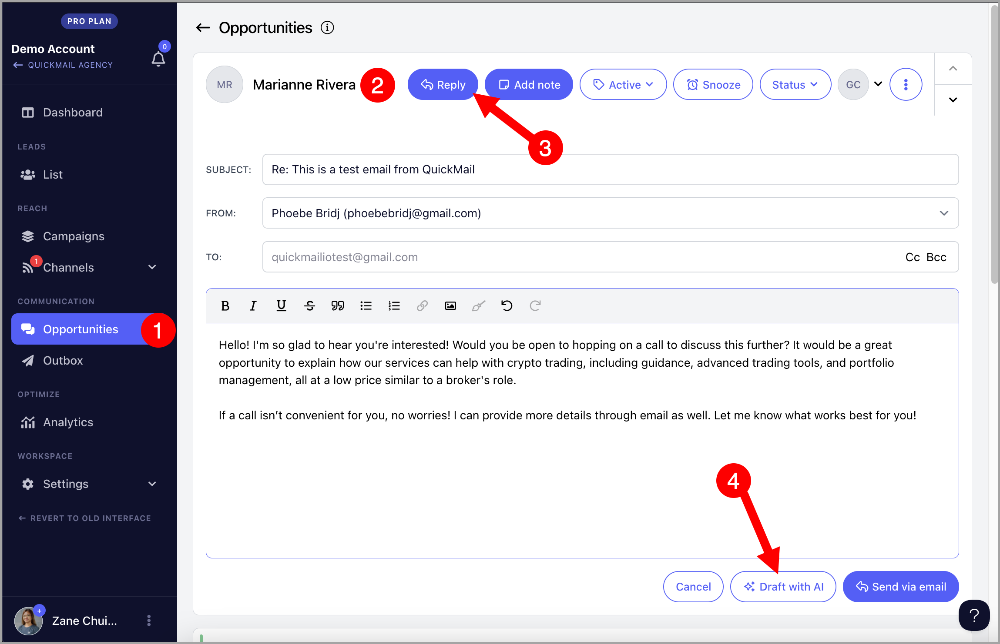

# Drafting Replies with AI

QuickMail's Draft with AI allows you to create replies that match the tone you want when engaging with leads via Opportunities. By leveraging AI, you can quickly draft professional and personalized responses, saving time while ensuring your communication aligns with your brand's voice.

**In this article:**

- Why use Draft with AI?

- How does it work?

- How to use it?

- How much does it cost?

## Why Use Draft with AI?

Draft with AI helps you communicate more effectively by automatically reading through the entire email thread before suggesting a response. This means it understands the full context and tone of the conversation, allowing it to craft a reply that feels natural and fits what has already been discussed.

This is especially useful for long email chains or when you are unsure how to phrase something. It saves time and mental energy while helping you handle more conversations without compromising on quality.

## How Does It Work?

Draft with AI generates a reply based on the prompt set for your workspace or agency, ensuring each response stays consistent and relevant.

If no prompt is set, the following default prompt is used:

*Continue the sales conversation as if it was a friend who is happy to hear from us. Casually ask if they would be down for a quick call. Make it as concise as possible, skip politeness, and go right down to business. The tone is positive and slightly uplifting. Longer sentences should be broken up into paragraphs.*

## How to Use It?

**Step 1.** Specify how you would like the reply to sound by describing the tone and style. You can skip this step to use the default prompt.

You can set up an AI prompt at either the agency or workspace level. If both are set, the workspace AI prompt takes priority. This allows for tailored communication so each client's tone is consistently reflected.

### Agency Level

The AI prompt at the agency level automatically applies to all workspaces, ensuring a consistent tone across all clients.

To set it up, go to **Settings** → **General** → under **Draft with AI**, specify the tone and style you want for replies.

### Workspace Level

The AI prompt at the workspace level allows you to create a unique prompt for each client, ensuring personalized communication that aligns with their specific tone and needs.

To set it up, go to the workspace → **Settings** → **Replies** → under **Draft with AI**, describe the tone and style you would like replies to have.

**Step 2.** Go to the lead's reply in Opportunities → click **Reply** → click **Draft with AI**.

You can click **Draft with AI** directly without typing anything, or write a few words and the AI will generate a reply based on that input.

**Step 3.** Edit the draft if needed, then send the email when you are ready.

## How Much Does It Cost?

Every workspace receives free Draft with AI credits each month, regardless of plan. Credits reset automatically each month.

- Agencies on new pricing: 500 credits per month

- Agencies on old pricing: 100 credits per month per workspace

- Teams: 100 credits per month

If you need additional credits, it costs $10/month per 1,000 credits. Contact [support@quickmail.io](mailto:support@quickmail.io) to configure your subscription.

**Note:** For users who added an OpenAI key before January 6, 2025, your OpenAI credits will be used automatically when using Draft with AI. If no OpenAI credits are available, the system will use your monthly credits instead.

You can view your remaining credits by going to the **Billing/Plan** page of your workspace or agency.

