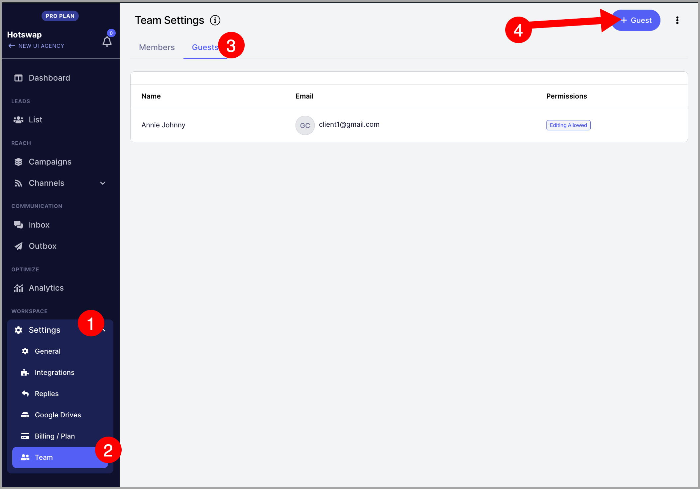
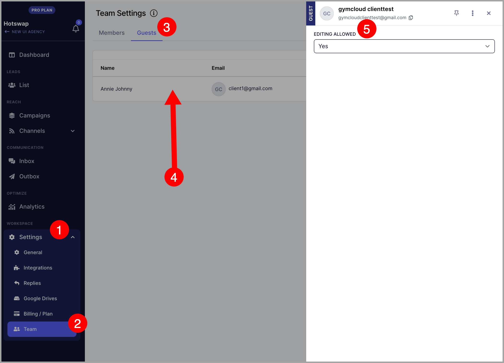
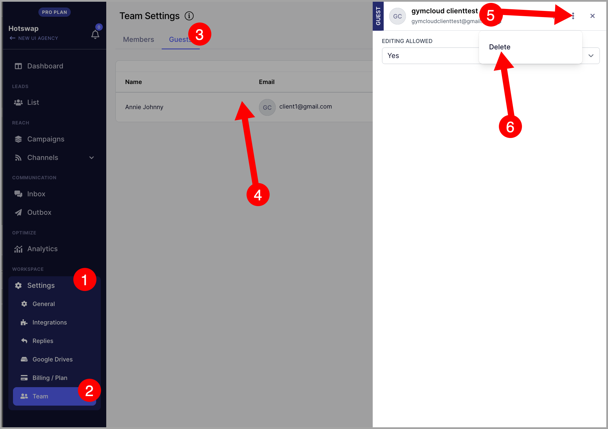

# Giving Clients Access to Their Workspace

**In this article:**

- Why invite clients to their workspace?

- What's the difference between guests and team members?

- How to invite clients as guests?

- How do I change edit permissions after clients are added to their workspace?

- How do I delete a client from a workspace?

## Why Invite Clients to Their Workspace?

Inviting clients as guests allows you to give them a view of their QuickMail campaigns and stats without granting access to other workspaces under the agency. This helps maintain client confidentiality.

Clients invited as guests cannot access workspace settings, so they cannot view or update billing information or the account plan.

## What's the Difference Between Guests and Team Members?

Unlike team members, guests cannot access other workspaces under the agency or the workspace settings.

## How to Invite Clients as Guests?

Go to **Settings** → **Team** → **Guests** tab → click **+ Guest**.

Set the edit permission:

- If edit access is allowed, the client can add and make changes to campaigns, handle replies using the Inbox, and view their stats.

- If edit access is not allowed, the client can only view campaigns, replies, and reporting.

Copy the invite link and send it to your client.

**Note:** Invitation links are only valid for 24 hours. Guests can only log in using Google, Microsoft, or LinkedIn accounts.

## How Do I Change Edit Permissions After Clients Are Added?

Click on the client from the **Guests** page → from the quick view, change the edit permissions.

## How Do I Delete a Client from a Workspace?

Click on the client from the **Guests** page → from the quick view, click the menu icon (three vertical dots) → **Delete**.

