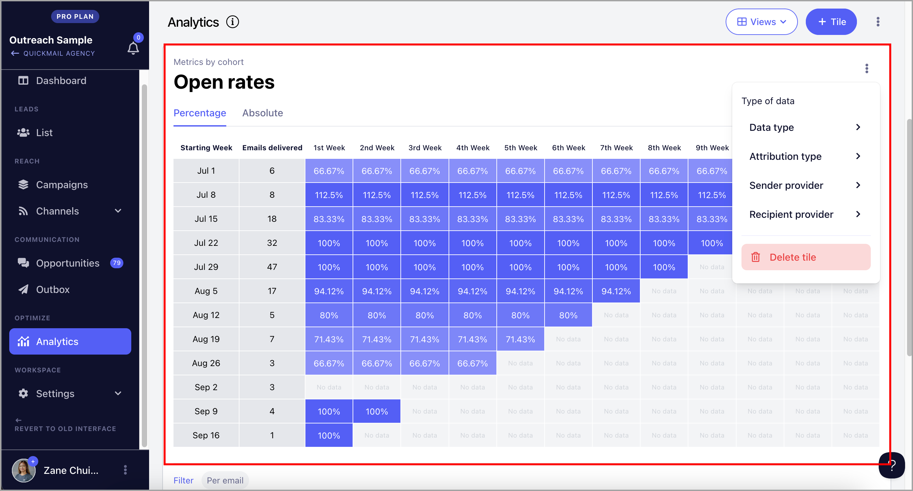
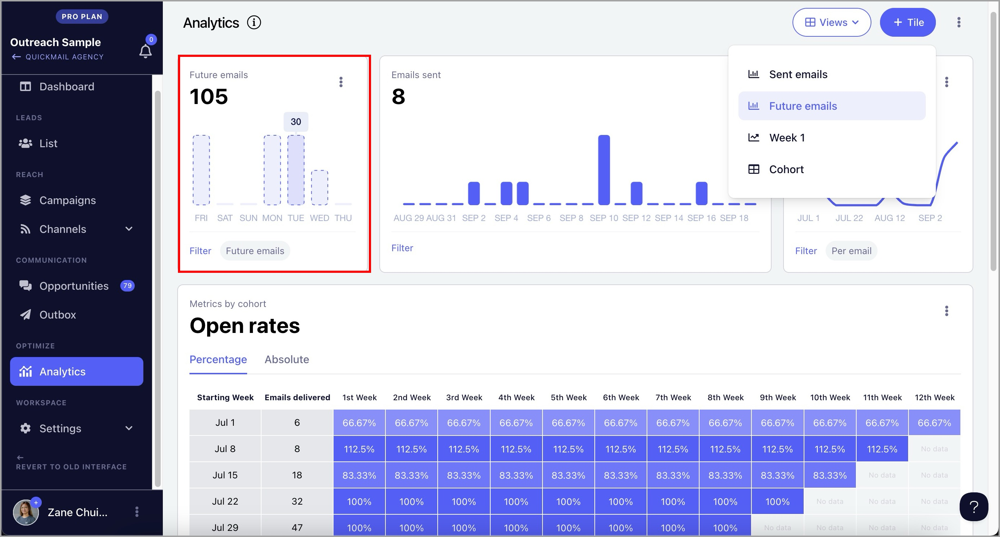
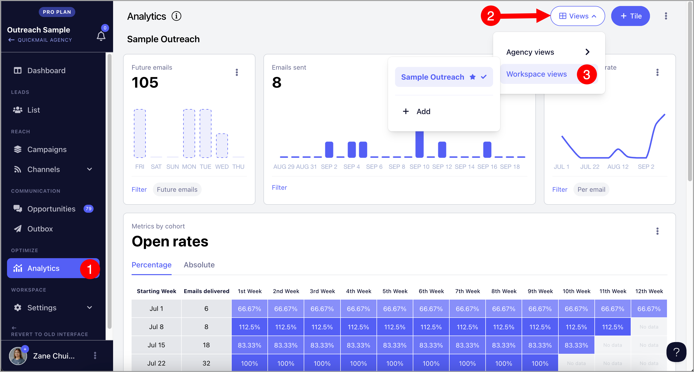

# Sharing Analytics to Clients (Client Portal)

Client portal streamlines agency workflows by eliminating manual reporting tasks. With this, users can provide clients with real-time access to their workspace's overall stats while preventing them from accessing other workspaces or altering campaign settings.

**In this article:**

- How does the Client Portal work?

- Video Demo

- What metrics can I share in the Client Portal?

- How to create a customized view of the Client Portal?

- How to add your agency's logo to the Client Portal?

- How can I generate a shareable link to the Client Portal?

- FAQs

## How Does It Work?

Customized views can be created on the Analytics page by adding tiles and selecting specific metrics. These views can then be shared with clients through a generated link, allowing access only to the relevant stats while restricting visibility to other pages in the workspace.

**Note:** The Client Portal is only available for agencies. For users on the Legacy Pro and Basic plans, this feature should also be available. Whitelabeling is not offered.

## What Metrics Can I Share in the Client Portal?

The metrics displayed in the Client Portal show the overall metrics for all campaigns in the workspace. They cannot be sorted by individual campaigns yet.

### Week 1 Stats

**Data type:** Open, Click, Reply, Positive Reply, Negative Reply, Bounce, and Unsubscribe

**View:** Percentage, Absolute

**Attribution type:** Per lead, Per email

**Sender provider:** Any, Gmail, Outlook, Custom

**Recipient provider:** Any, Gmail, Outlook

### Weekly Stats / Metrics by Cohort

**View:** Percentage, Absolute

**Data type:** Open, Click, Reply, Positive Reply, Negative Reply, Bounce, and Unsubscribe

**Attribution type:** Per lead, Per email

**Sender provider:** Any, Gmail, Outlook, Custom

**Recipient provider:** Any, Gmail, Outlook

**Pro tip:** If you'd like to know more about understanding Metrics by Cohort, check out this guide.

### Sent Emails

Total sent emails from all campaigns in the workspace.

### Future Emails (Only available in Workspace View)

Projected number of emails based on the number of leads in the triggers, the number of leads that have not yet started in the campaign, and follow-up emails.

## How to Create a Customized View of the Client Portal?

### Agency View

Creating an Agency View allows you to apply a uniform template across all workspaces under an agency. This ensures consistency in how data is presented and simplifies the reporting process for all clients.

**Note:** Agency Views can only be edited in the Agency Dashboard Analytics.

A default agency view is created automatically. To create a new view or edit the existing one, go to the Analytics page in the Agency Dashboard.

### Workspace View

Workspace views are exclusive to the specific workspace where they were created.

## How to Add Your Agency's Logo to the Client Portal?

Go to the Agency Dashboard → **Settings** → **General** → **Upload File** (max file size is 1MB).

## How to Generate a Shareable Link to the Client Portal?

Go to the workspace → **Analytics** → **Menu** → **Share** → **Copy Shareable Link**.

**Pro tip:** The shareable link does not expire, so the client can bookmark it and access the Client Portal at any time. Stats are updated in real time.

Here's what the Client Portal looks like for your clients:

**Note:** Clients cannot edit the tiles or change the view, metrics, or attribution types.

## FAQs

- **Are the stats reflected in real time in the Client Portal?** - Yes

- **Does the shareable link expire?** - No

- **Can I create multiple views?** - Yes

- **Is there a limit to the number of views I can create?** - No

- **Is there a way to share stats per campaign?** - This is not yet available.
