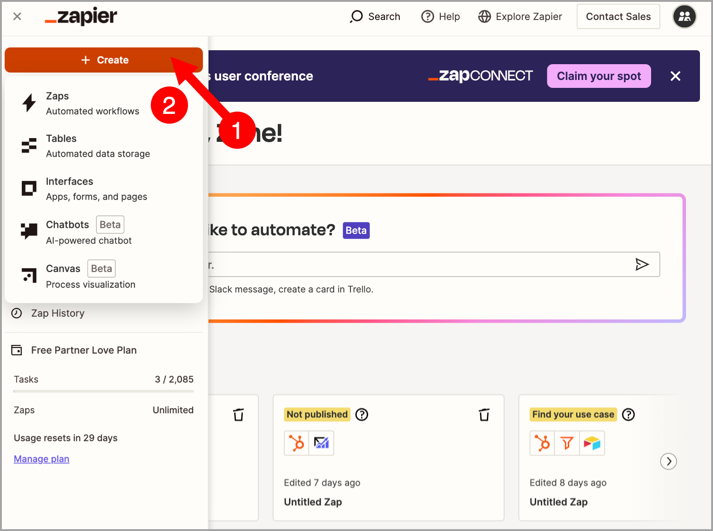
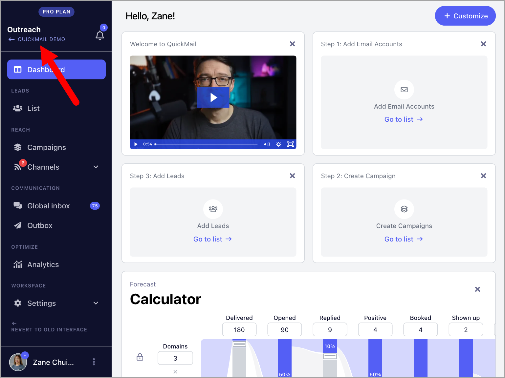

# Webhooks

Using QuickMail webhooks makes it easy to fetch data from the workspaces under your organization and consolidate it.

Here are the available webhook events:

- First open

- Repeat open

- First click

- Repeat click

- First reply

- Repeat reply

- Bounce

- Unsubscribe

- Lead tagging

- Task completed

- Journey completed

- Journey checkpoint

- Opportunity status

**In this article:**

- How does it work?

- How to set it up?

## How Does It Work?

Whenever an event occurs in a QuickMail workspace where a webhook is enabled, QuickMail sends all the information about that event to your webhook provider, such as Zapier or Make.com.

You can then use this information to automate workflows and perform actions such as recording data in a Google Sheet or sending it to another app.

## How to Set It Up?

### Step 1: Get the Webhook Endpoint URL

**For Zapier**

Go to your Zapier account and create a Zap.

Select **Webhook by Zapier** as the trigger → under **Event**, select **Catch Hook** → click **Continue**.

Click **Continue** again → copy the webhook endpoint URL.

### Step 2: Add the Webhook Endpoint URL to QuickMail

Go to the Organization Dashboard by clicking the organization name in the upper left corner of the workspace.

**Note:** Webhooks are only available for Agency accounts. If you do not see an option to access the Organization Dashboard, your account is likely a Team account. To switch to an Agency account, contact support at support@quickmail.io.

Go to the **Settings** tab → **Webhooks** → paste the webhook endpoint URL.

### Step 3: Enable Webhooks

Go to the specific workspace → **Settings** → **Integrations** → enable **Webhooks** → select your preferred triggers.

### Step 4: Complete Your Workflow

Go back to your webhook provider to complete the workflow and set it live.
