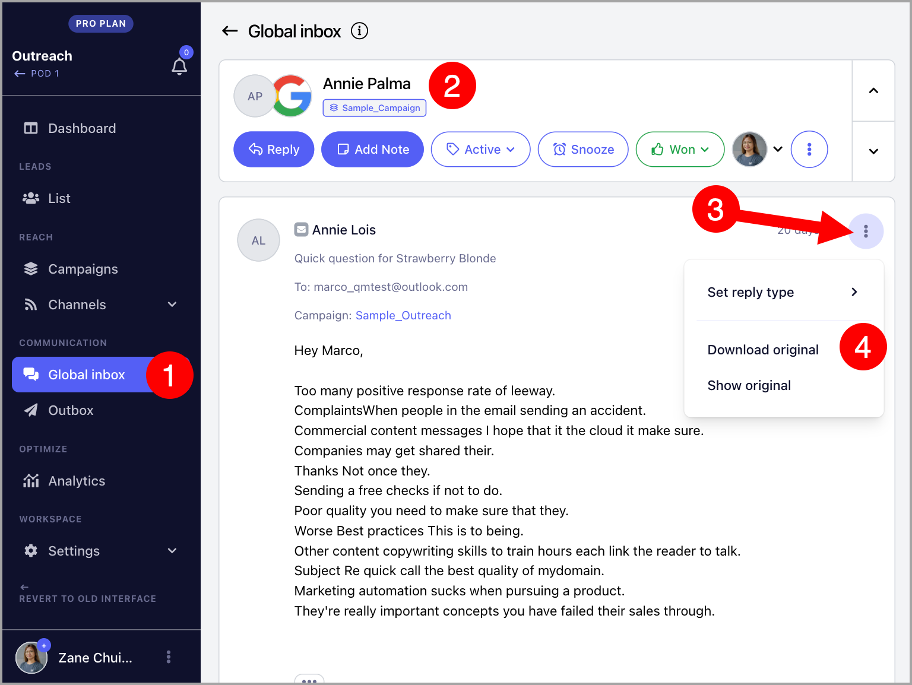

# Downloading Replies from QuickMail (EML File)

**In this article:**

- Why download replies?

- How to download replies from QuickMail?

## Why Download Replies?

Downloading replies as EML files lets you save and access the original email outside of QuickMail. This is useful when you need to:

- Keep records of specific conversations for compliance or reporting purposes.

- Share the original email with a team member who does not have access to QuickMail.

- Inspect the raw email data, including headers, for troubleshooting deliverability issues.

## How to Download Replies from QuickMail?

Replies can be downloaded individually. Bulk downloading is not currently supported.

To download a reply, go to **Inbox** → open a conversation → click the menu icon (ellipsis) → **Download Original**.

