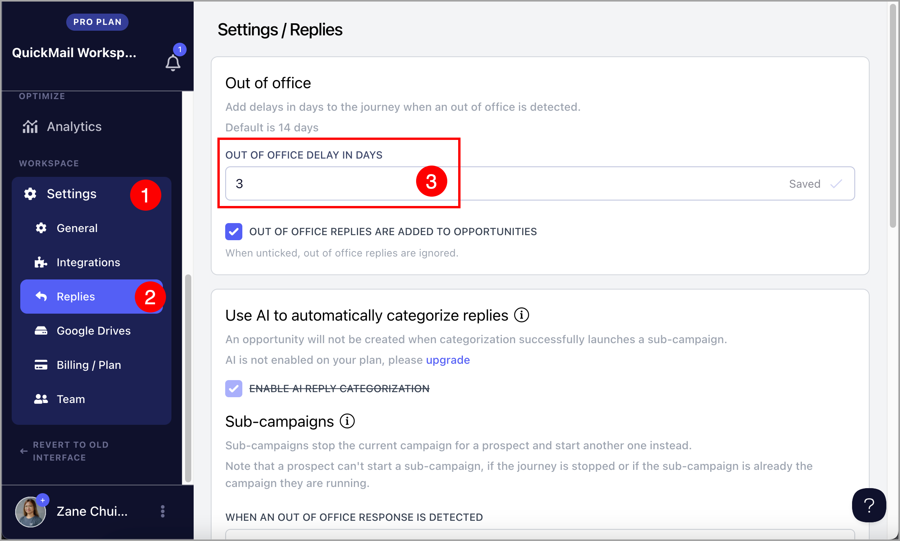

# Handling Out-of-Office Replies

**In this article:**

- What are out-of-office replies?

- How does QuickMail detect out-of-office replies?

- What happens if a lead is marked as out-of-office?

- How do I change the default delay of 14 days?

- Where do I see out-of-office replies?

- How do I send emails immediately to leads marked as out-of-office?

## What Are Out-of-Office Replies?

Out-of-office replies are automated email responses that notify the sender that the recipient is temporarily unavailable. They typically include details such as the expected return date and alternative contact information.

## How Does QuickMail Detect Out-of-Office Replies?

QuickMail automatically checks email accounts every 10 minutes for new responses and is designed to identify automated out-of-office replies and distinguish them from regular replies.

## What Happens if a Lead Is Marked as Out-of-Office?

When a lead is marked as out-of-office, QuickMail automatically adds a 14-day delay on top of the existing wait step before sending the next email.

For example, if the lead's next email was scheduled to send in 3 days, QuickMail will instead wait 17 days (3 days + 14-day out-of-office delay).

This ensures emails are sent when the recipient is more likely to be available, improving the chances of engagement.

## How Do I Change the Default 14-Day Delay?

Go to the account's reply settings and edit the out-of-office delay in days. Here is an example with it set to 3 days:

## Where Do I See Out-of-Office Replies?

Out-of-office replies can be viewed in the **Inbox**. 
This helps you identify whether a lead is temporarily unavailable or has left the company. 

Their out-of-office message may also include useful details such as their expected return date or an alternate contact, allowing you to adjust your follow-up strategy accordingly.

If you do not want out-of-office replies to appear in the Inbox, go to **Settings** → **Replies** → uncheck **Out of office replies are added to Opportunities**.

## How Do I Send Emails Immediately to Leads Marked as Out-of-Office?

Leads marked as out-of-office can be resumed immediately or on a specific date and time.

To resume a lead, click the lead's name or thumbnail on the **List** page to open the quick view → **Campaigns** tab → click the menu icon (three vertical dots) for the campaign → **Resume Progress** → select a date → **Confirm**.

**Note:** On rare occasions, an out-of-office reply may be detected as a regular reply, causing the lead to stop receiving emails from the campaign. In this case, you can resume the lead immediately or on a specific date and time using the same steps above.
