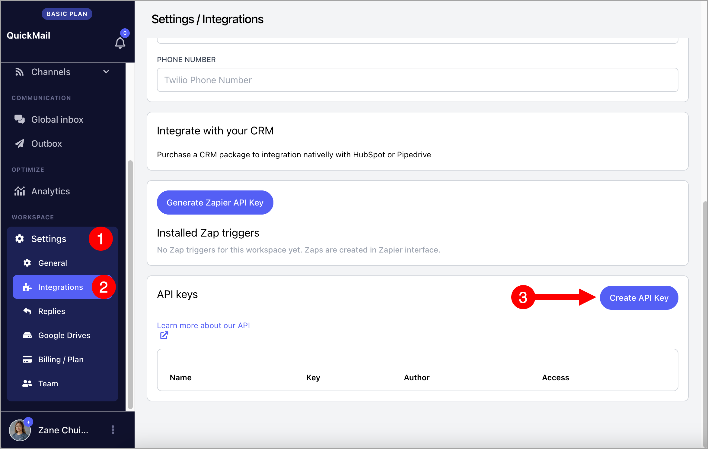

# Creating an API Key

**In this article:**

- For agency accounts

- For team accounts

## For Agency Accounts

Go to the Agency Dashboard by clicking the organization name in the upper left corner → **Settings** → **General** → scroll to the bottom → click **Create API Key**.

The API documentation link is available just above the button.

## For Team Accounts

Go to **Settings** → **Integrations** → under **API Keys**, click **Create API Key**.

The API documentation link is available just above the list of API keys.

