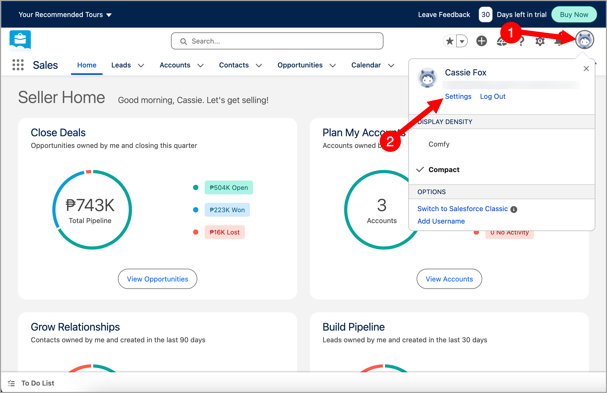
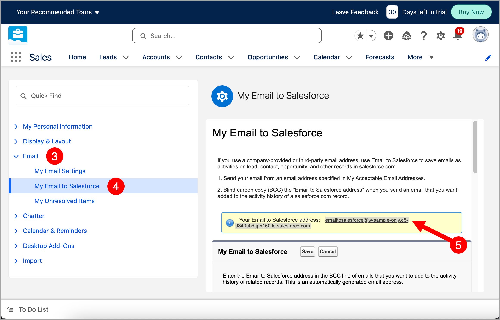
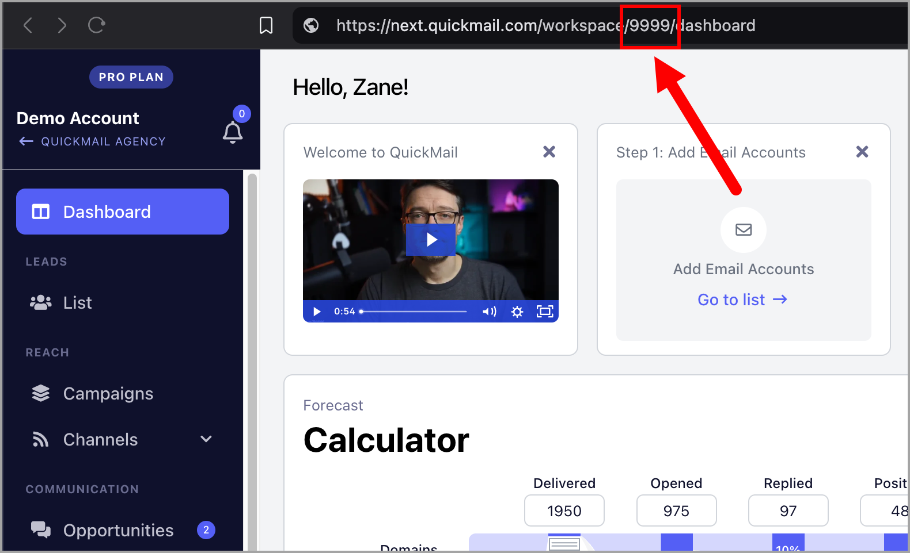
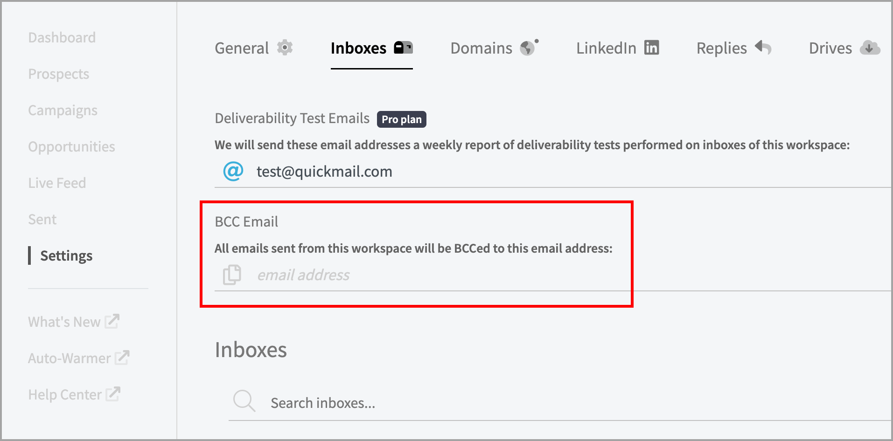

# How to BCC Emails to Salesforce

Blind copying emails to Salesforce allows you to automatically log communication without needing a native integration, ensuring all interactions are tracked and accessible in your CRM.

**In this article:**

- Step 1: Find your Salesforce BCC email

- Step 2: Add the BCC email to QuickMail

## Step 1: Find Your Salesforce BCC Email

Go to **Salesforce** → click your thumbnail in the upper right corner → **Settings**.

Select the **Email** tab → click **My Email to Salesforce** → copy your Email to Salesforce address (highlighted in yellow).

## Step 2: Add the BCC Email to QuickMail

Paste the Email to Salesforce address into QuickMail. There are two ways to do this:

### Option 1: Workspace Level

Adding a BCC email at the workspace level automatically BCCs all emails sent from the workspace, regardless of which email account is used.

**Note:** Workspace-level BCC is currently only available in the old interface. To access it, go to the URL below and replace `your-workspace-ID` with your actual workspace ID:

`https://next.quickmail.com/account/your-workspace-ID/settings/inboxes`

Here is where you can find your workspace ID:

### Option 2: Email Account Level

Adding a BCC email at the email account level BCCs emails sent from that specific email account only.

Go to **Email** → click the email account → under **Sending Settings**, fill in the BCC Email field.
