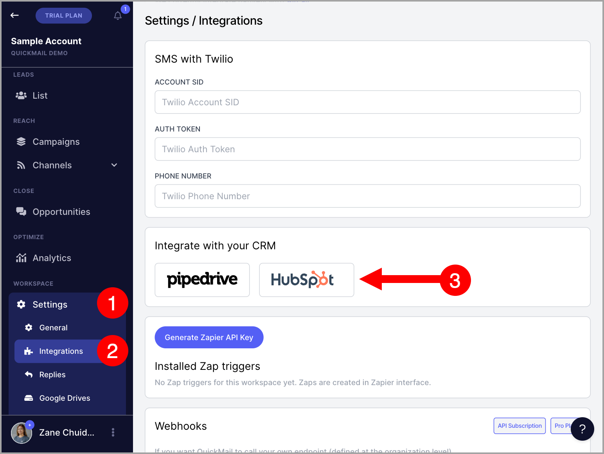
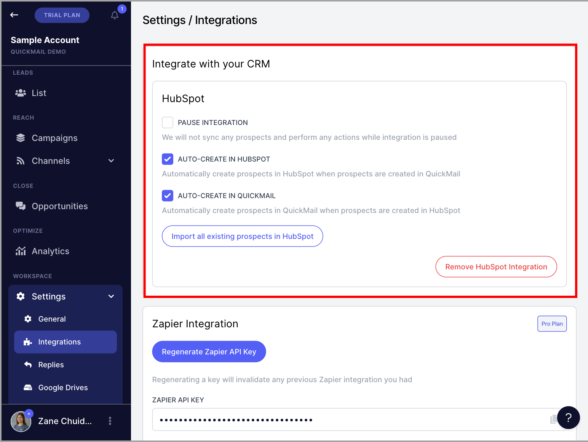
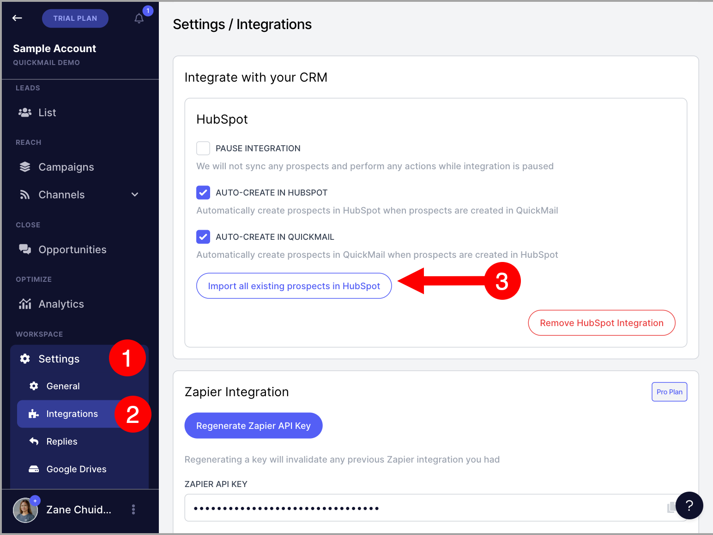
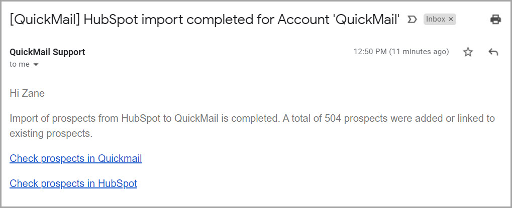
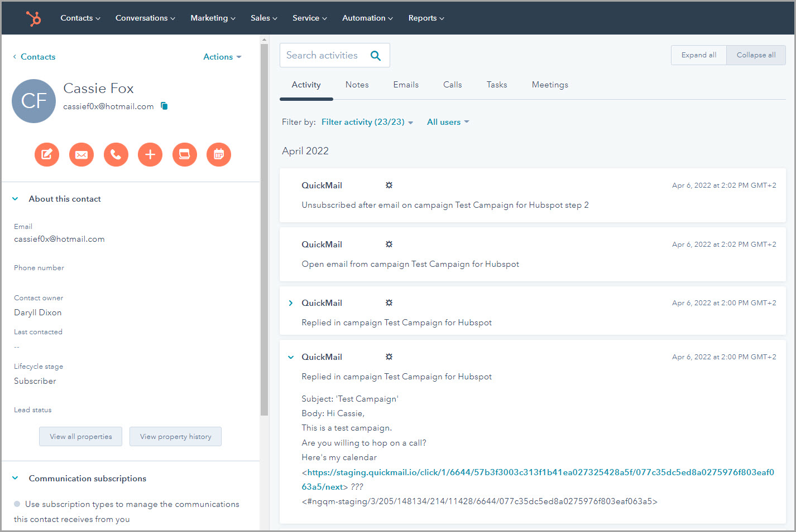
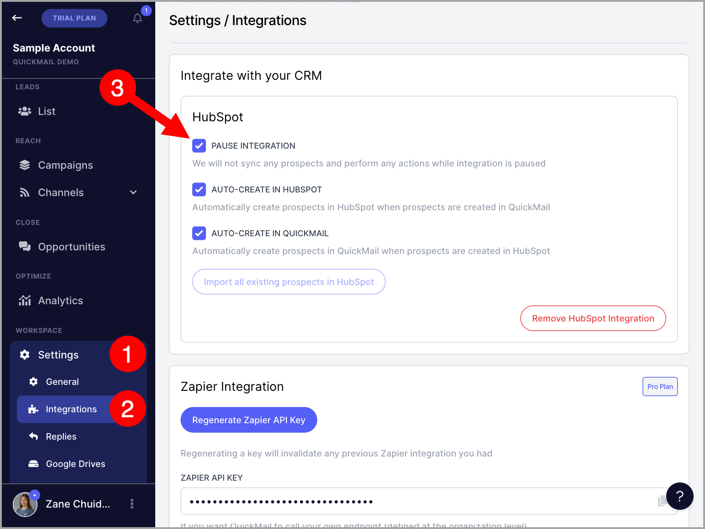
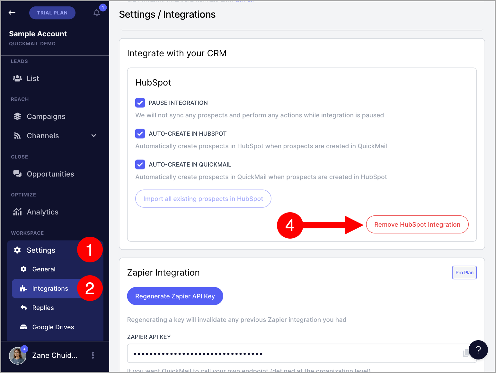

# HubSpot Integration

HubSpot CRM can be connected to QuickMail to improve your workflow. It allows you to export, import, and automatically sync leads, and view lead activity in HubSpot.

**In this article:**

- What is supported in the two-way sync?

- How to set up the HubSpot integration?

- How to manually trigger an import from HubSpot?

- How to see leads' activities in HubSpot?

- How to pause the HubSpot integration?

- How to remove the HubSpot integration?

## What Is Supported in the Two-Way Sync?

Leads are automatically synced in real time. Note that importing a large list may take some time for all data to be synced.

**Lead sync is triggered by:**

- Adding or importing leads

- Editing first name or last name

- Editing job title

- Editing phone number

- Events: opens, clicks, replies, unsubscribes, and bounces

- Assigning or unassigning tags and custom properties

**Tag and custom property sync behavior:**

- Editing a tag in QuickMail updates the corresponding QuickMail properties in HubSpot

- Deleting a tag in QuickMail marks the QuickMail property in HubSpot as "(deleted)"

- Editing a tag in HubSpot does not reflect in QuickMail

The HubSpot integration does not currently support recording sent emails. If you need to log sent emails in HubSpot, use the BCC setting. For more details, see: Logging Sent Emails in HubSpot

**Note:** Editing lead information will not create a new contact in HubSpot.

## How to Set Up the HubSpot Integration?

Go to **Settings** → **Integrations** → find **HubSpot**.

You will be prompted to sign in or create a new HubSpot account.

After signing in, select the HubSpot account you would like to connect to QuickMail.

Here is what it looks like in QuickMail once a HubSpot account has been connected:

## How to Manually Trigger an Import from HubSpot?

Existing leads in HubSpot and QuickMail will not automatically sync after the integration is set up. Only new leads created after the integration is configured will sync automatically. Existing leads must be manually imported.

**Note:** It is not possible to filter which leads are imported from HubSpot to QuickMail.

To manually import all leads from HubSpot, go to **Settings** → **HubSpot** → **Import all existing leads in HubSpot**.

Importing all leads may take some time. Once complete, you will receive an email notification.

## How to See Leads' Activity in HubSpot?

Go to the specific contact in HubSpot → **Filter Activity** → enable the filter for **QuickMail Integration**.

Lead activity will then be displayed under the **Activity** tab.

## How to Pause the HubSpot Integration?

When the integration is paused, new leads will no longer sync. However, the following actions will still sync:

- Updating tag names

- Creating and deleting custom properties from QuickMail to HubSpot

- Creating and deleting tags from QuickMail to HubSpot

To pause the integration, go to **Settings** → **Integrations** → under **HubSpot Integration**, check the box **Pause Integration**.

## How to Remove the HubSpot Integration?

Removing the HubSpot integration will permanently stop the two-way sync.

Go to **Settings** → **Integrations** → under **HubSpot Integration**, click **Remove HubSpot Integration**.

