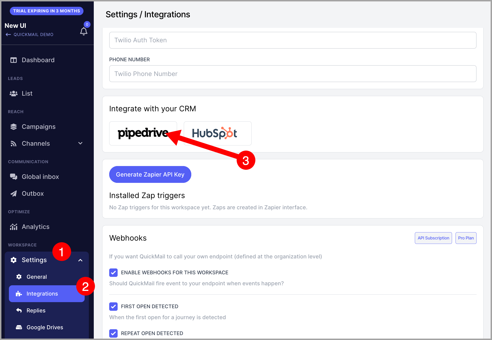

# Integrating QuickMail with Pipedrive

**In this article:**

- How does the integration work?

- How to set it up?

- How to import leads from Pipedrive to QuickMail?

- How to export leads from QuickMail to Pipedrive?

- How does the integration work while it's paused?

- How to delete the integration?

## How Does the Integration Work?

- Adding a contact in QuickMail creates a contact in Pipedrive and vice versa.

- Editing contact information such as names, companies, phone numbers, tags, and custom properties syncs both ways.

- Editing tag names and creating tags in QuickMail will update and create custom fields in Pipedrive.

- If a tag is deleted in QuickMail, the tag name in Pipedrive will have "(deleted)" appended to it.

- Creating and deleting custom properties in QuickMail will create and delete them in Pipedrive. Deleted properties will have "(deleted)" in their names.

- Existing contacts can be imported from Pipedrive to QuickMail and exported from QuickMail to Pipedrive.

- Editing synced QuickMail tag and custom property names in Pipedrive will not reflect in QuickMail, but the sync will continue to work.

## How to Set It Up?

Go to **Settings** → **Integrations** → scroll down → **Pipedrive** → log in to your Pipedrive account.

**Note:** The first Pipedrive installation must be done by a user who is an admin in Pipedrive. Otherwise, you will encounter an error.

## How to Import Leads from Pipedrive to QuickMail?

Under the Pipedrive integration on the add-ons page, click **Import all existing prospects from Pipedrive**.

This will add all contacts from Pipedrive to QuickMail, including their name, email address, company, and phone number.

## How to Export Leads from QuickMail to Pipedrive?

On the same page, click **Export all existing prospects to Pipedrive**.

This will add all leads from QuickMail to Pipedrive, including their email address, name, company, phone number, tags, and custom properties.

**Note:** An import and export cannot run at the same time. If you try to start one while the other is in progress, you will see an error — this is expected behavior.

## How Does the Integration Work While It's Paused?

While paused, the following will not happen:

- Creating a contact in QuickMail will not create a contact in Pipedrive, and vice versa.

- Two-way sync of contact information such as names, phone numbers, tags, and custom properties will not work.

The following will still work while the integration is paused:

- Creating tags in QuickMail will create a custom field in Pipedrive.

- Deleting tags in QuickMail will add "(deleted)" to the custom field name in Pipedrive.

- Changing tag names in QuickMail will update the custom field name in Pipedrive.

- Creating custom properties in QuickMail will create a custom field in Pipedrive.

- Deleting custom properties in QuickMail will add "(deleted)" to the custom field name in Pipedrive.

## How to Delete the Integration?

Go to **Settings** → **Add-ons** → **Pipedrive** → click **Remove Pipedrive Integration**.

