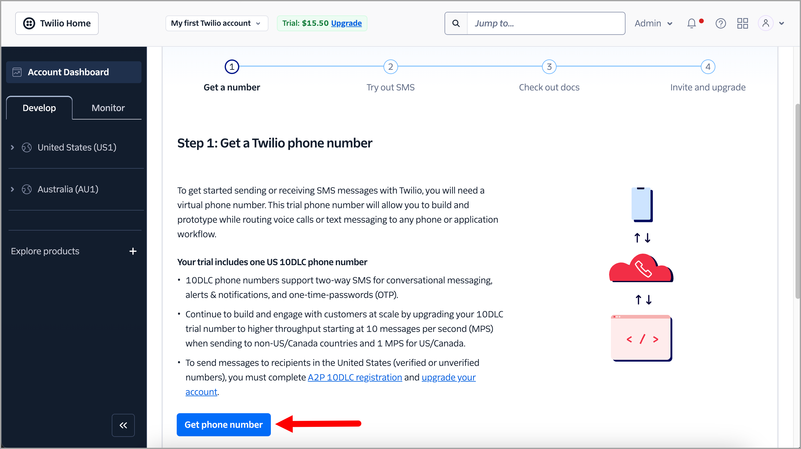
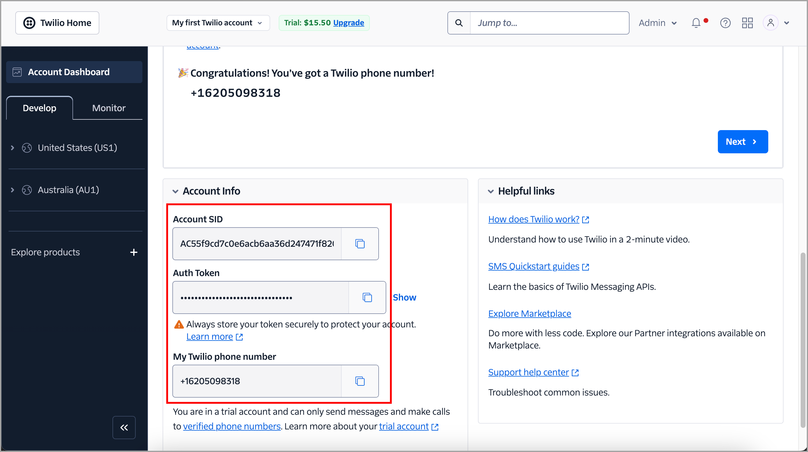
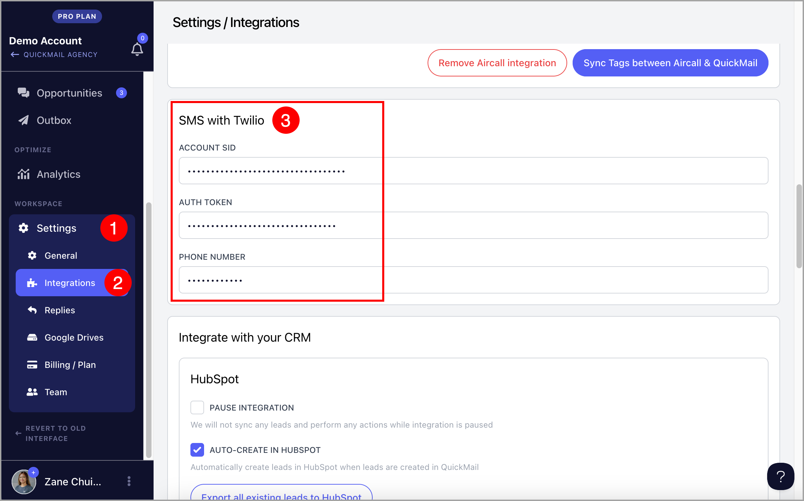
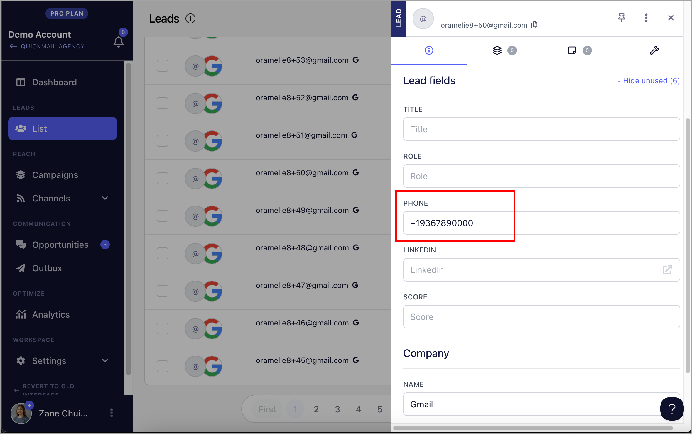
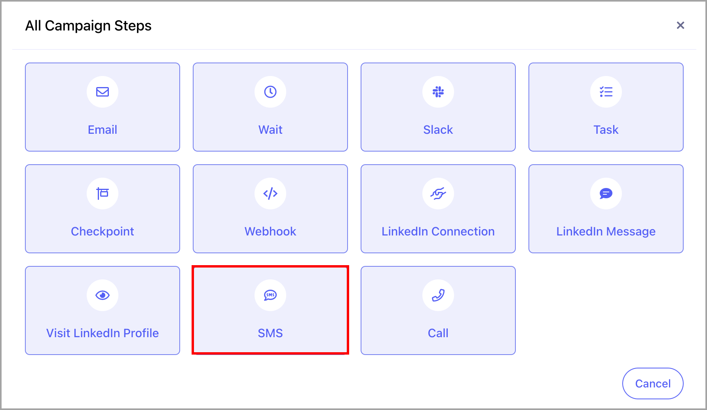
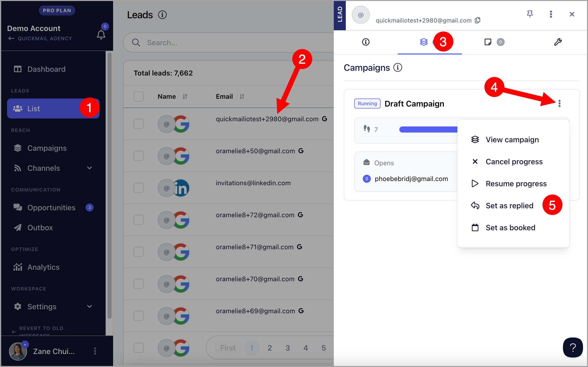

# Integrating Twilio with QuickMail (SMS)

In addition to Email Steps in a campaign, QuickMail can send SMS messages via a service called [Twilio](https://www.twilio.com)

## How to setup Twilio?

First up, head to [Twilio](https://www.twilio.com/) and create a new account.

**Note:** While on a Twilio trial, messages will be prefaced with "*Sent from your Twilio trial account.*" It may be best to upgrade to a paid Twilio account before putting it into action.

**Step 1.** Head to the [Twilio Dashboard](https://www.twilio.com/console) and get a phone number.

**Step 2.** Once a new phone number is available, on the same page, scroll down and look for the** Twilio Account SID**, **Auth Token**, and **Twilio phone number**

**Step 3.** in QuickMail, head to Settings → Integrations → Scroll down a bit and paste the Twilio Account SID, Auth Token, and Twilio phone number in the** SMS with Twilio** section.

## How to associate a phone number with leads in QuickMail?

All phone numbers associated with the leads must be in E.164 format. This format consists of a plus sign (+), followed by the country code, and then the phone number.

For example, if the phone number is a US-based number like (555) 123-4567, it should be formatted as:`+15551234567`

More information on E.164 can be found on [Twilio's page here](https://support.twilio.com/hc/en-us/articles/223183008-Formatting-International-Phone-Numbers).

Lead phone numbers, in that format, can be added either via a Google Sheets/CSV import or manually.

**Note:** An email address is required to add a lead in QuickMail, whether you plan on sending them emails or just SMS.

## How to add an SMS step in a campaign?

When creating steps in a campaign, there's an option to include an SMS step. From there, you can enter the text of the SMS message, along with custom properties for personalization:

**Important:** A single SMS message technically supports up to 160 characters, or up to 70 if the message contains one or more Unicode characters (such as emoji or Chinese characters). Learn more about the SMS character limits on [Tiwlio's page](https://www.twilio.com/docs/glossary/what-sms-character-limit)

## How to manage SMS Replies?

When a lead replies to an SMS step, it is visible in the Programmable SMS Dashboard in Twilio.

**Important:** Unlike emails, SMS Replies are not detected by QuickMail and will not prevent any subsequent steps from being sent in the campaign.

After receiving the reply, the lead in the SMS campaign needs to be marked as 'Replied' to prevent additional steps from being sent.

