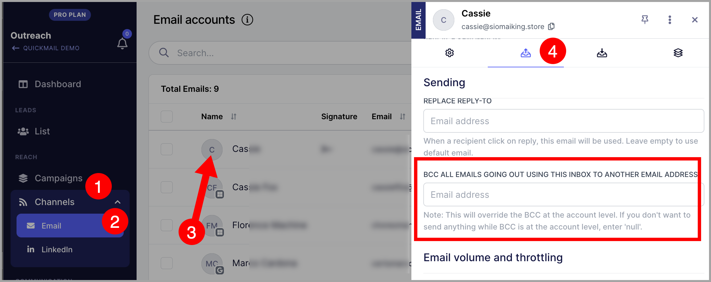

# Logging Sent Emails in HubSpot

**In this article:**

- Why log sent emails in HubSpot?

- How to log sent emails in HubSpot?

- How to get the BCC address in HubSpot?

- How to add the BCC address to QuickMail?

## Why Log Sent Emails in HubSpot?

Logging sent emails in HubSpot helps you keep track of all emails sent to a lead in your CRM.

While QuickMail has a HubSpot integration, it does not currently support logging sent emails.

## How to Log Sent Emails in HubSpot?

To log sent emails in HubSpot, you need to use BCC. BCC (blind carbon copy) allows you to send copies of all outgoing emails from a specific email account or the entire workspace to another address.

To set this up, get the BCC address from HubSpot and add it to your QuickMail account.

## How to Get the BCC Address in HubSpot?

Follow this [guide](https://knowledge.hubspot.com/connected-email/log-email-in-your-crm-with-the-bcc-or-forwarding-address) on how to get the BCC address in HubSpot.

When setting it up, make sure the email account sending emails in QuickMail is:

- A user in your HubSpot account.

- One of your [connected personal emails](https://knowledge.hubspot.com/articles/kcs_article/email-tracking/connect-your-inbox-to-hubspot).

Also make sure that the leads' email addresses are not on your "never-log list." Otherwise, sent emails will not be logged in their contact records.

## How to Add the BCC Address to QuickMail?

Go to **Settings** → **Channels** → click the email account → under **Sending Settings**, fill in the **BCC Email** field.

**Warning:** Avoid adding a BCC address that is already added as an email account in QuickMail. This may cause sent emails to be detected as replies.
