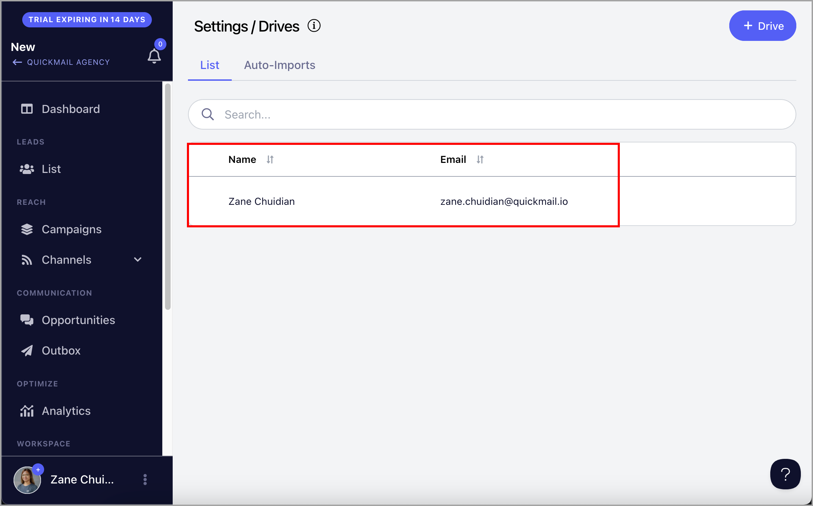
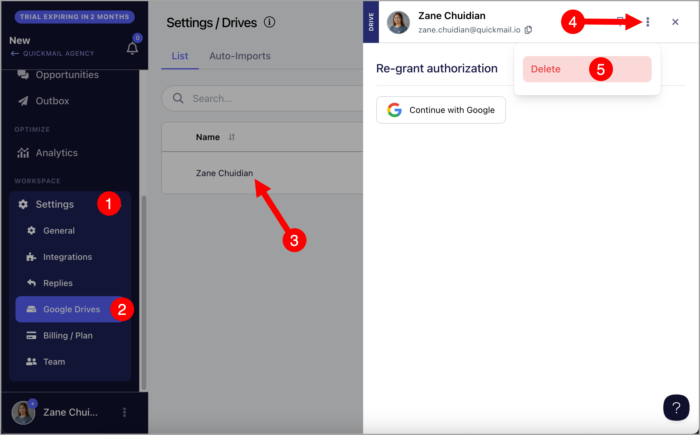
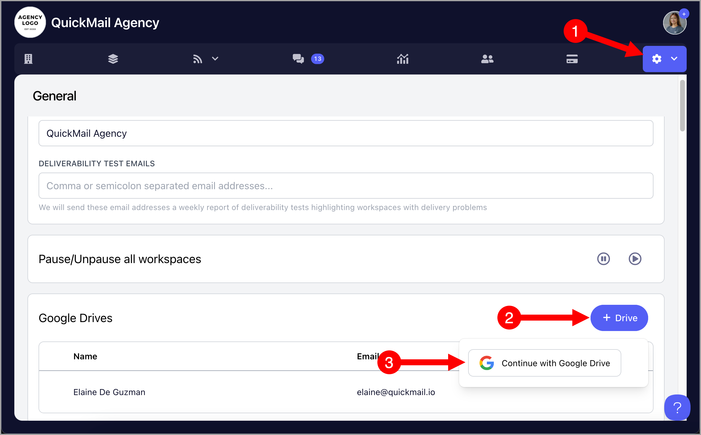
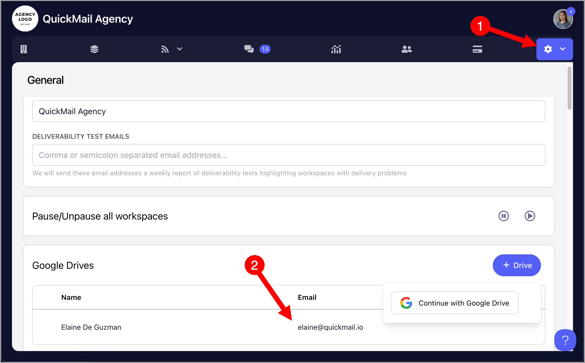
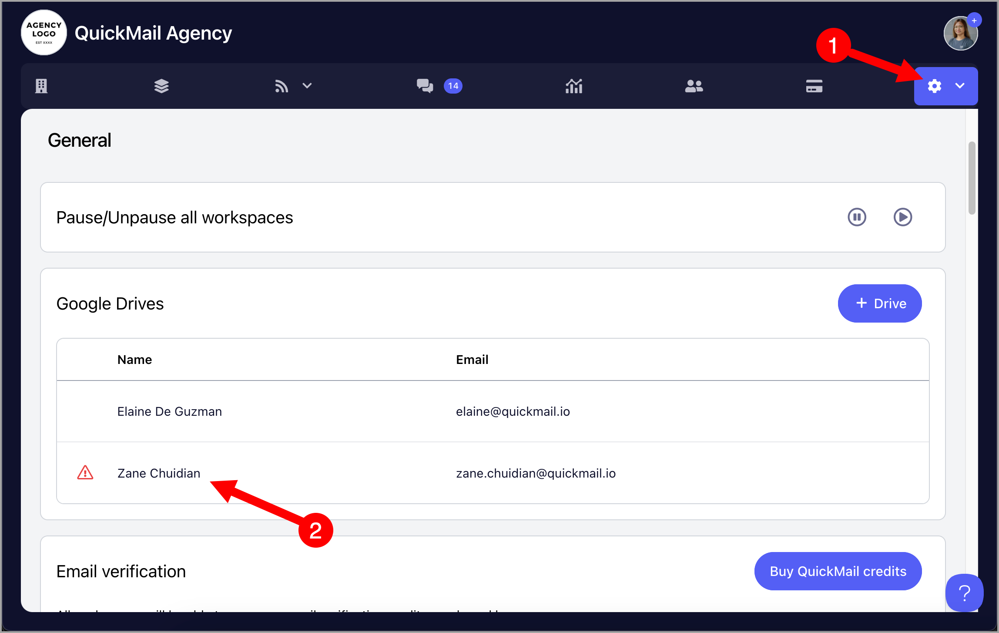
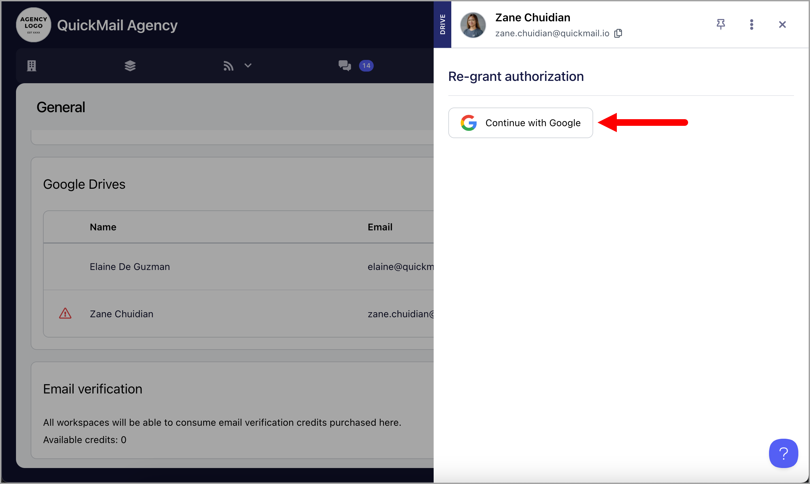

# Managing Google Drives

QuickMail allows you to link one or more Google Drive accounts to import leads or set up Auto-Import using Google Sheets.

**In this article:**

**For Workspaces**

- Connecting a Google Drive to a workspace

- Disconnecting a Google Drive account from a workspace

- Re-authenticating a Google Drive account in a workspace

**For Agencies**

- Connecting a Google Drive to an agency

- Disconnecting a Google Drive account from an agency

- Re-authenticating a Google Drive account in an agency

## Connecting a Google Drive Account to a Workspace

Go to **Settings** → **Google Drives** → **+ Drive** → **Continue with Google Drive**.

Once the drive is added, it will appear on that page.

After that, Google Sheets will be available as an import option on the Leads List page.

## Disconnecting a Google Drive Account from a Workspace

Go to the workspace → **Settings** → **Google Drives** → click on the Google Drive → click the menu icon (three vertical dots) → **Delete**.

**Warning:** Deleting a Google Drive account will also delete all auto-imports associated with it.

## Re-authenticating a Google Drive Account in a Workspace

When QuickMail's permission to your Google Drive is revoked, the connected drive will be disconnected. When this happens, a red warning icon will appear in Settings and next to the affected Google Drive account.

To reconnect, go to **Settings** → **Google Drives** → click on the Google Drive → **Continue with Google**.

## Connecting a Google Drive Account to an Agency

If you have multiple workspaces in an agency, you can link a Google Drive account at the organization level. This saves time by making the drive available across all workspaces without having to add it individually to each one.

Go to the Agency Dashboard → **Settings** → **Add Google Drive** → **Continue with Google Drive**.

Once added, all workspaces in the organization will be able to import sheets from that drive.

## Disconnecting a Google Drive Account from an Agency

Go to the Agency Dashboard → **Settings** → click on the Google Drive → click the menu icon (three vertical dots) → **Delete**.

## Re-authenticating a Google Drive Account in an Agency

When QuickMail's permission to your Google Drive is revoked, the connected drive will be disconnected. When this happens, a red warning icon will appear in the Agency Dashboard Settings and next to the affected Google Drive account.

To re-authenticate, go to the Agency Dashboard → **Settings** → click on the Google Drive → **Continue with Google** → follow the prompts from Google.

