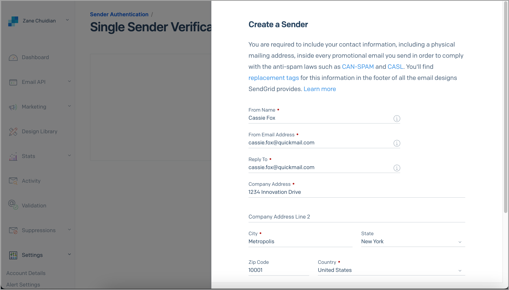
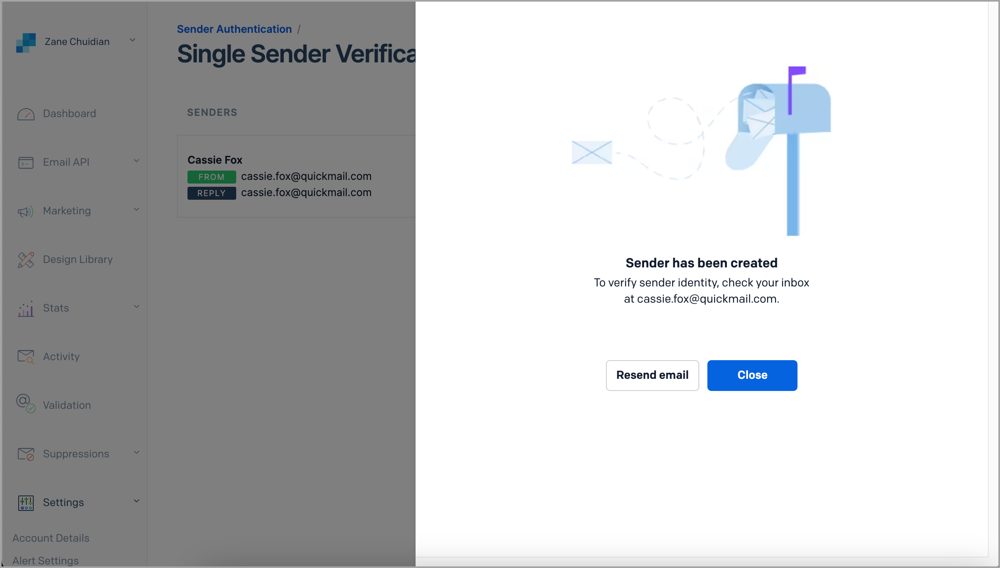
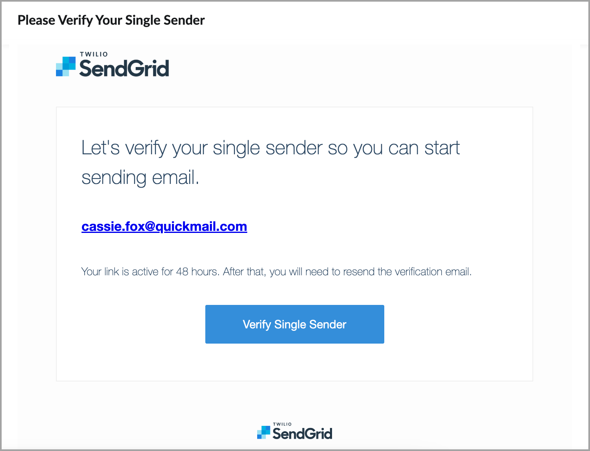
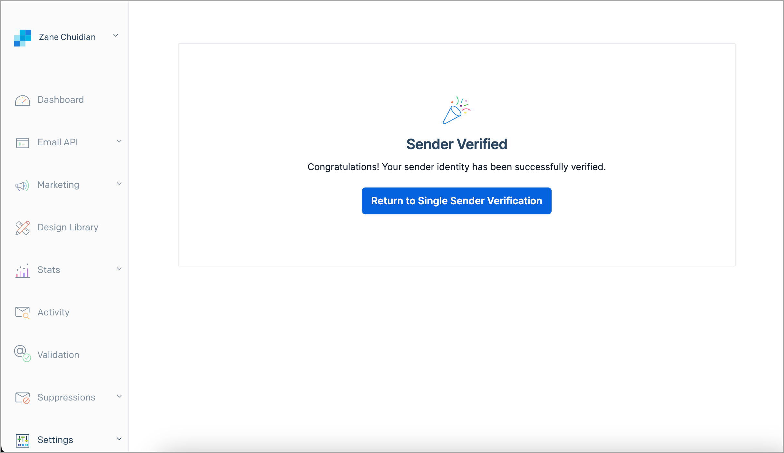
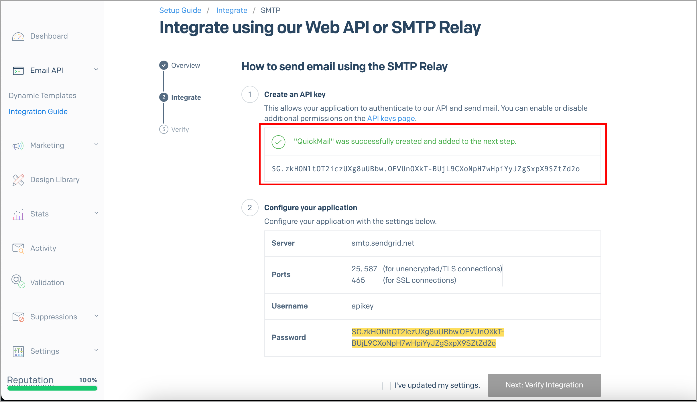
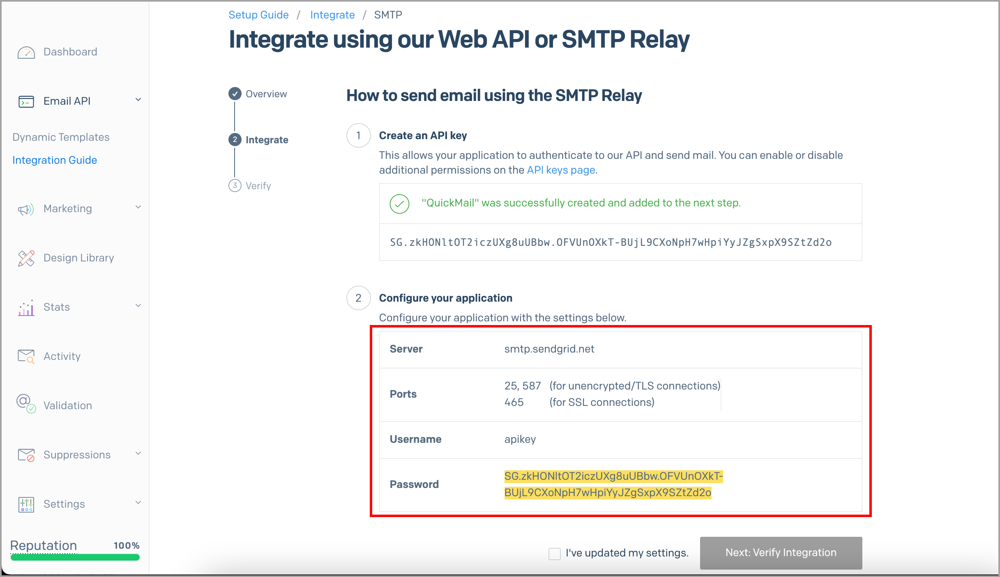
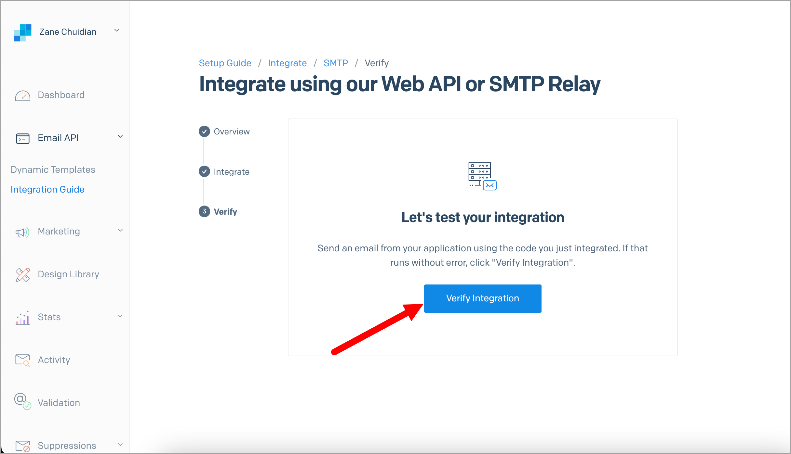
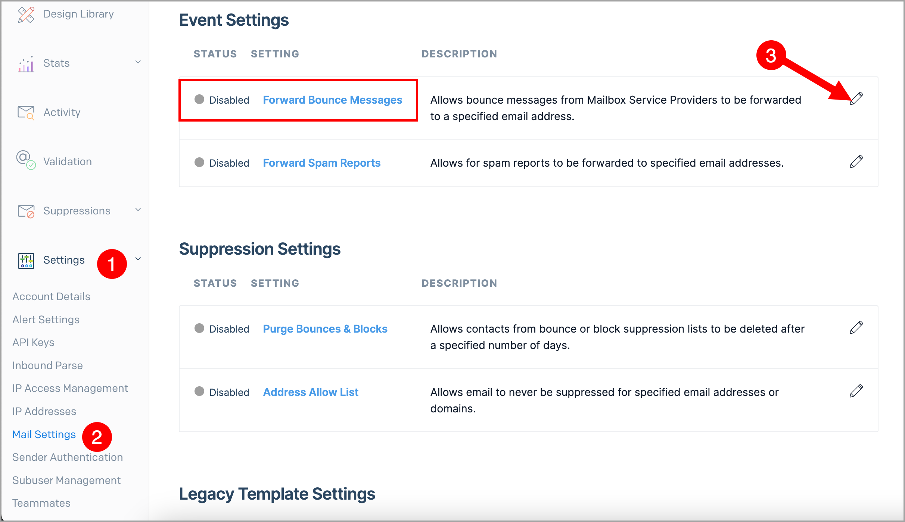
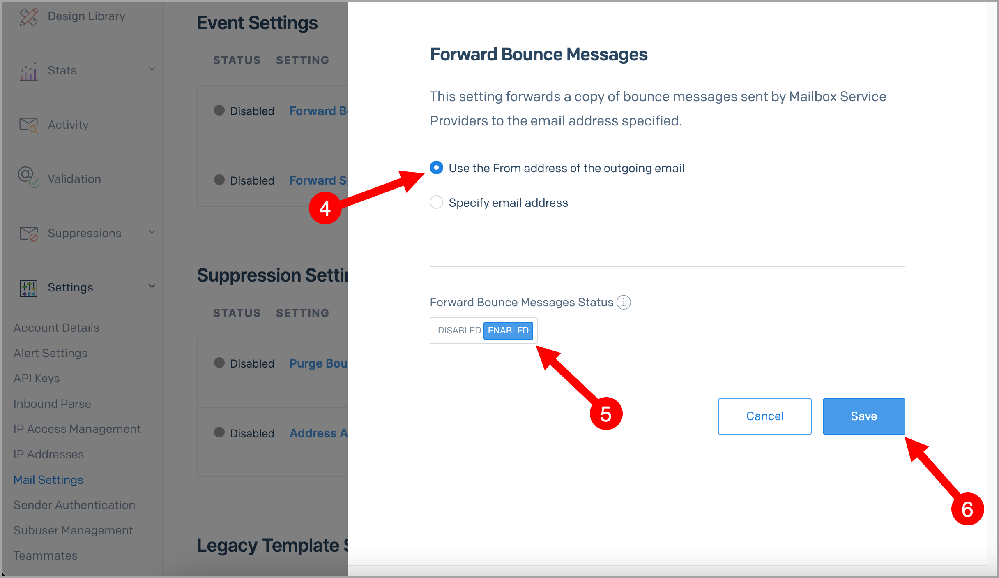

# Sending with SendGrid's SMTP

Using a custom SMTP like SendGrid with QuickMail lets you send emails without relying on your email account's default sending service. This allows you to send a higher volume of emails while reducing the risk of being flagged by your email provider.

**Important:** Using a custom SMTP has pros and cons. To learn more, check out this guide: Should I use Custom SMTP?

**In this article:**

- How to use QuickMail with SendGrid's SMTP?

- Forwarding bounced emails from SendGrid

- White-labeling your domain

## How to Use QuickMail with SendGrid's SMTP?

**Step 1.** Log in to your SendGrid account → **Dashboard** → **Create Sender Identity**.

**Step 2.** Fill in the details needed to create a sender.

**Step 3.** After creating a sender, check your inbox for an email from **no-reply@sendgrid.com** and verify the sender through that email.

Here is what the email looks like:

You will be directed to this page in SendGrid once verified:

**Step 4.** Go to **SendGrid** → **Email API** → **Integration Guide** → select **SMTP Relay**.

**Step 5.** Generate the API key by entering the API key name → click **Create Key**.

Here is what it should look like after generating the API key:

**Step 6.** Copy the SMTP configuration from SendGrid.

**Step 7.** Go to **Channels** → **Emails** → click on the email account where you would like to use SendGrid's SMTP → **Sending** tab → fill in the SMTP details → click **Test Sending**.

**Step 8.** If the configuration is correct, click **I've updated my settings** in QuickMail, then click **Verify Integration** in SendGrid.

**Step 9.** Click **Verify Integration** to send a test email.

If the test email was successful, you will see a confirmation message.

## Forwarding Bounced Emails from SendGrid

By default, SendGrid does not send bounce reports to the sender's inbox. This means follow-ups may still be sent to bounced leads in QuickMail, which can negatively affect your sender reputation.

To prevent this, set up bounce forwarding in SendGrid so QuickMail can detect bounces and stop follow-ups to those leads.

While logged in to your SendGrid account, go to **Settings** → **Mail Settings** → **Forward Bounce Messages**.

Select **Use the From address of the outgoing email**, or select **Specify email address** if you would like to send bounced emails to a different address → toggle **Enabled** → **Save**.

## White-Labeling Your Domain

Authenticating emails sent from SendGrid helps improve deliverability. Setting up SPF and DKIM records in your domain's control panel will improve deliverability and remove the "via SendGrid" label from outgoing emails.

For instructions on setting up SPF and DKIM records, see: [https://sendgrid.com/docs/ui/account-and-settings/how-to-set-up-domain-authentication/](https://sendgrid.com/docs/ui/account-and-settings/how-to-set-up-domain-authentication/)
