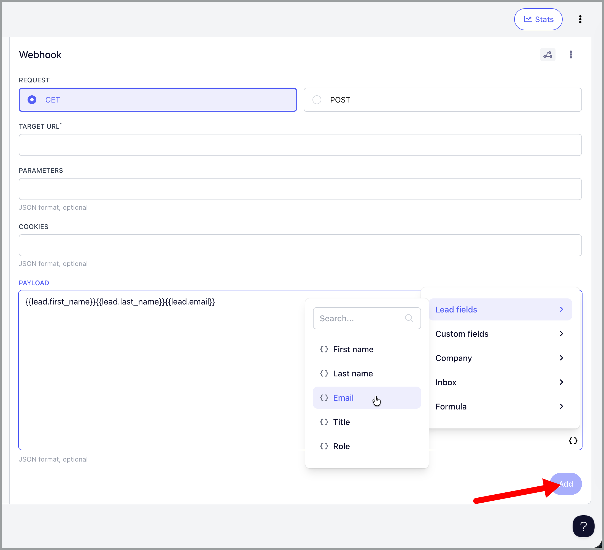

# Using Webhook Steps to Send Data to External Platforms

Webhook steps let you send lead data from QuickMail campaigns to external platforms like Make, Zapier, or HubSpot.

Each webhook step can have its own unique URL, separate from your account-level webhook.

**In this article:**

- Setting up a webhook step

- Tracking send dates

- Common webhook errors

- Webhook steps vs account webhooks

- How webhook steps with conditions work

- Troubleshooting tips

## Setting Up a Webhook Step

### Request Type and Payload

Use POST requests with a JSON payload to send data to most webhook platforms.

**Example payload:**

```json
{
  "first_name": "{{lead.first_name}}",
  "last_name": "{{lead.last_name}}",
  "email": "{{lead.email}}",
  "title": "{{lead.title}}",
  "role": "{{lead.role}}",
  "company": {
    "name": "{{company.name}}",
    "domain": "{{company.domain}}"
  },
  "city": "{{lead.custom.city}}",
  "source_campaign_id": "1234"
}
```

### Available Data Fields

Webhook steps can send the following lead data:

- `{{lead.first_name}}`

- `{{lead.last_name}}`

- `{{lead.email}}`

- `{{lead.title}}`

- `{{lead.role}}`

- `{{company.name}}`

- `{{company.domain}}`

- Custom fields using `{{lead.custom.field_name}}` (example: `{{lead.custom.city}}`)

You can also include static values like campaign IDs or tracking parameters in your payload.

To see the correct fields to use, click the properties button on the webhook step:



## Tracking Send Dates

QuickMail does not include send dates in webhook payloads, but you can capture approximate send times using your automation platform.

### The Workaround

Place your webhook step immediately after an email step in your campaign. When the webhook fires, your automation platform can record the timestamp it receives the webhook. Since the webhook triggers right after the email sends, this timestamp will be very close to the actual send time.

**In Make:**

- Use the `now` function to capture the current timestamp.

- Configure your scenario to add a timestamp field when the webhook is received.

- Send that timestamp to your destination platform as the send date.

**In Zapier:**

- Similar timestamp functions are available to capture when the webhook is received.

## Common Webhook Errors

### 404 Not Found

This error means the webhook URL could not be found on the receiving server.

**How to fix:**

- Verify you copied the complete webhook URL from your platform.

- Make sure you are using the correct webhook type in your automation platform.

- Confirm the URL is still active and has not been deleted or regenerated.

### 301 Moved Permanently

This error means the webhook reached the server but is being redirected to a different location.

**How to fix:**

- Ensure your webhook URL starts with `https://` (not `http://`).

- Copy the exact URL from your platform without adding or removing any characters.

- Do not add or remove trailing slashes.

- If the issue persists, regenerate a new webhook URL in your platform and paste it exactly as provided.

### Missing Protocol (https://)

Some platforms provide webhook URLs without the `https://` prefix. If your URL looks incomplete (example: `hook.us2.make.com/path`), check your automation platform's documentation or contact their support to confirm the correct format.

## Webhook Steps vs Account Webhook

QuickMail has two types of webhooks:

**Webhook steps (campaign-level):**

- Each step can have its own unique URL.

- Can be added multiple times within a campaign.

- Triggers when a lead enters that specific step.

- Limited to the available data fields listed above.

**Account webhook (account-level):**

- Only one webhook URL per account.

- Captures events across all campaigns.

- Can track opens, clicks, and other engagement events.

- Different payload structure and capabilities.

Both types can be used simultaneously.

## How Webhook Steps with Conditions Trigger

Webhook steps trigger when a lead enters the step, not when an event occurs.

**Example:** If you create a webhook step with the condition "at least one open," the step will:

- Let leads through if they already have an open at the time they reach the step.

- Skip leads that do not have an open yet.

The step will not wait for a future open to happen — it filters leads based on what they have already done at the moment they enter the step.

**To track opens and clicks:** Use the account-level webhook or a platform like Zapier instead of webhook steps.

## Troubleshooting Tips

- **Test your webhook URL** in your automation platform before adding it to QuickMail.

- **Use POST requests** unless your platform specifically requires GET.

- **Copy URLs exactly** as provided by your automation platform.

- **Check your automation platform's documentation** for webhook requirements.

- **Contact your platform's support** if errors persist after verifying the URL and request type.
