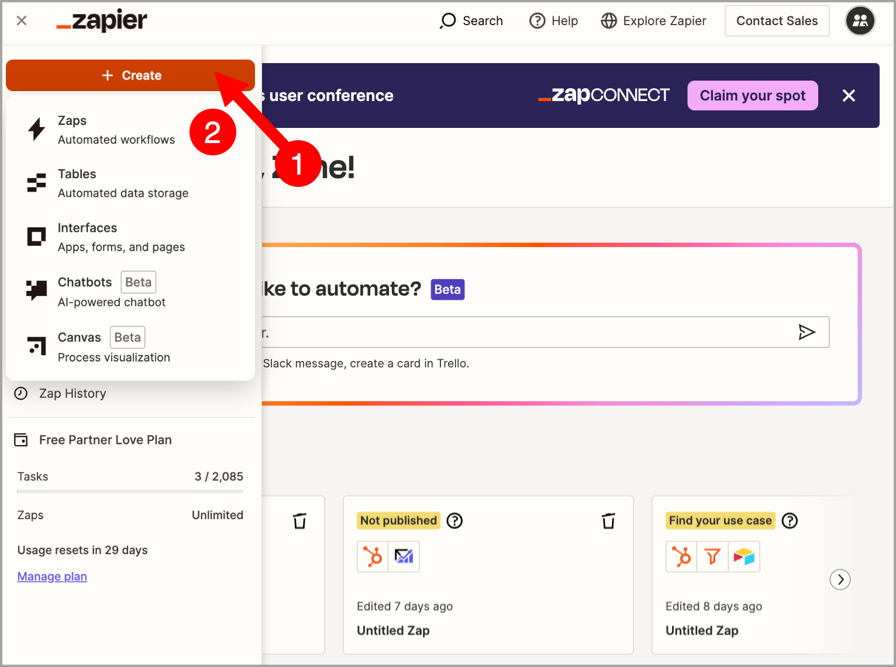
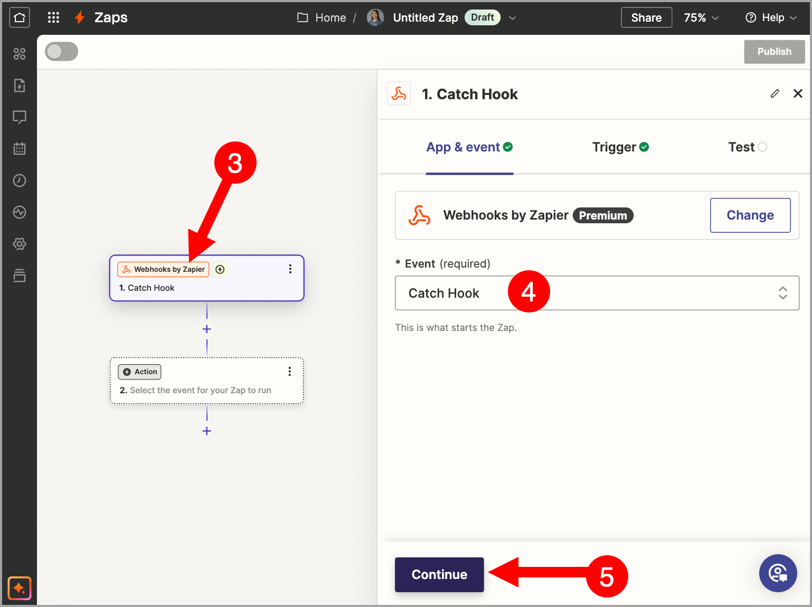
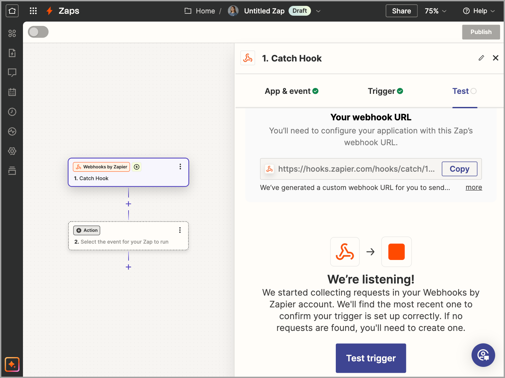
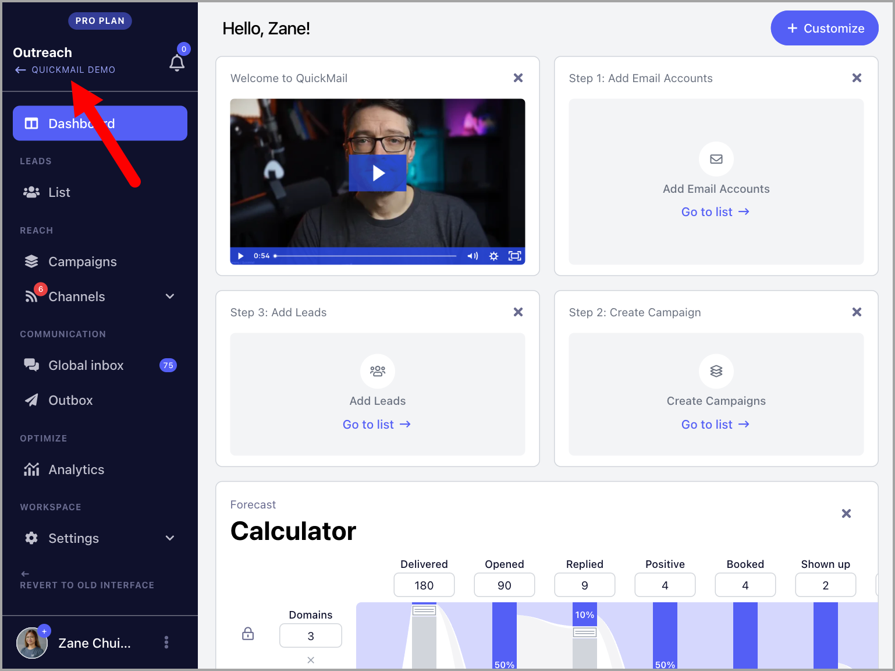
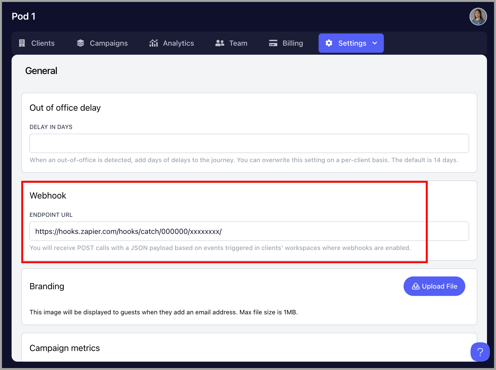
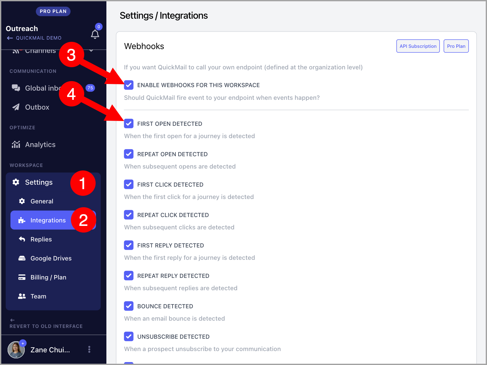

# Webhooks

Using QuickMail webhooks makes it easy to fetch data from the workspaces under your organization and consolidate it.

**Note** Webhooks is only available to accounts on the Agency Plan.

Here are the available webhook events:

- First open

- Repeat open

- First click

- Repeat click

- First reply

- Repeat reply

- Bounce

- Unsubscribe

- Lead tagging

- Task completed

- Journey completed

- Journey checkpoint

- Opportunity status


## How Does It Work?

Whenever an event occurs in a QuickMail workspace where a webhook is enabled, QuickMail sends all the information about that event to your webhook provider, such as Zapier, N8N, Make.com.

You can then use this information to automate workflows and perform actions such as recording data in a Google Sheet or sending it to another app.

## How to Set It Up?

### Step 1: Get the Webhook Endpoint URL

Go to your preferred webhook-enabled automation platform and get the webhook endpoint URL.

In the screenshot below, I'm using Zapier as an example. 



In Zapier, select **Webhook by Zapier** as the trigger → under **Event**, select **Catch Hook** → click **Continue**.



Click **Continue** again → copy the webhook endpoint URL.



### Step 2: Add the Webhook Endpoint URL to QuickMail

Go to the Organization Dashboard by clicking the organization name in the upper left corner of the workspace.



**Note:** If you don't see the option to access the Organization Dashboard, it means your account isn't on the Agency plan. To use webhooks, you'll need to upgrade to the $299/month Agency plan.

Go to the **Settings** tab → **Webhooks** → paste the webhook endpoint URL.



### Step 3: Enable Webhooks

Go to the specific workspace → **Settings** → **Integrations** → enable **Webhooks** → select your preferred triggers.



### Step 4: Complete Your Workflow

Go back to your webhook provider to complete the workflow and set it live.

# Commonly Asked Questions:

**What's the difference between webhooks and webhook steps?**
Webhooks send data automatically whenever an event happens, like an open, reply, bounce, or unsubscribe. You set them up once in your settings, and they work across all your campaigns.

Webhook steps are added inside a campaign, just like an email step. They only send data when a lead reaches that step in the sequence, so they can't be triggered by events like opens, clicks, bounces, or unsubscribes.

**Which plans include webhooks**?
Webhooks are only available on the Agency plan.

**What information is included in the payload?**
Here's a sample payload:

```json
{
  "event_name": "reply",
  "account.id": 13,
  "prospect.id": "136132",
  "prospect.first_name": "O",
  "prospect.last_name": "b",
  "prospect.full_name": "O b",
  "prospect.email": "aw.replyfrom.qm@gmail.com",
  "prospect.title": "",
  "prospect.role": "",
  "prospect.phone": "",
  "prospect.score": "0",
  "prospect.custom.att9": "",
  "prospect.custom.common-name": "",
  "prospect.unsubscribed": false,
  "prospect.verified_source": null,
  "prospect.tag.common-name": false,
  "prospect.tag.enum12": false,
  "prospect.tag.enum2": false,
  "prospect.tag.tag-11": false,
  "prospect.tag.test": false,
  "journey.id": 170,
  "campaign.id": "10",
  "campaign.name": "Plain text follow up",
  "campaign.description": null,
  "step.index": 3,
  "inbox.email": "aw.flow.test@gmail.com",
  "journey.opens": 0,
  "journey.clicks": 0,
  "journey.replies": 0,
  "journey.step_count": 3,
  "journey.sentiment": null,
  "journey.label": null
}
```

**How does my endpoint know which event it received?**
Every payload includes an event_name field in the body. For example, a reply event includes ```"event_name": "reply"```. This means you can send several events to the same endpoint URL and use event_name to decide how to handle each one.

**How can I verify that a request came from QuickMail?**
QuickMail doesn't currently use a signing secret, HMAC signature, or static token. To verify requests, you can add a secret token to your endpoint URL and set up your endpoint to reject any request that doesn't include it.

For example:

```
https://yourdomain.com/webhook?token=yoursecret
```

**What happens if my endpoint is down or returns an error?**

QuickMail retries failed webhooks [number of retries and time period]. If the webhook keeps failing after these retries, we'll pause it and notify you by email. A paused webhook stays paused until you fix the issue and turn it back on by removing and adding the endpoint URL again in your Organization Settings.

