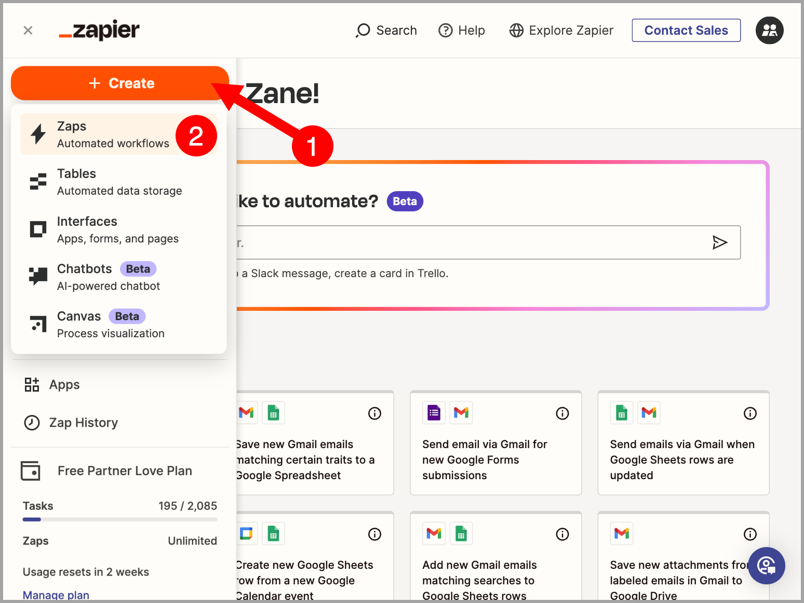
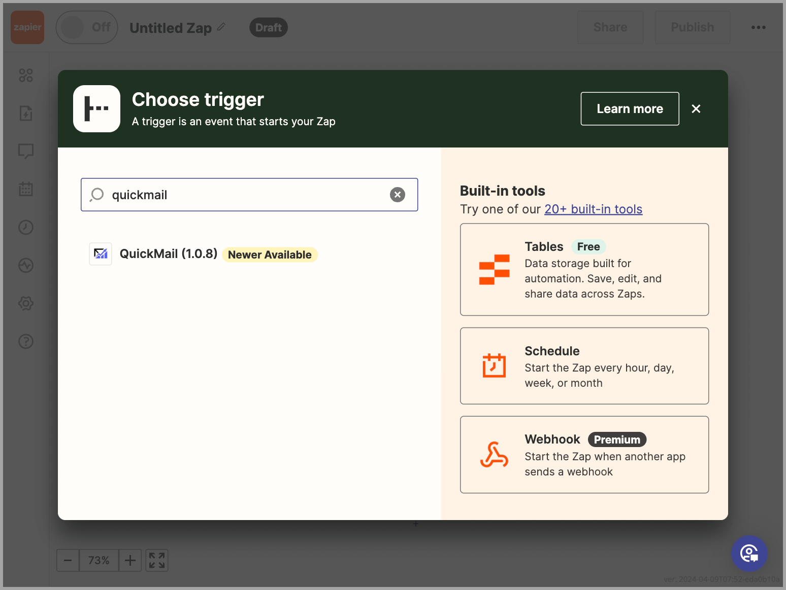

# Zapier Integration

**In this article:**

- What is Zapier integration for?

- How to set up Zapier integration?

- How to create Zaps with QuickMail triggers and actions?

## What Is Zapier Integration For?

Zapier allows you to connect multiple apps by linking triggers and actions, making it possible to automate workflows between QuickMail and other apps supported by Zapier.

Here are the available QuickMail **Triggers:**

- Update Tag

- New Reply

- New Checkpoint Reached

- New Journey Completed

- New Unsubscribe

- New Bounce

- New Task

- New Open

- New Click

- New Journey Sentiments or Labels

- New Inbox Reply Status

Here are the available **Actions:**

- Create or Update a Lead (this action can also add a lead to a campaign)

- Cancel Journey

- Unsubscribe Lead

Here is the available data that can be extracted:

- Account ID

- Lead ID

- Lead Email

- Lead First Name

- Lead Last Name

- Lead Title

- Lead Role

- Lead Phone

- Lead Score

- Lead Language

- Lead Unsubscribed

- Lead Verified Source

- Company ID

- Company Name

- Company Domain

- Journey ID

- Campaign ID

- Campaign Name

- Campaign Description

- Email Account

- Journey Opens

- Journey Clicks

- Journey Replies

- Journey Step Count

- Click Link

## How to Set Up Zapier Integration

Go to **Settings** → **Integrations** → scroll down to the **Zapier Integration** section → click **Regenerate Zapier API Key** → copy the Zapier API key.

Go to **Zapier** → **Apps** → search for **QuickMail** → click **Connect**.

A new window will appear. Paste the Zapier API key generated in QuickMail → click **Yes, Continue to QuickMail**.

Here is what it looks like once QuickMail has been successfully connected to your Zapier account:

## How to Create Zaps with QuickMail Triggers and Actions

Go to the Zapier home page → click **+ Create** → select **Zaps**.

When creating a Zap, search for **QuickMail** to find the trigger or action you need.

Follow the on-screen prompts to finish setting up the Zap. Once it is ready, use the toggle in the top-right corner to turn it on.
