# Adding New Leads

### In this article:

- What are leads?

- Creating leads manually

- Importing leads from CSV

- Importing leads from Google Drive

- Importing leads from Sales Navigator

- Importing leads from a LinkedIn Post

- Auto-importing via Google Sheet

- Auto-importing via Sales Navigator

- Importing leads from emails received

- Importing leads who viewed your LinkedIn profile

- FAQs

**IMPORTANT:** When leads are imported to a campaign in QuickMail, they are also added to your main Lead list. Leads can be filtered by engagement, tags, and more to narrow down targeted follow-up lists for further outreach or export.

## What are leads?

Leads are the people you will send emails or LinkedIn messages to. An email address is required to add a lead in QuickMail.

There are different ways to add leads to QuickMail:

- Adding Leads Manually

- Importing Leads from CSV

- Importing Leads from Google Drive

- Importing Leads from Sales Navigator

- Importing Leads from LinkedIn Posts

- Auto-importing via Google Sheet

- Auto-importing via Sales Navigator

- Importing leads from emails received

- Importing leads who viewed your LinkedIn profile

## Creating Leads manually

**Step 1.** Head to List → + Leads →  Add Lead Manually

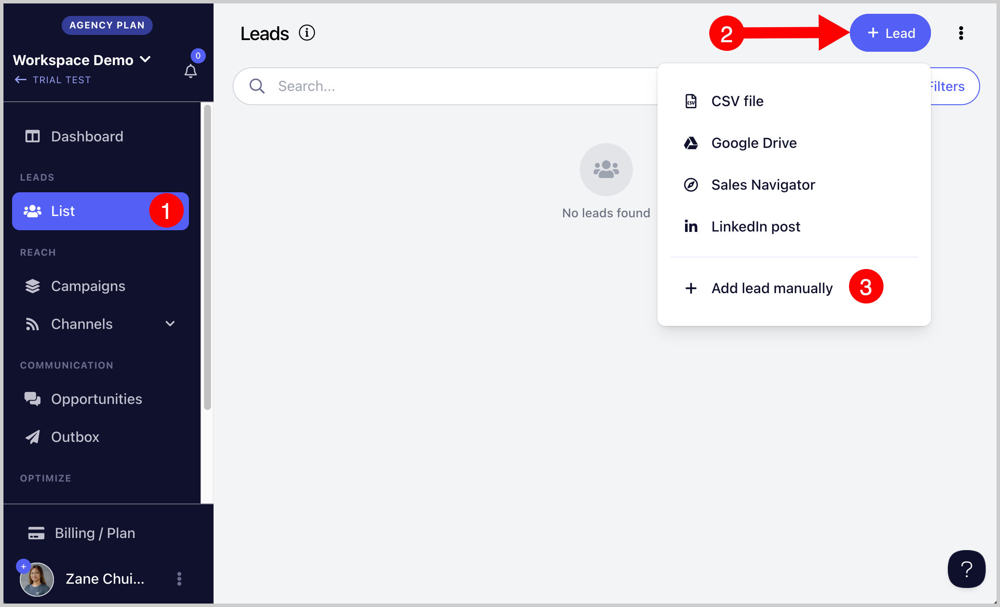

**Step 2.** Enter the lead's information including the email address

**Step 3.** **(Optional) I**f you would like to add custom properties like location, custom notes, etc., click on "Custom Properties" section. Add the name of the custom property and default value.

**Step 4. (Optional) **If you would also like to add Tags, click on the "Tags" section. Type in the name of the tag you'd like to create.

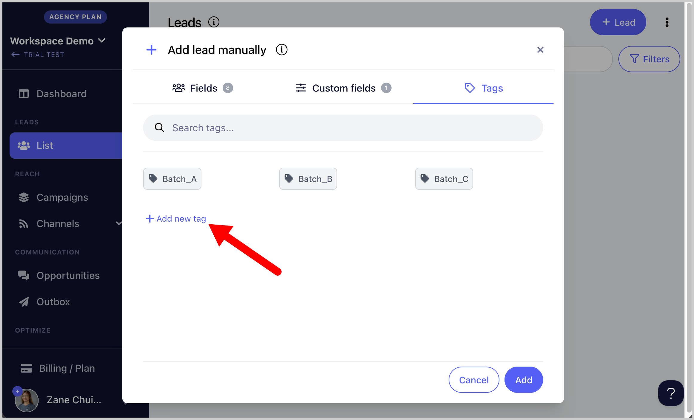

**Step 5.** Click on the tag syou'd like to add and finally, once all of the lead's information is entered, click on "Add"

## Importing Leads from CSV

Leads can be imported from a CSV (comma-separated value) file to your Leads list.

The leads in the sheet can be imported directly into a campaign

#### IMPORTANT CSV specifications:

- CSV file should be comma-delimited. Other delimiters (such as semicolons) are not supported.

- File size should not exceed 20 MB

- Number of rows should not exceed 49,999. If you have a large CSV, you can use this[free tool.](https://www.splitcsv.com/)

- Each lead entry should have a unique email

- The CSV file should contain a header row

**Step 1.** To start importing from a CSV, head to the List → +Leads → Import from CSV

**Step 2.** Drag and drop the CSV file to the box or click "Load File"

**Step 3.** Use the dropdown menu to map the correct headers in the CSV to the properties in QuickMail.

→ After that, click "Next"

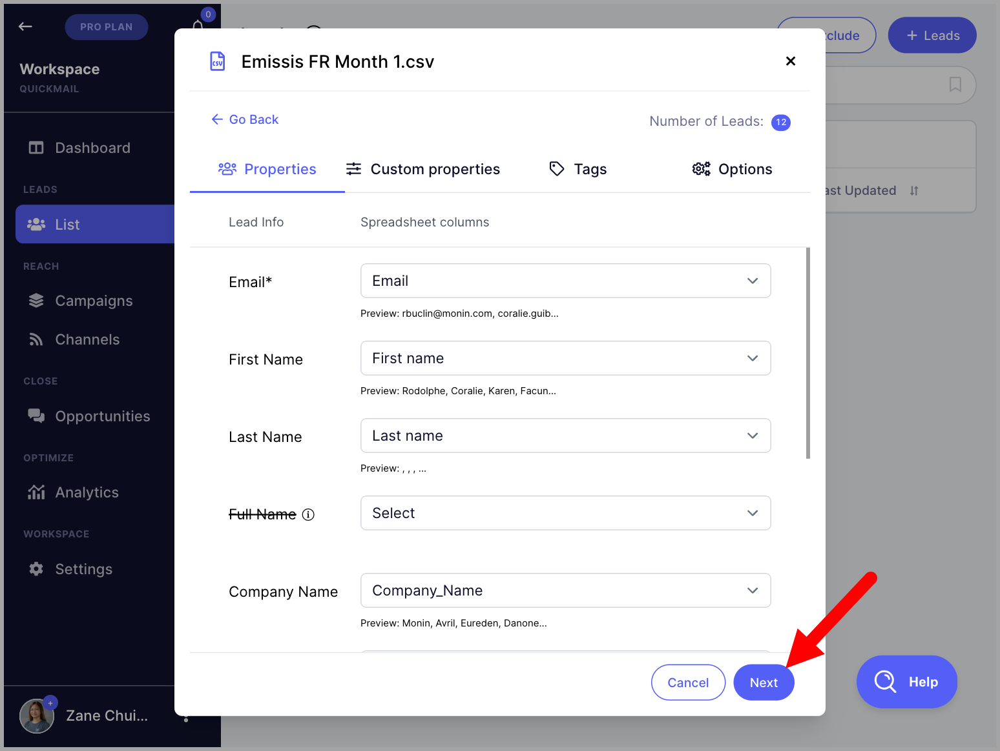

**Tip:** The headers can be named exactly as the lead properties (e.g. Email, Firstname, Lastname, etc.) to automatically map them to the same properties when importing.

**Step 4. (Optional) **You'll be directed to the "Custom Properties" section. If needed, create custom properties and map the headers in the CSV column for the custom properties → After that, click "Next"

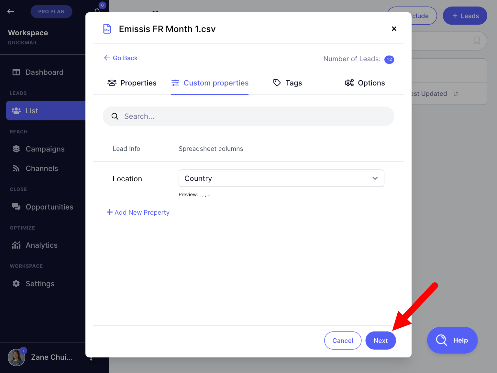

**Step 5. (Optional) **You'll be directed to the "Tags" section. If needed, create tags and map the headers in the CSV column for the tags → After that, click "Next"

**Step 6. (Optional)** You'll be directed to the "Options" section. Select a campaign if you would like to directly add the leads to the campaign → Finally, click "Import"

**Tip:** Check the box '**Update Lead if it exists'** if you would like to reimport the list of leads and update their information. Otherwise, the import will be rejected

Once the import is completed, an import report will be sent to the email address you're using to log in.

**Tip:** For troubleshooting related to Imports, this guide might come in handy: Understanding Import Report

## Importing Leads from Google Drive

Leads can be imported from a Google Sheet that is added to Google Drive.  The leads in the Google Sheet can be imported directly into a campaign.

#### Google Sheet Specifications

- Each Lead entry should have a unique email

- The Google Sheet should contain a header row

- The Google Sheet should be in a Google Drive that you have access to or a shared Google Drive folder that you have access to

### Step 1. Add a Google Drive

To import from a Google Sheet, the Google Drive must be added to QuickMail first. To do that, go to Settings → Google Drive → +Drive

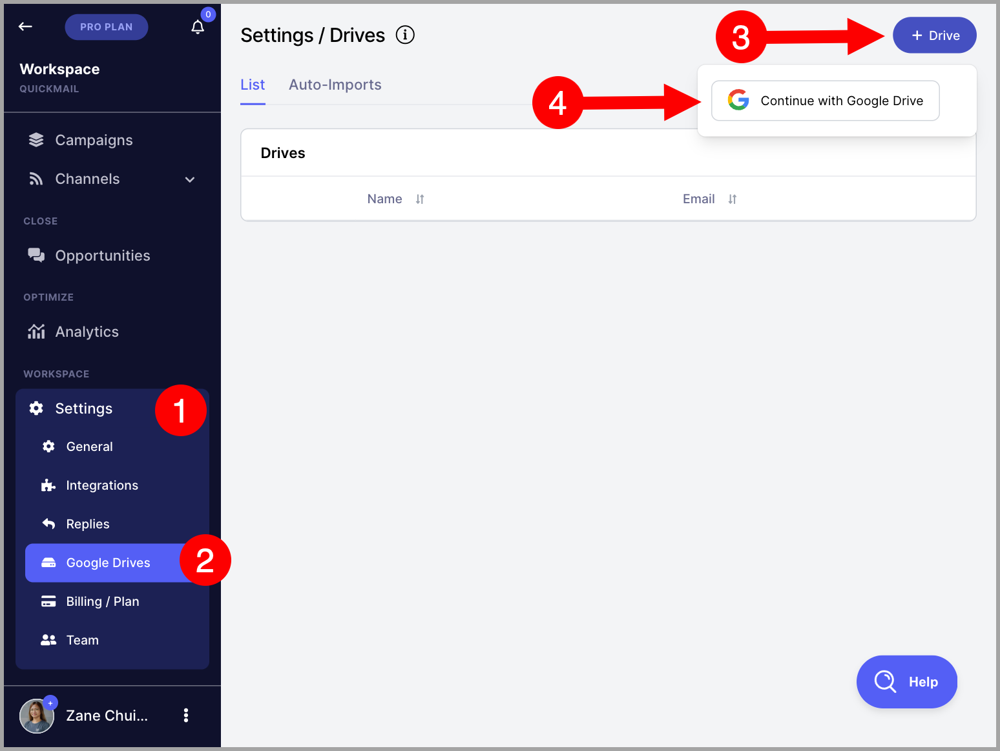

**Step 2.** Log in with the Google account associated with the Google Drive account. Once the Google account is added, it'll show on the list of available drives in your account

#### Step 3.  Select a Google Sheet for import

To start importing, go to List → click + Leads → Import from Google Drive

**Step 4.** Select the Google Sheet you would like to use for import

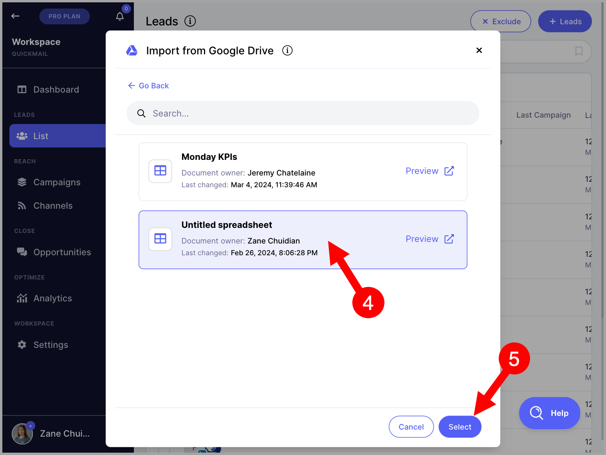

Use the dropdown menu to map the correct headers in the CSV to the properties in QuickMail.

→ After that, click "Next"

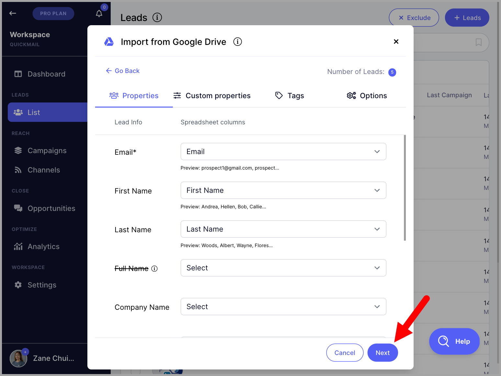

**Step 5.** You'll be directed to the "Custom Properties" section. If needed, create custom properties and map the headers in the CSV column for the custom properties → After that, click "Next"

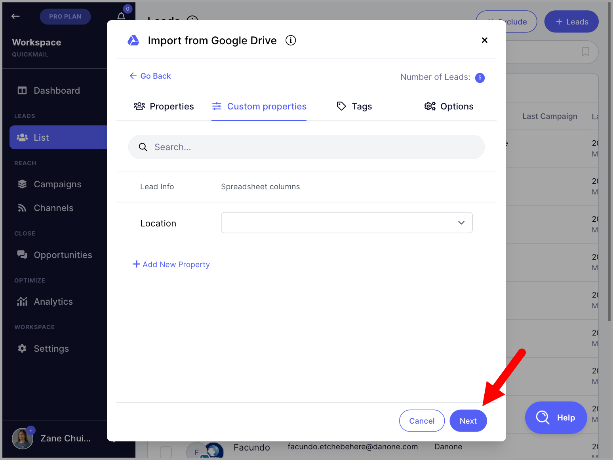

**Step 6.** You'll be directed to the "Tags" section. If needed, create tags and map the headers in the CSV column for the tags → After that, click "Next"

**Step 7.** You'll be directed to the "Options" section. Select a campaign if you would like to directly add the leads to the campaign → Finally, click "Import"

**Tip:** Check the box "Update Lead if it exists" if you would like to reimport the list of leads and update their information. Otherwise, the import will be rejected

**Step 8.** Once the import is completed, an import report will be sent to the email address you're using to log in.

## Importing From Sales Navigator

Our integration with LinkedIn Sales Navigator allows you to easily import selected leads into QuickMail. This is especially useful for running LinkedIn outreach.

**Note:** While LinkedIn profile URLs and other lead details are imported, email addresses are not included.

**Step 1.** Add a LinkedIn account that has Sales Navigator subscription. Go to Channels → LinkedIn → + LinkedIn. This guide about Adding LinkedIn accounts might come in handy.

**Note:** LinkedIn accounts showing a Sales Navigator icon are supported for Sales Navigator. If there's no Sales Navigator icon, it means the account is not compatible.

**Step 2.** Go to [Sales Navigator](https://www.linkedin.com/sales/home) → Search for the leads you'd like to import → Use filters to narrow down your search if needed → Copy the URL

**Note:** Recent Search links are not yet support. The URL Should start with [https://www.linkedin.com/sales/search/people?query=](https://www.linkedin.com/sales/search/people?query=) from fresh search.

**Step 3.** Go to Leads → + Add Leads → Import from Sales Navigator

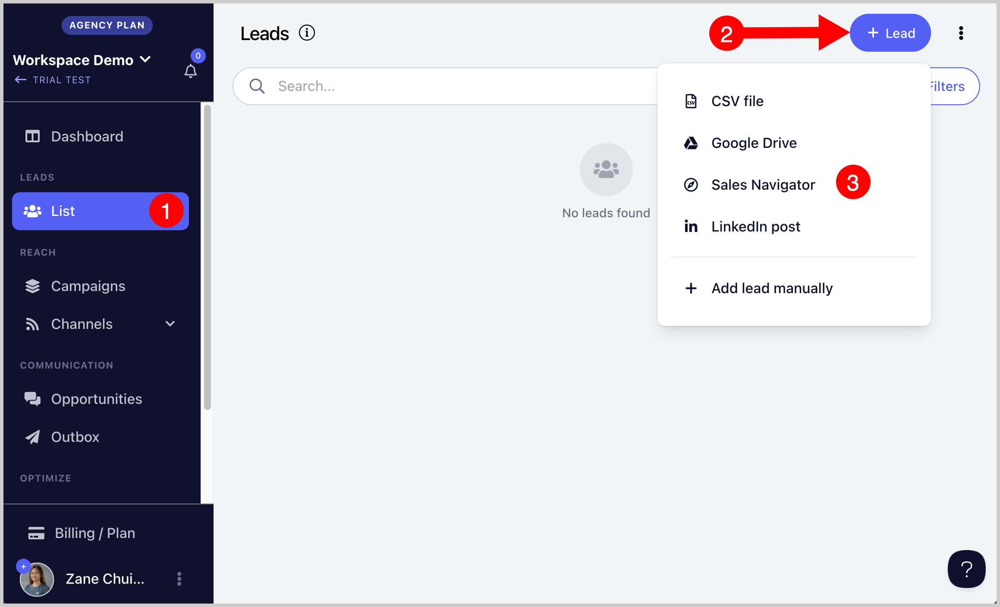

**Step 4.** Paste the URL copied from Sales Navigator → Follow the on screen instructions to setup import

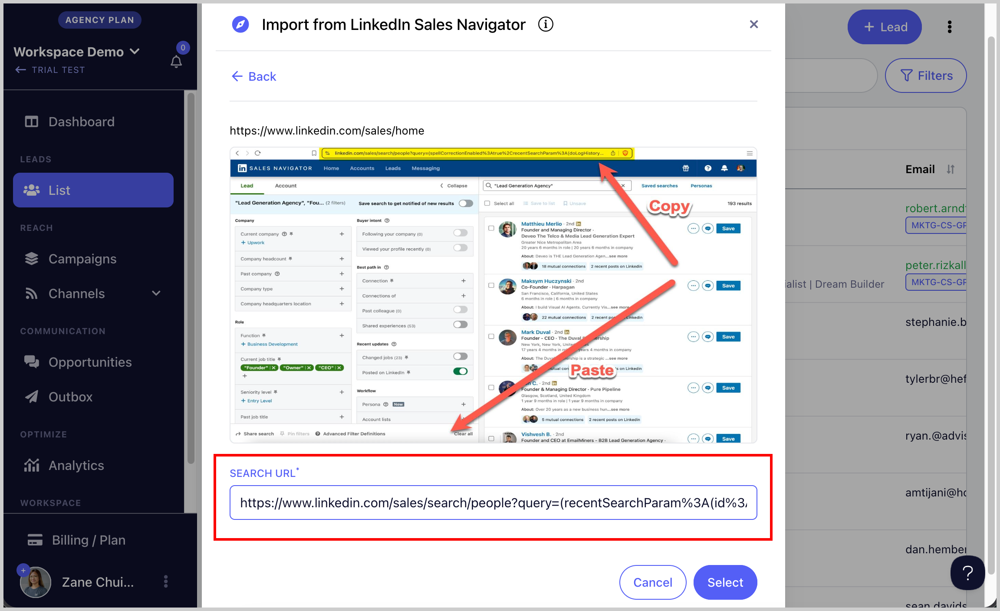

**Step 5.** An import report will be sent shortly via email where you can see how many leads have been imported or rejected.

## Importing Leads from a LinkedIn Post

**Tip:** You can also import leads from a different person's LinkedIn post

**Step 1.** Add a LinkedIn accoun. Go to Channels → LinkedIn → + LinkedIn. This guide about Adding LinkedIn accounts might come in handy.

**Step 2.** Copy the LinkedIn post link and paste it into QuickMail.

**Step 3.** Map the leads' properties and add custom properties or tags if you'd like.

**Step 4.** Select the campaign where you would like to add the leads (optional) and click 'Import'

**Step 5.** An import report will be sent shortly via email where you can see how many leads have been imported or rejected.

## Auto-import with Google Sheet

**Important:** Make sure that the sharing settings of the Google Sheet is Shared and it isn't saved in a Shared Drive. Otherwise, permission issues may occur and auto-import may not work.

Every time you add a new lead to your Google Sheet, they'll be added automatically to your list or campaign automatically. ust keep your sheet updated, and we’ll handle the rest.

**Step 1** . To setup auto-import with Google Sheet, first, Add a Google Drive for auto-import. Head to Settings → Google Drive → +Drive

**Step 2.** Import from the Google Sheet you'd like to use for auto-import. Go to List > + Leads > Google Drive > Tick the box 'Auto-import automatically if spreadsheet changes'

**Note:** Auto-import will only import new leads added to the Google Sheet after it was setup. Existing leads in the Google Sheet need to be imported separately.

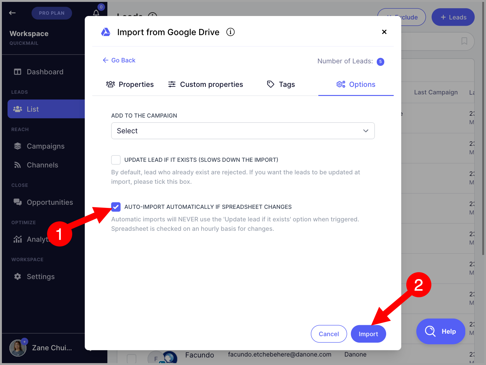

QuickMail will scan the Google sheets for any change every hour - and if new Leads are detected, those leads will automatically get imported.

**Note:** There is a limit to the number of auto-import sheets that can be added: 1 for the Basic plan, 10 for the Pro plan, and 30 for the Expert plan.

## Auto-import via Sales Navigator

Auto-Import continuously monitors your saved Sales Navigator search. When a new lead appears, it’s automatically pulled into your list or campaign so you can engage without lifting a finger.

**Step 1.** To setup auto-import with Sales Navigator, first, add a LinkedIn account that has Sales Navigator subscription. Go to Channels → LinkedIn → + LinkedIn. This guide about Adding LinkedIn accounts might come in handy.

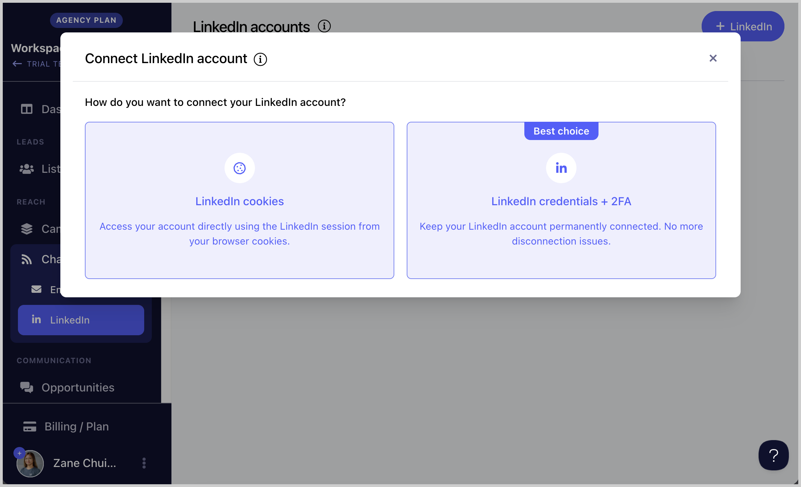

**Note:** LinkedIn accounts showing a Sales Navigator are supported for Sales Navigator. If there's no Sales Navigator icon, the account is not compatible.

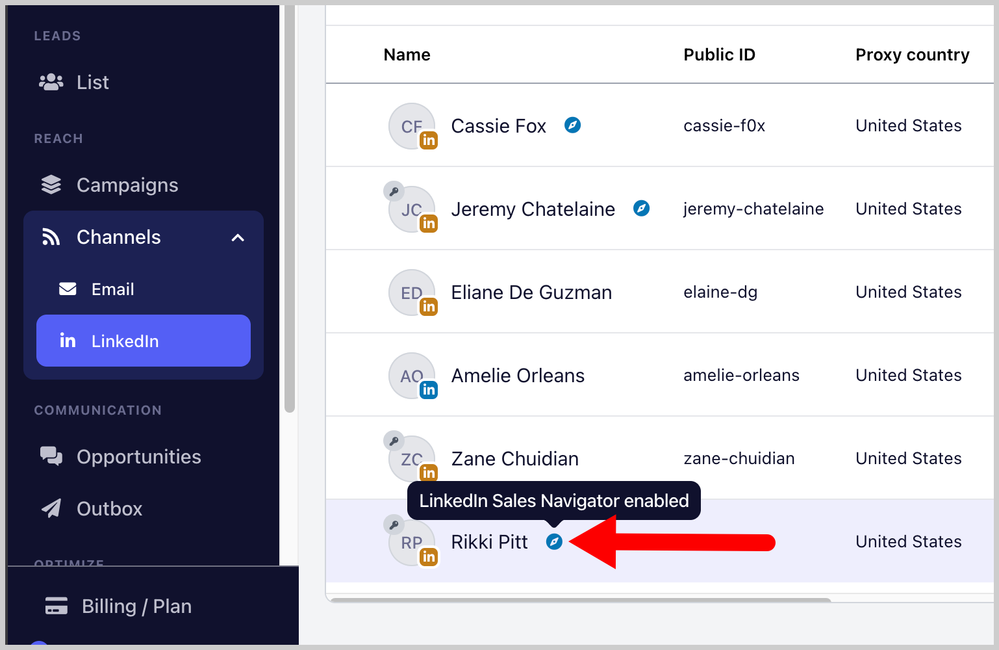

**Step 2.** Go to [Sales Navigator](https://www.linkedin.com/sales/home) > Search for the leads you'd like to import → Use filters to narrow down your search if needed → Copy the URL

**Note:** Recent Search links are not yet support. The URL Should start with [https://www.linkedin.com/sales/search/people?query=](https://www.linkedin.com/sales/search/people?query=) from fresh search.

**Step 3.** Go to Leads → + Add Leads → Import from Sales Navigator

**Step 4.** Paste the URL copied from Sales Navigator → Follow the on screen instructions to setup import

**Step 5.** Setup the auto-import and under Options, check the box 'Re-run this import at regular intervals' → Then select preferred interval

**Tip:** You can select a campaign in the **“Add to campaign”** dropdown to automatically add new leads from Auto-Import to that campaign.

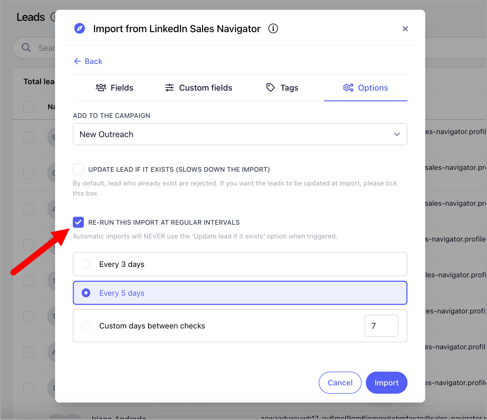

When a new lead appears, it’s automatically added to your list or campaign, so you can engage them right away without having to search again.

## Importing Leads From Emails Received

You can automatically import email addresses who sent you emails. Note, however, that this can include personal or marketing email addresses who sent you emails.

To enable this option, go to Channels → Emails → Click on an email account → Receiving tab → Check the box 'Create leads from emails received' → Choose campaign where you'd like to add the leads (Optional)

## Importing Leads Who Viewed Your LinkedIn Profile

It's now possible to automatically import LinkedIn IDs of people who viewed your LinkedIn profile.

To enable this option, go to Channels → LinkedIn → Click on the Linkedin account → Receiving tab → Check the box 'Create leads from profile viewers' → Choose campaign where you'd like to add the leads (Optional)

## FAQs:
**Q:** How do I know if the import process has been completed?
**A:** **You will receive an email about the details of the import similar to other import methods - Import Report Email
**Q:** What will happen if leadsthat are already on the list are imported?
**A:** Leads that are already on the list will be skipped/rejected.

That's because each lead should have a unique email address to be imported or added.

If you want to update the details of the existing leads, you can tick the box "Update Lead if it exists" before hitting the import button. This can be useful when moving existing Leads to a different bucket or when adding new details to Leads (such as custom attribute values).

**Note:** "Update Lead if it exists" only works for manual imports.

Auto-imports will always skip leads that already exist.

**Important:** When updating leads upon import, make sure to map the Company information. If the company information is not mapped, the company name will default to the domain name which can have skewed capitalization (e.g. Abc instead of ABC).
