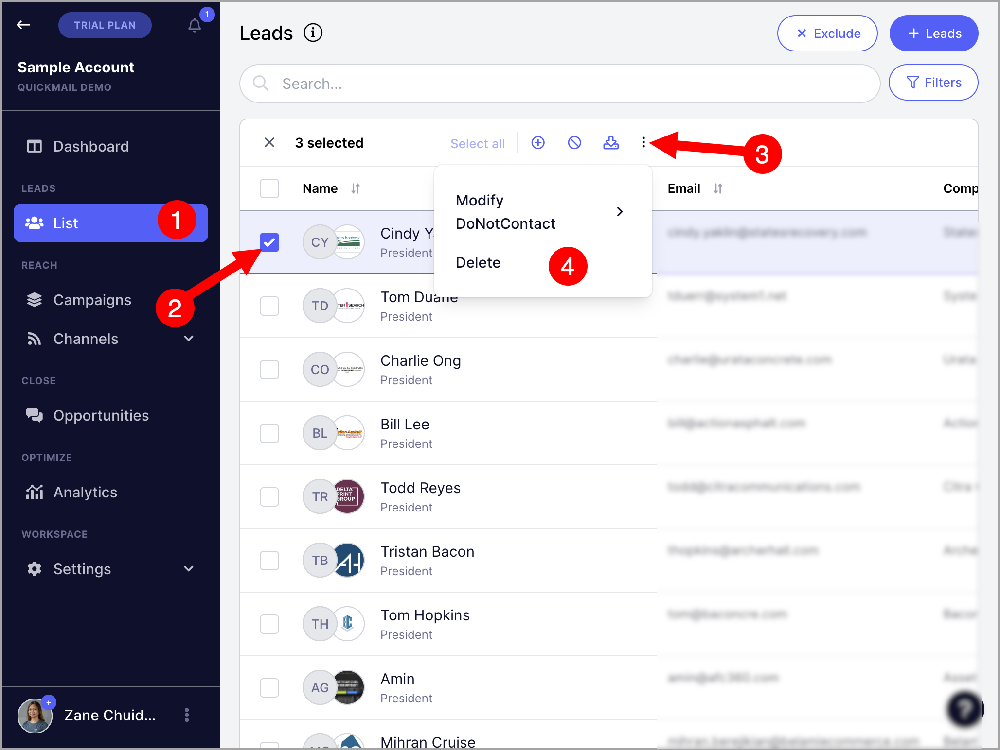
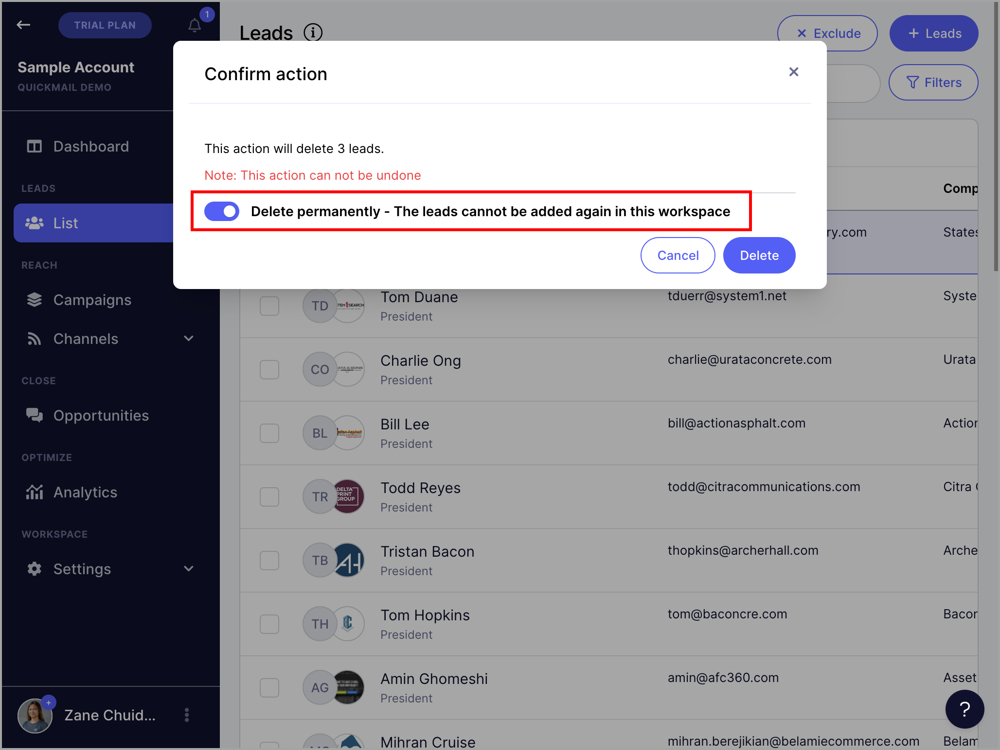

# Deleting Leads

**In this article:**

- Why delete leads?

- What happens when a lead is deleted?

- How to delete leads?

## Why Delete Leads?

Leads may need to be deleted when they are no longer needed in the account or to make space for new leads.

## What Happens When a Lead Is Deleted?

Deleting a lead removes all of that lead's data from the account. This is an irreversible process.

The lead will be removed from any campaigns, and any conversations or tasks related to them in Opportunities will also be removed. If the lead had been verified, their email verification status will also be removed.

## How to Delete Leads?

Leads can be deleted temporarily or permanently.

Go to **List** → select a lead → click the menu icon (three vertical dots) → **Delete**.

After clicking delete, an option to permanently delete the lead will appear. Permanently deleted leads cannot be imported back into the account.

**Note:** Leads do not need to be permanently deleted if the goal is simply to make space for new leads.
