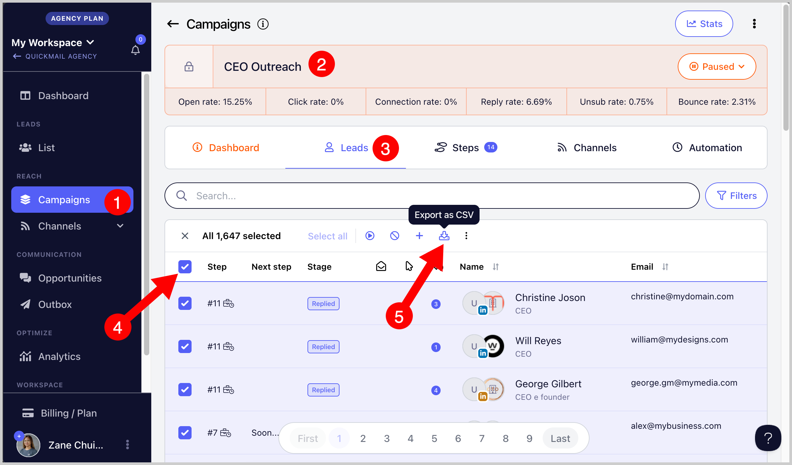

# Exporting Journeys

Exporting journeys allows you to export leads and view each lead's status in a campaign along with other campaign activity.

**In this article:**

- How to export journeys?

- What do I do if I didn't receive the email?

## How to Export Journeys?

Go to the campaign's **Leads** page → select all leads → click **Export**.

After the export, a CSV file will be sent to the email address you use to log in.

**Note:** You can use filters to narrow down the leads you would like to export.

## What Do I Do if I Didn't Receive the Email?

If you did not receive the email containing the CSV export, check the change log on the **Teams** page to find the export link.

It is also possible that your email address was added to the suppression list. This can happen if QuickMail notification emails to your address bounced more than once. Contact [support@quickmail.io](mailto:support@quickmail.io) for assistance.
