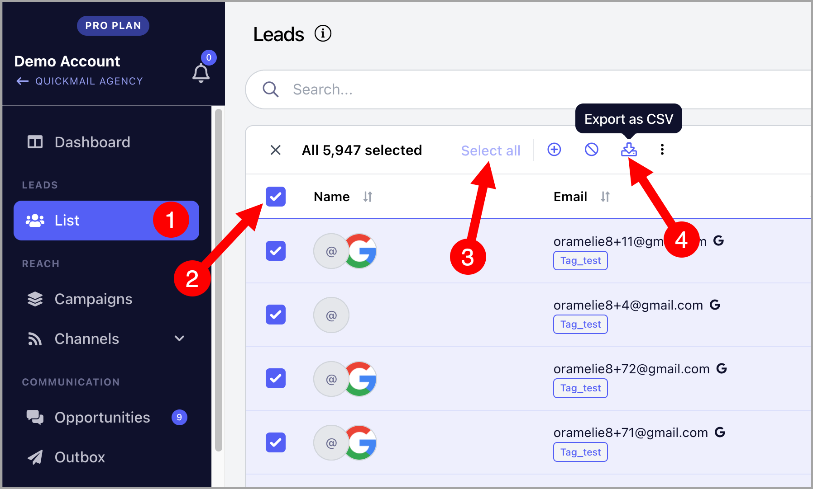

# Exporting Leads

If you need a backup of your leads or want to use them elsewhere, you can export your leads from QuickMail in just a few steps.

**In this article:**

- How to export leads?

- What do I do if I didn't receive the email?

## How to Export Leads?

Go to **Leads** → select the leads → click **Export**.

After the export, a CSV file will be sent to the email address you use to log in.

**Note:** You can use filters to narrow down the leads you would like to export.

## What Do I Do if I Didn't Receive the Email?

If you did not receive the email containing the CSV export, your email address may have been added to the suppression list. This can happen if QuickMail notification emails sent to your address have bounced more than once.

Alternatively, the email may have landed in your spam, junk, or another folder.

You can find a copy of the download link sent to your email in your account’s change log: Go to Settings → Team → Ellipsis → Changelog

