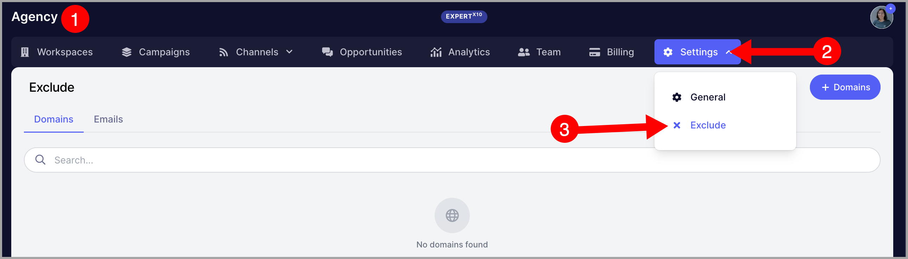
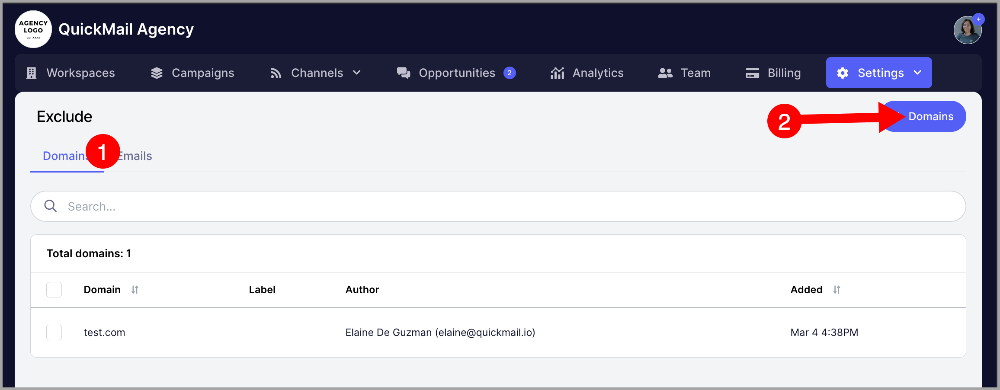
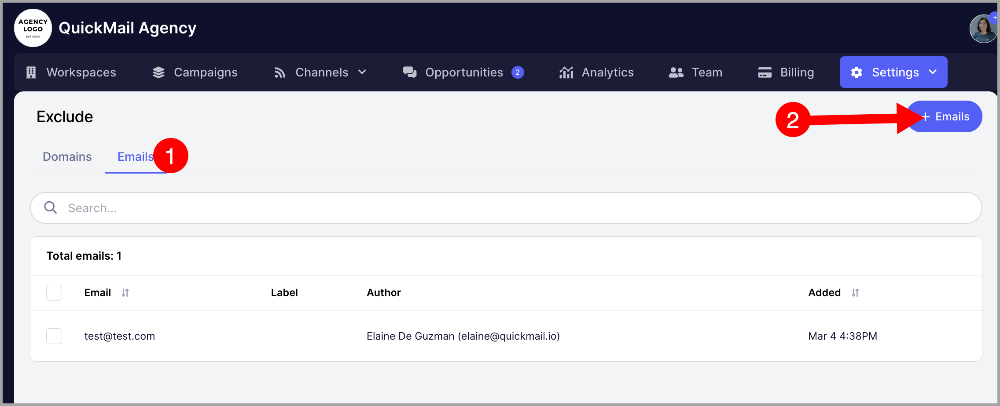
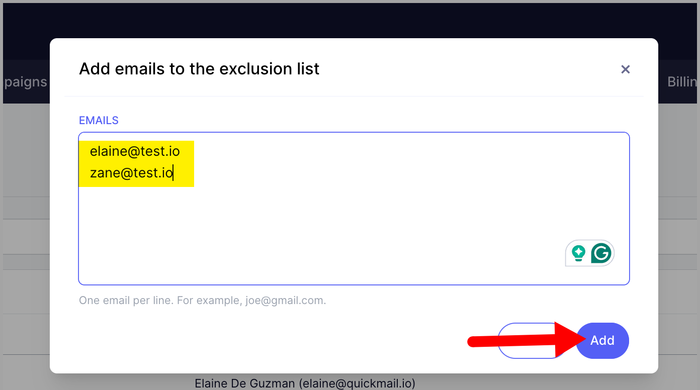

# Managing Exclusion Lists (For Agencies)

**In this article:**

- Why keep an agency exclusion list?

- How does it work?

- How to add domains to the agency exclusion list?

- How to add email addresses to the agency exclusion list?

- How to automatically add leads to the exclusion list if they unsubscribe from a workspace?

- How to automatically add a domain to the exclusion list if a lead unsubscribes from a workspace?

- What if I want an email address excluded only from certain workspaces?

- What if I want a domain excluded only from certain workspaces?

## Why Keep an Exclusion List?

Keeping an exclusion list helps you:

- Comply with laws like CAN-SPAM, GDPR, and CASL, which require honoring opt-out requests.

- Reduce the risk of being blacklisted by email providers.

- Protect your sender reputation by avoiding re-contacting leads who have already opted out.

- Filter out irrelevant contacts to improve targeting.

## How Does It Work?

If a domain or email address is added to the agency exclusion list, it cannot be contacted from any workspace under the agency. If a lead using an excluded address or domain is added to a campaign, they will be automatically skipped.

If only an email address is excluded, other leads from the same domain can still be contacted. If a domain is excluded, all leads using that domain will be blocked.

## How to Add Domains to the Agency Exclusion List?

Go to the Agency Dashboard → **Exclude** tab.

Click **Domain** → **Add Domains**.

**Important:** Do not include `www` before the domain, as it will be interpreted as a subdomain.

You can add multiple domains at once — enter one domain per line.

## How to Add Email Addresses to the Agency Exclusion List?

From the same page, go to the **Emails** tab → add addresses, one per line → click **Add**.

All added domains and email addresses will show who added them and when. If entries were added via automation, the source will also be displayed.

**Source types and what they mean:**

- **API** — marked as Do Not Contact via API.

- **Zapier** — marked as Do Not Contact via Zapier automation.

- **Campaign** — marked after completing a Do Not Contact sub-campaign.

- **AI** — marked after a reply was categorized as an unsubscribe request.

Learn more about automatically handling unsubscribes [here](https://help.quickmail.com/leads/handling-unsubscribes/).

## How to Automatically Add Leads to the Exclusion List if They Unsubscribe from a Workspace?

Go to the workspace **Settings** → **General Settings** → enable **Update Organization Do Not Contact**.

When enabled, leads will automatically be added to the agency exclusion list if they are:

- Manually marked as Do Not Contact.

- Unsubscribed from a campaign.

- Marked via Zapier or API.

Domains added to a workspace's DNC domain list will also be added to the agency exclusion list when this setting is enabled.

**Note:** This setting must be enabled in each workspace for it to apply across the entire agency.

## How to Automatically Add a Domain to the Exclusion List if a Lead Unsubscribes from a Workspace?

This is not currently supported. As a workaround, domains must be added to the agency exclusion list manually.

## What if I Want an Email Address Excluded Only from Certain Workspaces?

Add the lead to those specific workspaces and mark them as Do Not Contact. Here is a quick guide: [Marking Leads as Do Not Contact](https://help.quickmail.com/leads/handling-unsubscribes/).

## What if I Want a Domain Excluded Only from Certain Workspaces?

Sure, that's possible. Simply go to the Leads page of a specific workspace, click on the ellipsis, and click exclude list. From there, you'll see an option to add domains to the exclude list. 

**Note:** To ensure domains and email addresses are only excluded from specific workspaces and not the entire agency, make sure to turn off **Update Organization Do Not Contact** before marking them as Do Not Contact or adding domains to the DNC domain list.
