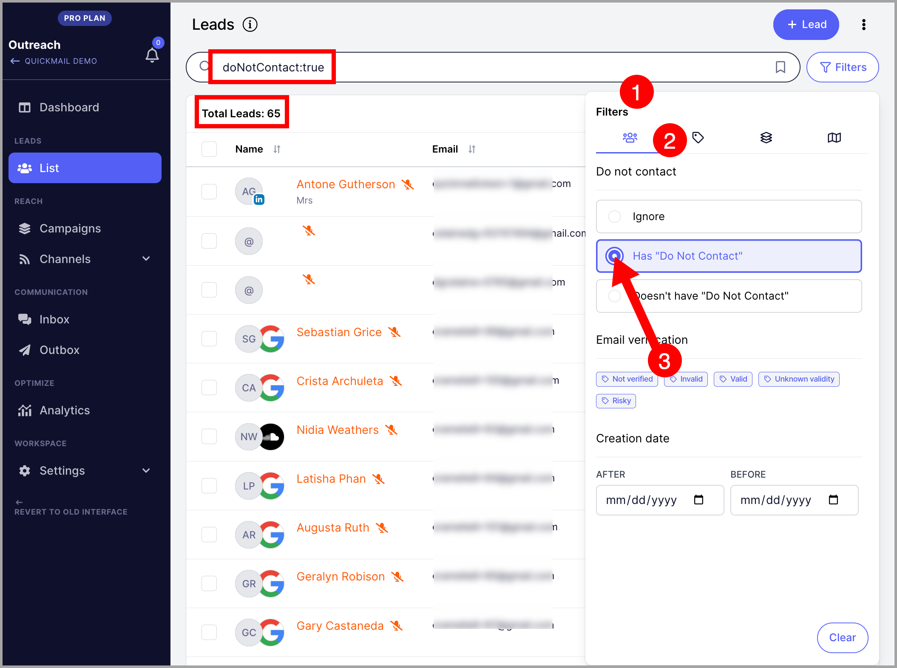
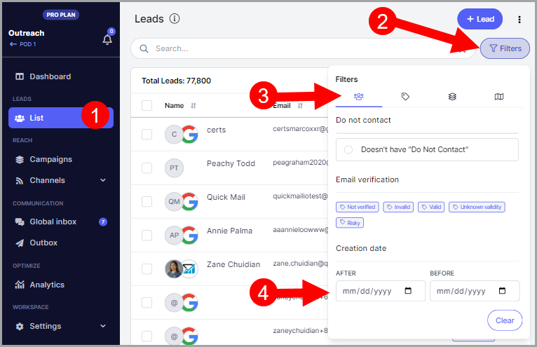
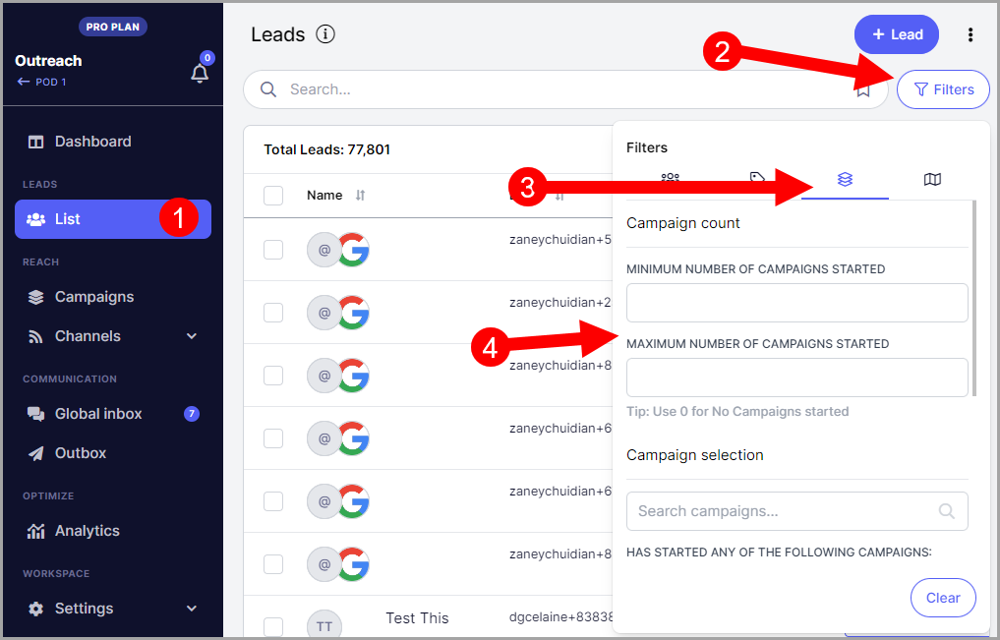
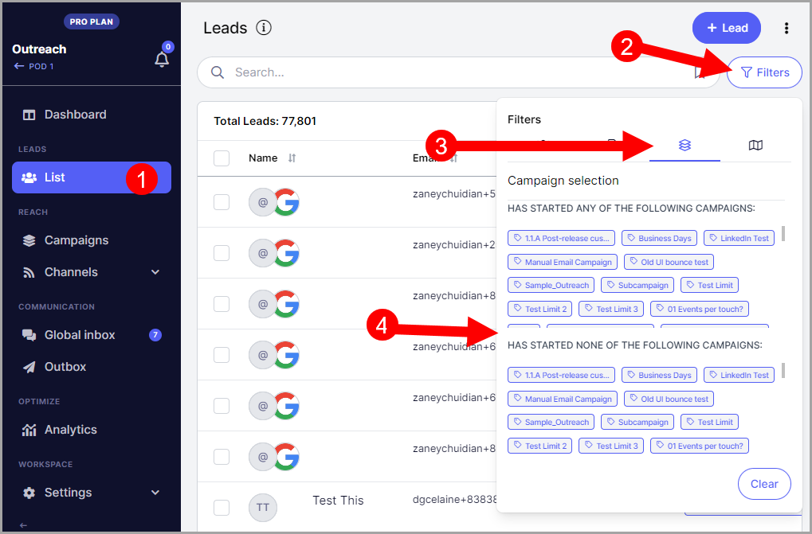
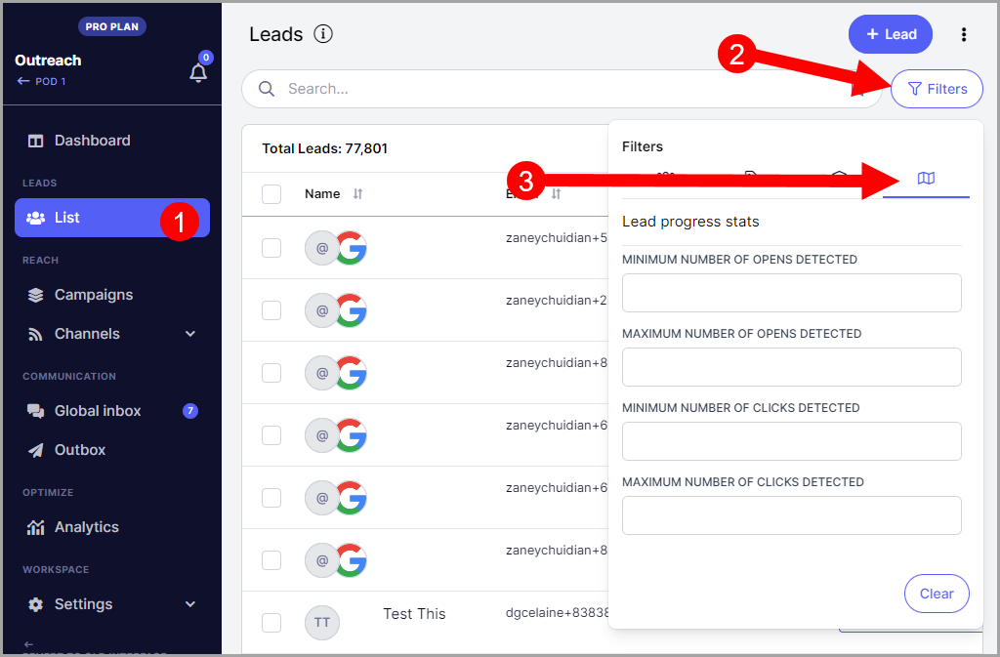
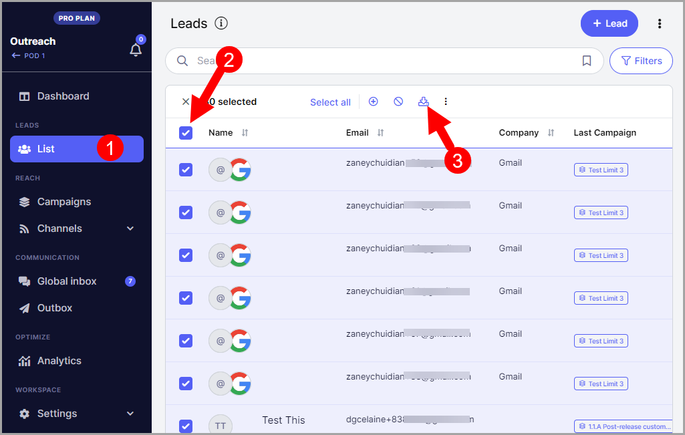
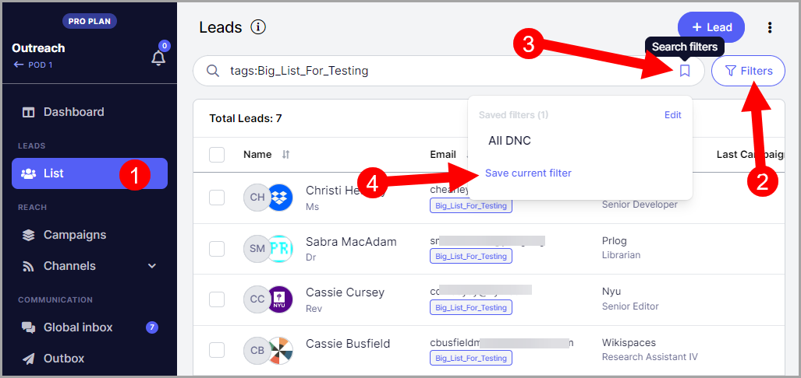

# Narrowing Down Your List Using Filters

**In this article:**

- Why filter leads?

- How to filter leads?

  - Unsubscribed / Do Not Contact leads

  - Leads with specific email validity

  - Leads created in a specific timeframe

  - Leads with and without specific tags

  - Leads in a specific number of campaigns

  - Leads in specific campaigns

  - Lead status in a campaign

  - Leads with opens or clicks

- How to share filtered leads?

- How to save filters?

## Why Filter Leads?

Filters allow you to narrow down your lead list and quickly find the leads you are looking for based on specific criteria. This saves time and helps you find leads more accurately than searching manually.

## How to Filter Leads?

Go to the **Leads** page and click **Filters**. This will open a window showing all available filters.

### Unsubscribed / Do Not Contact Leads

Leads are marked as Do Not Contact if they unsubscribed from a campaign, or if they were manually marked as Do Not Contact.

To filter for these leads, click the relevant radio button under the first tab:

You can also use this filter to find leads that are not marked as Do Not Contact.

### Leads with Specific Email Validity

Select any status under **Email Verification** to filter leads based on their email validity.

**Pro tip:** To verify emails in QuickMail, set up an email verification tool. Here is a detailed guide on email verification.

### Leads Created in a Specific Timeframe

Filter leads by their creation date by setting a start and end date. Use the **After** date as the start and the **Before** date as the end.

### Leads with and Without Specific Tags

Filter leads based on tags they have or do not have.

### Leads in a Specific Number of Campaigns

Filter leads based on how many campaigns they are part of.

### Leads in Specific Campaigns

Filter leads based on which campaigns they are participating in.

### Lead Status in a Campaign

Filter leads by their status within a campaign, such as replied or on a specific step. You can also filter by status change date.

### Leads with Opens or Clicks

Filter leads based on whether they have opened or clicked emails.

## How to Share Filtered Leads?

To share filtered leads with team members or save them for record keeping, select all filtered leads → **Select All** → **Export** to download a CSV file.

## How to Save Filters?

To save a custom filter for future use, apply your filters first, then click the bookmark icon in the search bar and enter a name for the filter.

Saved filters will be available for reuse, so you do not need to recreate the same filter repeatedly.
