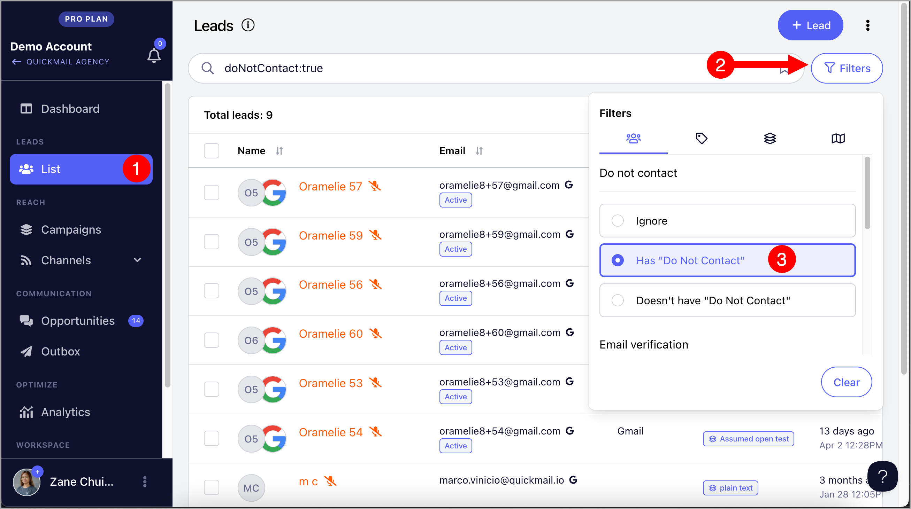

# Permanently Deleting Leads

**In this article:**

- Why delete leads permanently?

- What leads should I permanently delete?

- How to delete leads permanently?

- I mistakenly deleted leads permanently. How do I undo it?

- Can I get a list of permanently deleted leads?

- Can I restore permanently deleted leads?

## Why Delete Leads Permanently?

All accounts have a lead limit based on their plan — 10,000 for Basic, 50,000 for Pro, and 100,000 for Expert.

When you reach your lead limit, you can permanently delete leads to make room for new ones. Permanently deleting leads also helps prevent accidentally re-adding leads you no longer wish to contact.

## What Leads Should I Permanently Delete?

The most commonly deleted leads are those who have unsubscribed, are marked as Do Not Contact, or have bounced or invalid email addresses.

To filter for unsubscribed or Do Not Contact leads, go to **List** → **Filters** → select **Has "Do Not Contact"**.

To filter for invalid emails, go to **List** → **Filters** → under **Email Verification**, select **Invalid**.

## How to Delete Leads Permanently?

Select the leads you would like to delete.

Before confirming, make sure to toggle **Delete Permanently** on.

## I Mistakenly Deleted Leads Permanently. How Do I Undo It?

Go to workspace **Settings** → scroll down → **Clean List**.

## Can I Get a List of Permanently Deleted Leads?

It is not possible to retrieve a list of permanently deleted leads. Once permanently deleted, the lead data is encrypted in the database and cannot be read.

To avoid losing records, export the leads before permanently deleting them. Select the leads → **Export** (a CSV will be sent to the email address you use to log in).

## Can I Restore Permanently Deleted Leads?

Permanently deleted leads cannot be restored to the account. The only workaround is to clear the list and re-add the leads manually, though this will not restore any of their original data.
