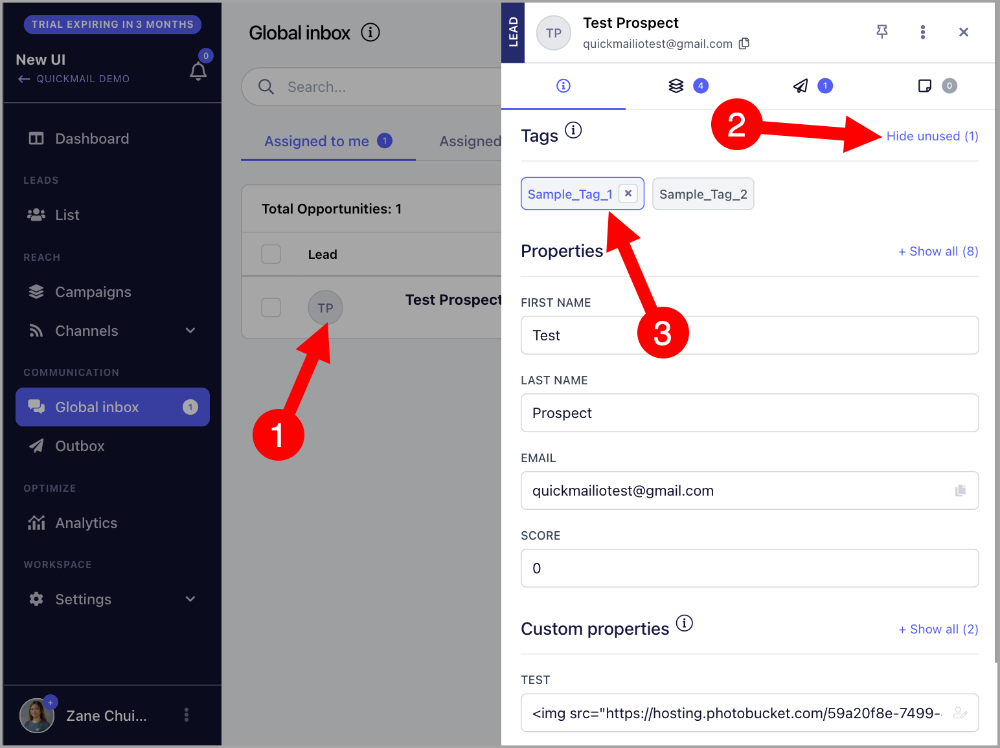
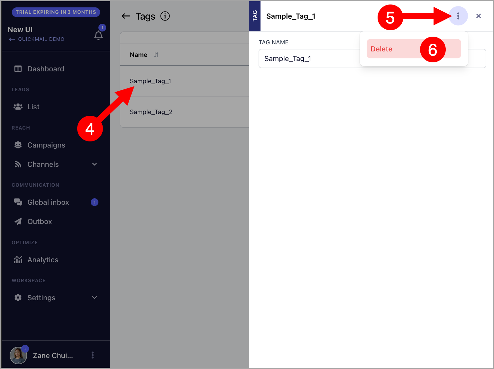

# Segmenting Leads with Tags

**In this article:**

- Why use tags?

- How to create tags?

- How to apply tags to leads?

- How to bulk-apply tags via import?

- How to delete tags?

## Why Use Tags?

Tags are useful for categorizing leads. By tagging leads, you can quickly search for specific leads using Advanced Filters.

## How to Create Tags?

### From the List Page

Go to **List** → click the menu icon (three vertical dots) in the top-right corner → **Tags**.

On the Tags page, click **Add Tag** → name the tag → **Confirm**.

### While Importing Leads

Go to the **Tags** tab during import → click **Add New Tag**.

## How to Apply Tags to Leads?

There are three ways to apply tags to leads:

### From the List Page

Go to the **List** page → select the leads → click the menu icon (three vertical dots) → **Add/Remove Tags**.

### From the Lead's Quick View

The lead's quick view can be accessed by clicking on the lead's thumbnail or email address from the:

- Campaign's Leads page

- Opportunities page

- List page

From there, you can manually add tags to a specific lead. Applied tags are shown in blue.

### Bulk-Applying Tags via Import

When importing leads, tags can be applied in bulk by adding tag columns to your CSV. For each lead that should receive a tag, enter any value (such as "x") in the corresponding column. Leaving a row blank means the tag will not be applied.

Here is an example of a CSV with tag columns:

**Note:** If the leads being imported already exist in the list, make sure to check **Update Lead if Exists** so that the tags are applied to them.

**Pro tip:** A lead can have multiple tags, and you can filter leads by combining tags. To learn more, see: Filtering Leads.

## How to Delete Tags?

Go to **List** → click the menu icon (three vertical dots) in the top-right corner → **Tags**.

On the Tags page, click on the tag you want to delete → click the menu icon (three vertical dots) → **Delete**.

