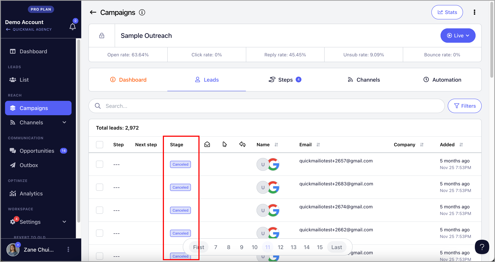

# Understanding Lead Status

When you're running a campaign, keeping track of where each lead stands in the journey is crucial. Lead status helps you quickly identify a lead’s current position in the campaign, understand what actions they've taken, and determine your next best move. Whether you're nurturing new prospects or following up with hot leads, having a clear view of their status makes your workflow more efficient and your communication more targeted.

In this article, we’ll break down what lead status means, the different types you might encounter, and how to use them effectively to get the most out of your campaigns.

## Where can I see a lead’s status?

To see the leads' status, go to a specific campaign → Leads page → See 'Stage' column

## What are the different types of lead statuses, and what do they mean?

### Not Started

In the new interface, when leads are added to a campaign, their status is set to Not Started by default. This means the campaign won’t begin for those leads yet — no emails will be sent until their status changes. It’s essentially a holding stage, giving you time to review or adjust the leads before the campaign progresses.

### Starting

Our system processes leads starting the campaign every 1–15 minutes. Once a lead is set to start, it may take a few minutes for its status to change to Starting before finally moving to Running.

### Running

When a lead is in Running status, they are now actively going through the campaign. This means the campaign has started sending emails to them, but they haven’t completed the sequence or replied yet.

### Out of office

If we receive an automated out-of-office reply, the lead’s status changes to Out of Office.

By default, their journey in the campaign is paused for 14 days and will automatically resume afterward.

### Replied

When a lead replies, their status changes to Replied. This stops any further emails from being sent to them.

**FYI:** You can view and respond to their reply from the Opportunities page

### Unsubscribed

If a lead clicks the unsubscribe link in your emails or requests to be removed (via AI reply categorization), their status changes to **Unsubscribed**. When this happens:

- The system stops sending them emails.

- The lead is added to your **Do Not Contact** list.

- They cannot be added to any future campaigns.

### Bounced

If an email cannot be delivered (usually due to an invalid email address), the lead's status will change to **Bounced.**

### Canceled

The lead's status will be set to **Canceled** when it's manually canceled or automatically canceled based on settings such as sub-campaign rules. Once canceled, the lead will no longer receive any emails from the campaign.

### Completed

When a lead completes all steps in the campaign without replying, their status will change to **Completed.**

**Note:** If you add a new step to a campaign that already has leads marked as **Completed**, those leads will not automatically proceed to the new step.

To include them in the new email step, you’ll need to manually resume the leads who have already completed the campaign.

## Has errors

There are different reasons why a lead will run into an error.
To know the error, you can hover your pointer on the error running status.

Here are some of the errors and how to troubleshoot them:
1. "This email will bounce." 
Leads marked as invalid will cause bounces, so we stop emails from going out to those leads.
What to do: Ignore it or delete them from the campaign.

2. "No variations found."
This could happen if the step is paused or the step has conditions but the lead doesn't match that condition.
What to do: Double-check the steps and activate them.
If it's an issue related to conditions, recheck your conditions to make sure you set it up properly.

If it's set up properly, you can ignore those leads that ran into an error.
It's the campaign filtering out your leads based on your conditions.

3. "System Exception: 404 Not Found"
These are temporary issues coming from your email service provider.
What to do: Try to resume them. If the issue on provider's side is solved, the error should be solved.

4. "Can't send emails, no more reword credits to use"
If reword with AI is turned on for your account, it uses reword credits.
You have 1,000 by default but you can buy more for $10 for every 10,000 credits.

Alternatively (less recommended), turn off reword with AI and resume all leads that ran into an error.

5. Message can't be sent. You are not connected to this lead.
Send a connection request first.

LinkedIn doesn't allow sending to leads you are not connected yet.
To prevent this error from happening, please set your LinkedIn step to wait before connection request is accepted.

What to do: These leads can't be resumed until they accept the connection.
So all you can do is wait.

Leads can't skip a step so if you have email steps in your campaign, they will not be sent until the lead connection request is accepted.
