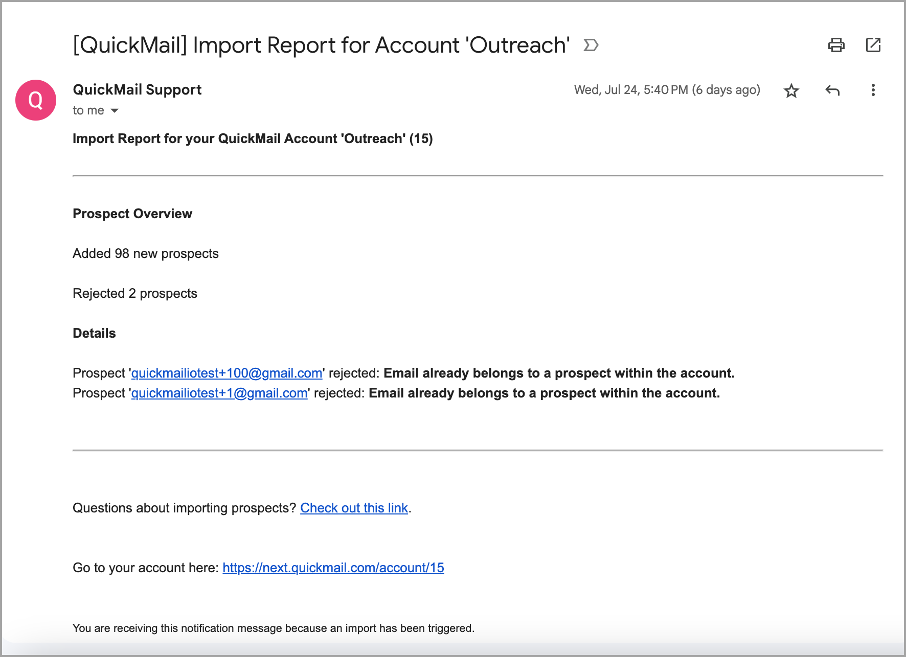
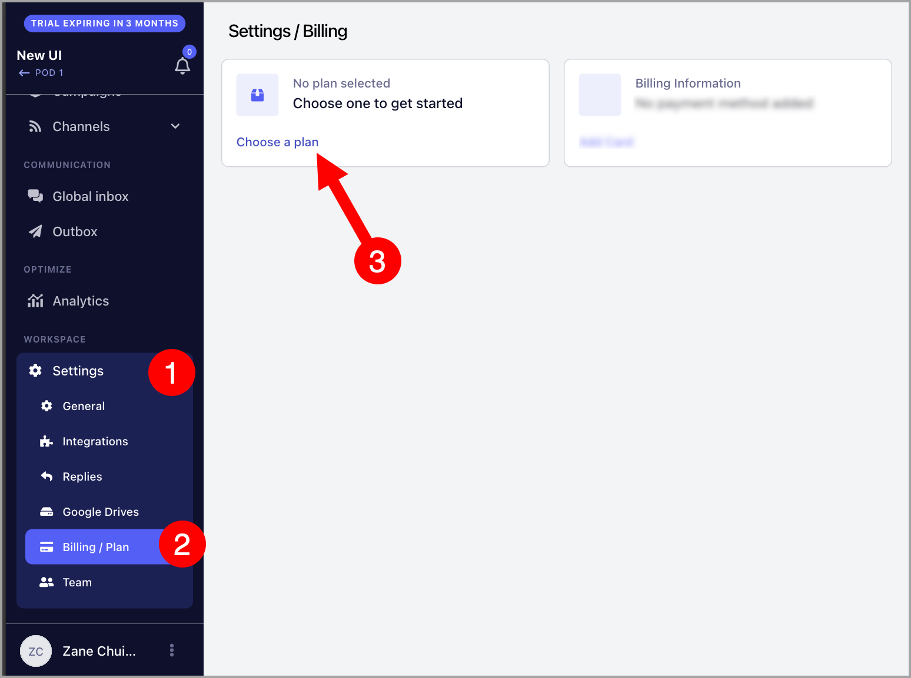
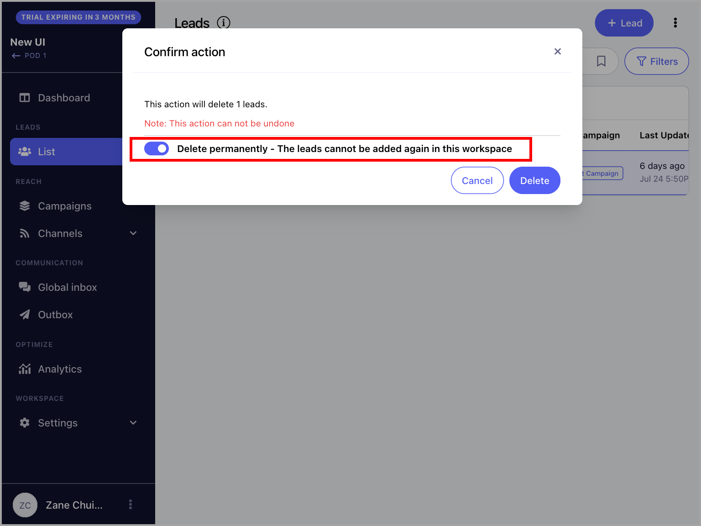
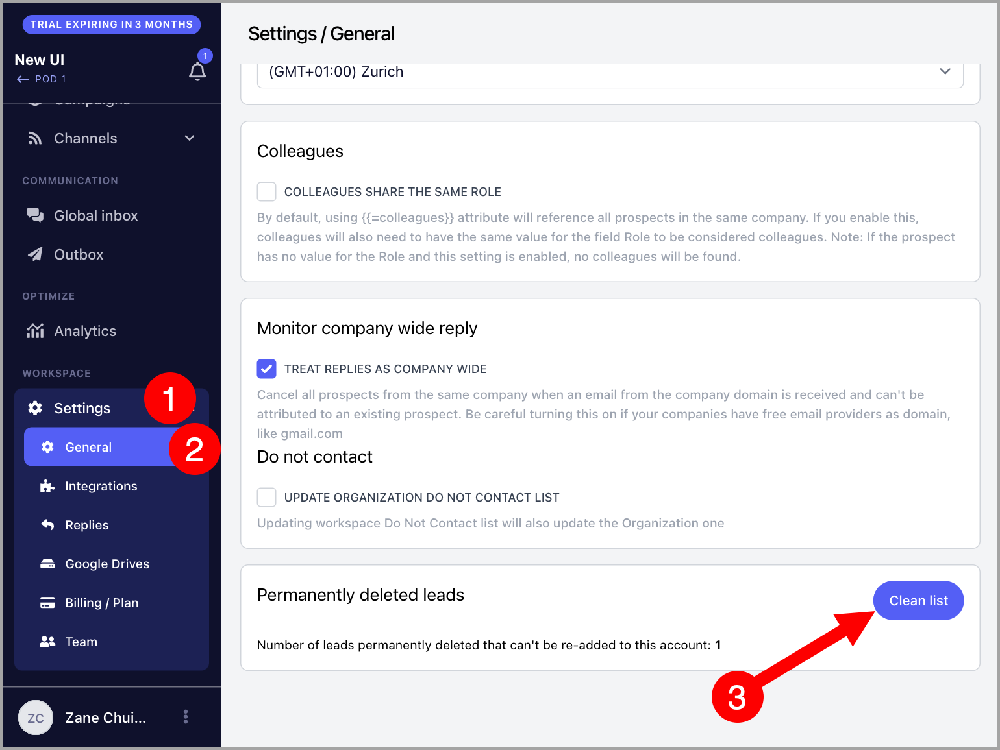

# Understanding the Import Report

**In this article:**

- What is an import report?

- Why are leads getting rejected upon import?

  - Email already belongs to a lead within the account

  - Max number of leads reached (100)

  - Email was permanently deleted

  - Total number of leads in the import report doesn't match the workspace or campaign

## What Is an Import Report?

An import report is sent to the email address you use to log in after every import. It contains details about what happened during the import.

The report includes:

**Lead overview** — a summary of what happened to each lead in the import:

- **Added X new leads** — the number of new leads added to the account.

- **Modified X leads** — the number of existing leads that were re-imported. Note that this does not necessarily mean their information was updated.

- **Rejected X leads** — the number of leads that were rejected.

**Details** — information on which leads were rejected and the reasons why.

## Why Are Leads Getting Rejected Upon Import?

Leads may be rejected during import for a number of reasons. Here are the most common errors and how to fix them:

### "Email already belongs to a lead within the account"

**Reason:** Leads that already exist are automatically rejected to prevent duplicates. This error can also occur if there are duplicate entries within the CSV itself.

**Fix:** If you would like to re-import the same leads to update their information, check the box **Update lead if it exists** before importing.

### "Max number of leads reached (100)"

**Reason:** Your account is currently on a trial, and the maximum number of leads that can be added during a trial is 100.

**Fix:** Delete existing leads to free up space, or upgrade your plan. To upgrade, go to **Settings** → **Billing/Plan** → choose a plan.

**Note:** You must be logged in with the admin email address to update the plan.

### "Email was permanently deleted"

**Reason:** The email address was permanently deleted when the lead was removed.

**Fix:** Clear the permanently deleted leads list. Go to **Settings** → **General** → scroll to the bottom → click **Clean List**.

### Total Number of Leads in the Import Report Doesn't Match the Workspace or Campaign

**Reason:** This can happen if:

- The import contained duplicate leads. Duplicates will show as updated leads if **Update lead if it exists** is enabled.

- The campaign is set to reject leads that are not valid, so not all leads were added to the campaign.
