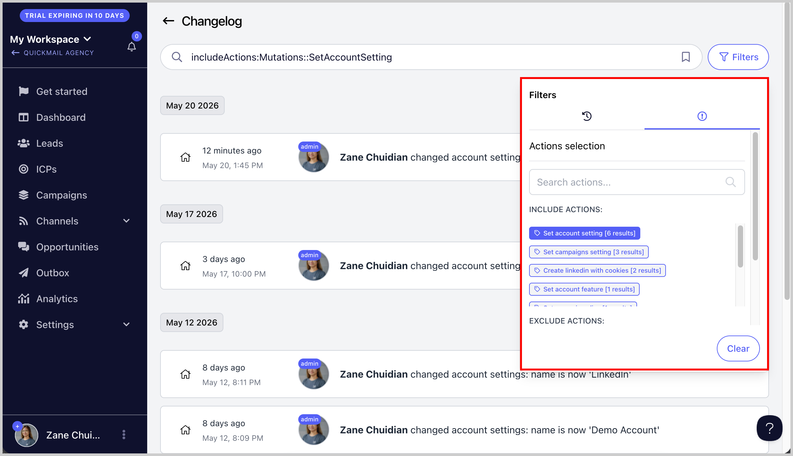

# Using the Changelog and Filters to Find Activity History

The Changelog in QuickMail helps you track and review activity across your account. It is useful for monitoring changes, reviewing team member actions, and troubleshooting issues.

**In this article:**

- Accessing the Changelog

- Using filters

## Accessing the Changelog

Go to **Settings** → **Team** → **Options** button → **Changelog**.

This will open a detailed activity log containing changes made to campaigns, settings, email accounts, team members, and more.

## Using Filters

Within the Changelog, you can filter activities by:

- Errors

- User

- Date

- Action taken

These filters make it easier to find specific events or investigate account activity.

