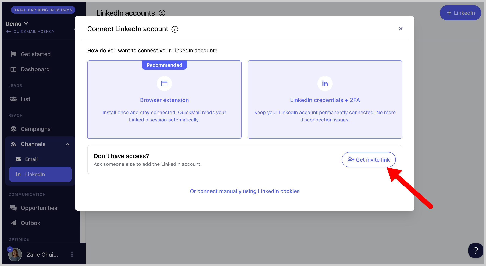
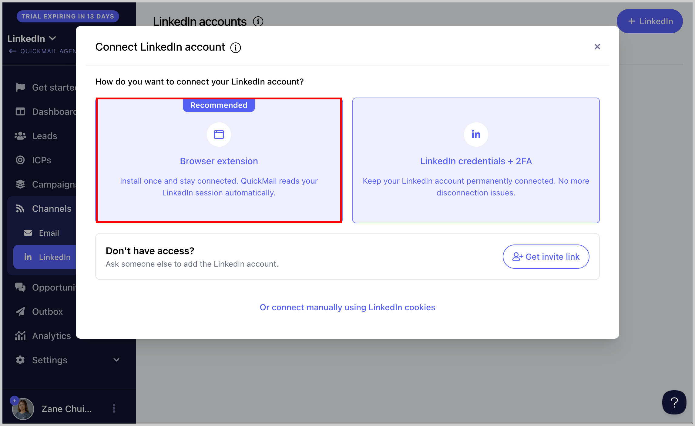
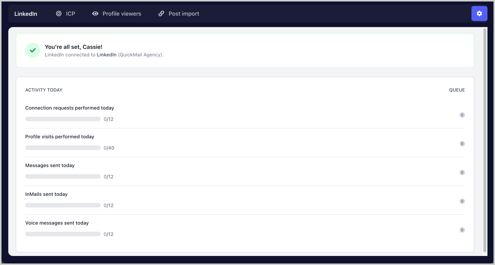
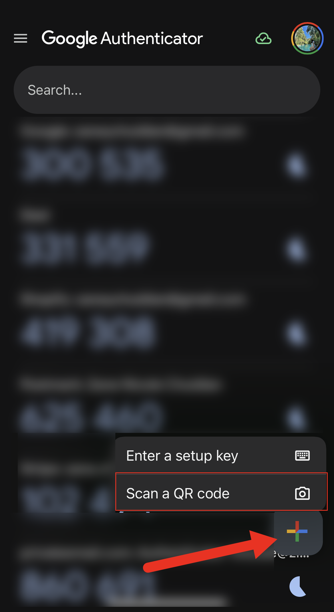
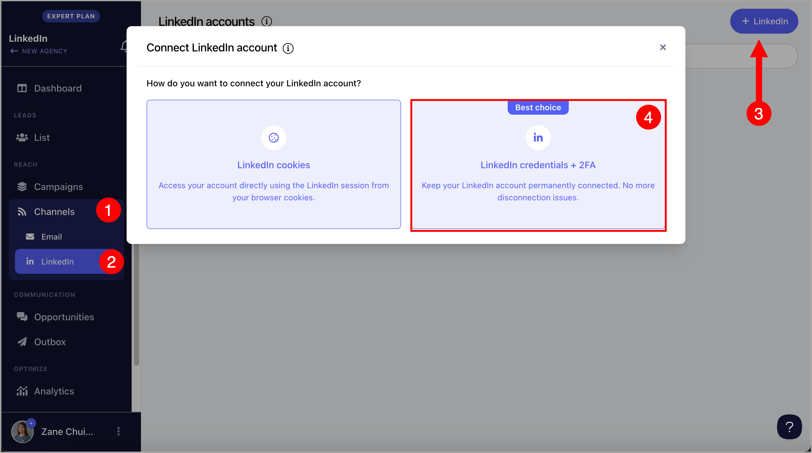
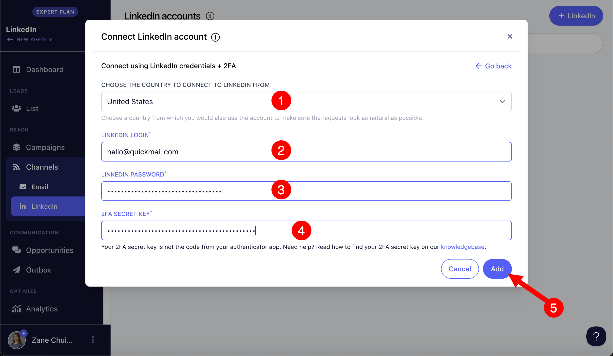
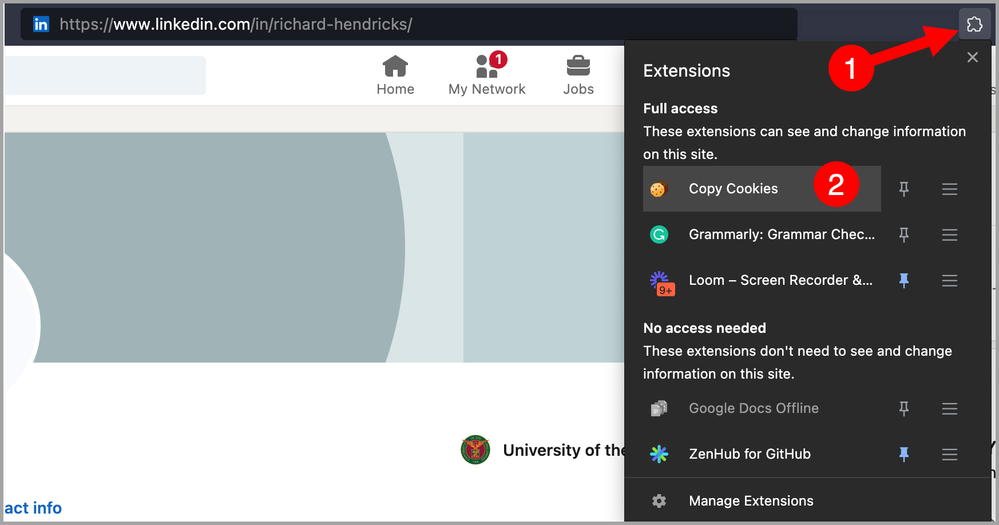
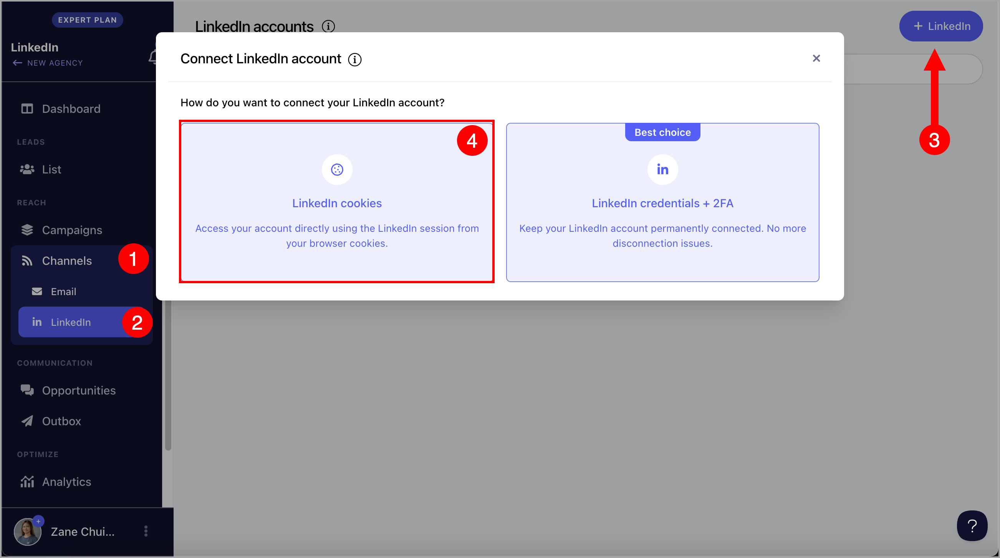

# Adding LinkedIn Accounts

**In this article:**

- How to add a LinkedIn account?

  - Option 1: Via browser extension (recommended)

  - Option 2: Via credentials + 2FA

  - Option 3: Via cookies

- Troubleshooting

  - I added the LinkedIn account but I can't find it.

  - My LinkedIn lost permission. How do I reconnect?

  - I'm getting an error when adding my LinkedIn account.

## How to Add a LinkedIn Account?

There are three ways to add a LinkedIn account in QuickMail.

**Tip:** If you do not have access to the LinkedIn account directly, you can generate an invite link instead.

### Option 1: Via Browser Extension (Recommended)

**Step 1.** Log in to the LinkedIn account you want to add.

**Step 2.** In a separate browser tab, go to **Channels** → click **Browser Extension**.

**Step 3.** Click **Install the Chrome Extension**.

**Step 4.** Once the extension is installed, a new tab will open. The LinkedIn account currently signed in will be detected automatically. Select the account and the workspace where you would like to add it.

**Step 5.** You will receive a confirmation indicating whether the LinkedIn account was added successfully. From the same page, you can also view the LinkedIn account activity.

### Option 2: Via Credentials + 2FA

**Step 1.** Log in to your LinkedIn account in a separate browser tab → click **Me** → **Settings & Privacy**.

**Step 2.** Go to **Sign in & Security** → click **Two-Step Verification**.

- If two-step verification is already enabled, temporarily disable it, then proceed to the next step.

- If two-step verification is not enabled, proceed to the next step to enable it.

**Step 3.** Enable two-step verification → enter the code sent to your email address → click **Submit**.

**Step 4.** Select **Authenticator App** → click **Continue** → enter your LinkedIn password to proceed.

**Step 5.** Download an authenticator app on your mobile phone, such as [Google Authenticator](https://support.google.com/accounts/answer/1066447?hl=en&co=GENIE.Platform%3DAndroid) or [Microsoft Authenticator](https://www.microsoft.com/en-us/security/mobile-authenticator-app).

**Step 6.** In your authenticator app, open the QR scanner and scan the QR code displayed on your screen. This will add your LinkedIn account to the authenticator app.

For Google Authenticator, here is where to find the QR scanner:

Here is the page where the QR code appears:

**Step 7.** Once the authenticator is set up, copy the code shown below the QR code and save it somewhere safe (such as a Notepad file) → click **Continue**.

**Step 8.** Enter the code shown in your authenticator app → click **Verify**. Two-factor authentication is now set up on your LinkedIn account.

**Step 9.** Log out of your LinkedIn account, then log back in.

**Step 10.** Copy the 2FA code from LinkedIn that you saved earlier.

**Step 11.** Go to **Channels** → **LinkedIn** → **+ LinkedIn** → **LinkedIn Credentials + 2FA**.

**Step 12.** Select your country → enter the email address and password associated with your LinkedIn account → paste the 2FA code → click **Add**.

It may take a few minutes for the LinkedIn account to be added, but no longer than an hour.

**Note:** If you have trouble adding your LinkedIn account, contact support at support@quickmail.io.

### Option 3: Via Cookies

**Step 1.** Install the cookies extension on your browser using this [link](https://chrome.google.com/webstore/detail/copy-cookies/jcbpglbplpblnagieibnemmkiamekcdg).

**Step 2.** Once installed, go to your LinkedIn profile and click the cookie icon to copy the page cookies.

If you do not see the cookie icon, click the puzzle icon in your browser toolbar to view all installed extensions.

**Step 3.** Go to **Channels** → **LinkedIn** → **+ LinkedIn** → **LinkedIn Cookies**.

**Step 4.** Select your country → paste the cookies → click **Add**. The LinkedIn account will be added immediately.

**Important:** Logging out of your LinkedIn account will disconnect it from QuickMail by invalidating the cookies. To avoid this, log in through an incognito window and close the window when done without logging out.

## Troubleshooting

### I Added the LinkedIn Account but I Can't Find It. Why?

If a LinkedIn account is not visible, it may be set to private. Private LinkedIn accounts are only visible to the user who added them — specifically, the email address used to log in to QuickMail at the time of adding the account.

If you are logged in with a different email address, the private LinkedIn account will not appear and its settings will not be editable.

Try logging in with the email address that was used to add the account. If you still cannot find it, contact support at support@quickmail.io.

### My LinkedIn Lost Permission. How Do I Reconnect?

- If the account was added via cookies, generate a new cookie and add it to the account.

- If the account was added via 2FA, you can use the browser extension to reconnect it.

If you are unable to reconnect via 2FA, contact support at support@quickmail.io.

### I'm Getting an Error When Adding My LinkedIn Account.

If you are seeing the error "We failed to create your LinkedIn account due to network issues. Please try again later," this is a temporary error caused by high server load. Wait a few minutes and try again.
